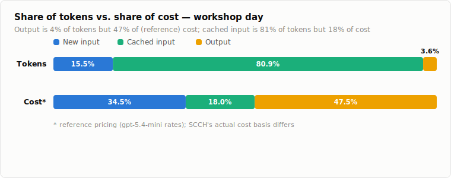
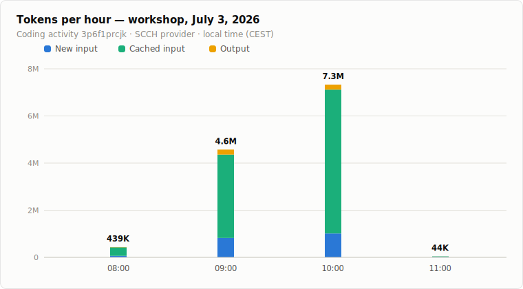
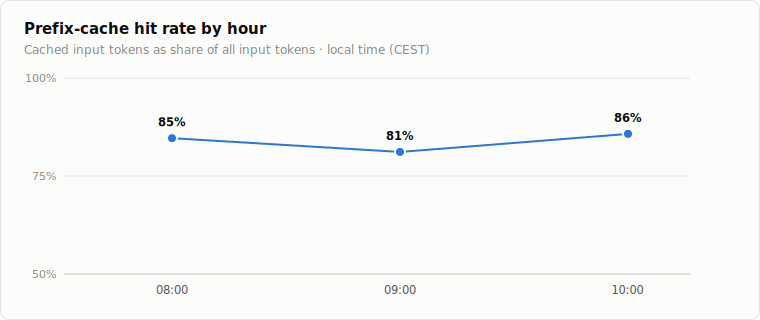
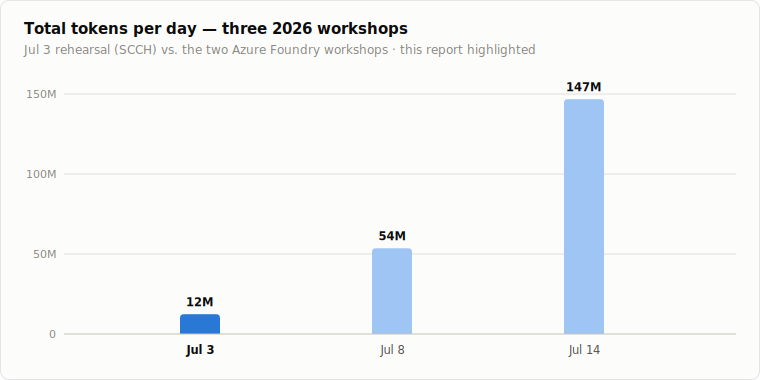

# Token usage report: student workshop, July 3, 2026

**TL;DR:** This was the earliest of the three 2026 coding workshops: a **rehearsal run with 5 students** who had already completed one year at an HTL (a computer-science-focused Austrian technical high school), age 16, making them the most experienced cohort of the three. It ran on a single coding activity (`3p6f1prcjk`) through the **SCCH** provider, with a **32k context window**, the same window size as the July 8 workshop. Between 09:00 and 11:00 local time (CEST) the students consumed **12.4 million tokens**. The provider does not report a model name or a per-token price, so costs below use the same gpt-5.4-mini reference rates as the other two workshops **purely for comparability**; on that basis the day would cost about **$4.17**. Prefix caching was exceptionally effective: **84 %** of all input tokens were cache hits, the highest of the three workshops.

This is a **usage-only report**: no pi conversation transcripts were captured for July 3, so (unlike the [July 8](../2026-07-08-reports/student-work.md) and [July 14](../2026-07-14-reports/student-work.md) workshops) there are no per-student work reports here, only the aggregate token data from the production `novedu_usage_by_code` table (hourly aggregates, filtered to 2026-07-03). The coding module is anonymous and its API path carries no user identity, so per-student numbers are not available by design.

## Totals

| Metric | Tokens | Share | Ref. price / 1M | Ref. cost |
|---|---:|---:|---:|---:|
| New input | 1,921,117 | 15.5 % | $0.75 | $1.44 |
| Cached input | 10,024,992 | 80.9 % | $0.075 | $0.75 |
| Output (incl. reasoning) | 440,452 | 3.6 % | $4.50 | $1.98 |
| **Total** | **12,386,561** | 100 % | | **$4.17** |

Because caching was so heavy and new input so small, **output dominates the (reference) cost**: it is only 3.6 % of the token volume but **47.5 %** of the cost. New input is 34.5 % of cost and cached input just 18.0 %.

## Usage over the morning

Activity peaked in the 10:00 hour, which alone accounts for 59 % of the day's tokens. By 11:00 the workshop was winding down.

| Hour (CEST) | New input | Cached input | Output | Total tokens | Ref. cost |
|---|---:|---:|---:|---:|---:|
| 08:00–09:00 | 65,622 | 361,824 | 11,966 | 439,412 | $0.13 |
| 09:00–10:00 | 822,467 | 3,537,984 | 212,206 | 4,572,657 | $1.84 |
| 10:00–11:00 | 1,014,523 | 6,101,728 | 213,867 | 7,330,118 | $2.18 |
| 11:00–12:00 | 18,505 | 23,456 | 2,413 | 44,374 | $0.03 |
| **Total** | **1,921,117** | **10,024,992** | **440,452** | **12,386,561** | **$4.17** |

(The stored buckets are UTC 06:00–09:00; shown here in local time.)

## Cache efficiency

The prefix-cache hit rate was high and stable throughout the core two hours, around 81–86 %:

In money terms (reference pricing): the 10.0M cached input tokens cost $0.75 instead of the $7.52 they would have cost as fresh input, a saving of **$6.77**. The effective blended reference price for the whole session was about **$0.34 per million tokens**. At 84 %, the blended cache rate was notably higher than July 8 (74 %) and July 14 (60 %), consistent with a short, focused rehearsal session and a smaller cohort producing highly repetitive, cache-friendly context.

## Context: how the day compares

July 3 was the smallest of the three workshops by total volume: 12.4M tokens, versus 53.6M on July 8 and 146.8M on July 14. It was effectively the rehearsal for the later runs (a different provider, SCCH, and a different activity code).

| Day | Total tokens | Note |
|---|---:|---|
| **Jul 3** | **12,386,561** | **rehearsal, 5 HTL CS students, age 16 · SCCH · 32k context** |
| Jul 8 | 53,576,755 | workshop 1, 20 students, age 15–16 · Azure Foundry (gpt-5.4-mini) · 32k context |
| Jul 14 | 146,768,222 | workshop 2, 15 students, age 12–14 · Azure Foundry (gpt-5.4-mini) · 128k context |

Per student, July 3 used ≈ **2.48M tokens** (12.4M ÷ 5) at a reference cost of ≈ **$0.83 per student**, the lowest per-student usage of the three, despite this being the most experienced group. A dedicated [cross-workshop comparison](../2026-07-workshop-comparison.md) analyses the three days together.

## Notes

- **Usage-only:** no conversation transcripts were available for July 3, so this folder contains only the aggregate usage report and its charts; there are no per-student work write-ups.
- **Provider / pricing:** the activity ran on the **SCCH** provider, which does not report a model name (`model` is NULL in the usage table). The costs above apply the July-8/14 **gpt-5.4-mini reference rates for comparability only**; SCCH's actual cost basis (an academic/self-hosted backend) is different and not a per-token bill.
- The coding endpoint is metered per code only (no user attribution, no message content).
- `tool_calls`, `user_messages`, `quiz_answers`, and `writing_saves` are all zero for this code: the coding proxy counts tokens only.

*Reference prices used: $0.75 / 1M new input, $0.075 / 1M cached input, $4.50 / 1M output. Data queried from `ng-workshop.database.windows.net / WizardAcademy` (table `novedu_usage_by_code`, code `3p6f1prcjk`, hours in 2026-07-03 UTC) on July 14, 2026.*
