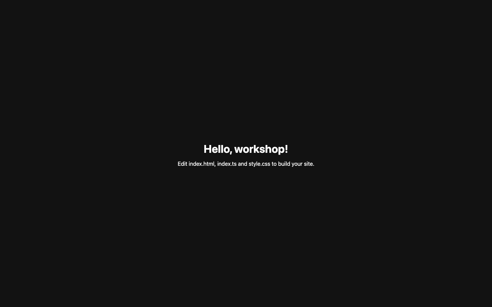

# Student Report — vcenv-vm-11

| | |
|---|---|
| Environment | `vcenv-vm-11` |
| Pi conversation history | Yes — 1 session (2026-07-07, 14:28 UTC) |
| Conversation language | German |
| Project outcome | A "Magenschmaus" Austrian-restaurant landing page was built during the session, but the files were reverted to the starter afterwards — only an orphaned SVG logo remains on disk |
| Live check | ⚠️ Dev server was not running; started manually — site renders the untouched starter ("Hello, workshop!"), not the restaurant page |

## Summary

The student used a single pi session to grow the starter website into a landing page for a fictional Austrian home-cooking restaurant called "Magenschmaus". They worked entirely in conversational German, starting by asking the agent for ideas rather than a finished result, then iterating twice on look-and-feel (an "edler" gold-on-black serif redesign, then a custom SVG wordmark). The agent did all the implementation; the student never touched code or specified technical detail. Notably, the current on-disk state no longer contains any of this work: `index.html`, `index.ts`, and `style.css` were reverted to their original starter content roughly nine minutes after the session ended (file mtimes 14:50 vs. last agent write 14:41), leaving only the orphaned `magenschmaus-logo.svg`. As a result the live site now shows the default "Hello, workshop!" starter.

## How the student worked with the agent

**Approach.** The student worked in a goal-oriented, conversational style typical for a beginner: plain-language requests, no technical vocabulary, and a sensible "let's start with a proposal" opening rather than demanding a full build immediately.

- **Turn 1 — brainstorming first.** *"Ich möchte eine Webseite für ein Restaurant namens 'Magenschmaus' erstellen. Wir bieten österr. Hausmannskost an. Kannst du mal was vorschlagen, mit dem wir starten können?"* ("I want to create a website for a restaurant called 'Magenschmaus'. We offer Austrian home cooking. Can you suggest something we can start with?"). The agent replied with a structured concept (hero, about, specialties, hours/contact, color direction) but wrote no code yet.
- **Turn 2 — commit to code.** *"Kannst du das mal in meinen Code einbauen?"* ("Can you build that into my code?"). The agent read the three starter files plus `AGENTS.md` and rewrote `index.html`, `index.ts`, and `style.css` into a warm cream/dark-red first version.
- **Turn 3 — restyle.** *"Das ist eine schöne Sache. Das ganze soll aber etwas edler aussehen, Serif-Schrift, Gold auf Schwarz"* ("That's a nice thing. But the whole thing should look a bit classier, serif font, gold on black"). The agent switched the palette to gold-on-black and serif headings.
- **Turn 4 — custom logo.** *"Kannst du einen coolen Schriftzug für 'Magenschmaus' in SVG machen und einbauen?"* ("Can you make a cool wordmark for 'Magenschmaus' in SVG and build it in?"). The agent created `magenschmaus-logo.svg` (gold-gradient italic serif wordmark with a tagline) and wired it into the hero.
- **Turn 5 — `/clear`.** The student ended by clearing the conversation.

**Problems / friction.** Very little friction inside the session — every request was understood and satisfied on the first try, and there were no errors, typos, or dead ends in the transcript. The one significant issue is outside the conversation: none of the built work survives on disk. All three project files carry a 14:50 modification time (nine minutes after the last agent write at 14:41) and now hold the exact original starter content, while the SVG the agent added remains. This strongly suggests the changes were undone/reverted after the session (e.g. via the editor), leaving the project in a broken half-state — an orphaned logo file referenced by nothing.

**Signals about the student.** Evidence of a thoughtful beginner: they scoped the project as a realistic small business, opened with a request for suggestions rather than a finished artifact, and iterated on presentation (classier look, then a logo) the way a real client would. They trusted the agent completely for implementation and never engaged with the code itself. Whether the final revert was intentional (a deliberate reset) or accidental (an undo gone too far) cannot be determined from the data, but the result is that the visible outcome does not reflect the work done in the session.

## The app

Current on-disk state (what the live site serves):

- `index.html` — original starter markup: `<h1>Hello, workshop!</h1>` and an empty `#msg` paragraph. Reverted; none of the restaurant markup remains.
- `index.ts` — original starter script that sets the placeholder "Edit index.html, index.ts and style.css to build your site." message. Reverted.
- `style.css` — original starter stylesheet (system font, centered grid). Reverted.
- `magenschmaus-logo.svg` — the only surviving artifact of the session (agent-written). A clean, well-formed 1.8 KB SVG: a gold linear-gradient italic serif "Magenschmaus" wordmark with a drop-shadow/glow filter, decorative flourish strokes, and a spaced-out "ÖSTERREICHISCHE HAUSMANNSKOST" tagline. It includes `role="img"` and `aria-labelledby` for accessibility. It is currently orphaned — no HTML references it.
- `package.json` — unchanged starter Vite + TypeScript config (`dev` = `vite`).

During the session the agent had produced a coherent, idiomatic restaurant landing page (hero with CTA buttons, specialties list, about card, opening-hours/contact card; a gold-on-black serif theme using CSS custom properties, glassmorphism cards, and gradient buttons; plus smooth-scroll anchor logic in `index.ts`). That work is no longer present, so it cannot be assessed live.

## Live check

The Vite dev server was **not** running when checked (a `pgrep -f vite` false-positive initially suggested otherwise, but nothing was listening on port 8080). I started it manually (`npm run dev`, Vite v8.1.3 on `0.0.0.0:8080`), confirmed HTTP 200, screenshotted, and stopped it again afterwards. The page served is the untouched starter, not the restaurant site.

The screenshot shows a near-black page with a centered white "Hello, workshop!" heading and the placeholder line "Edit index.html, index.ts and style.css to build your site." — i.e. the default starter, confirming the Magenschmaus work is no longer live.
