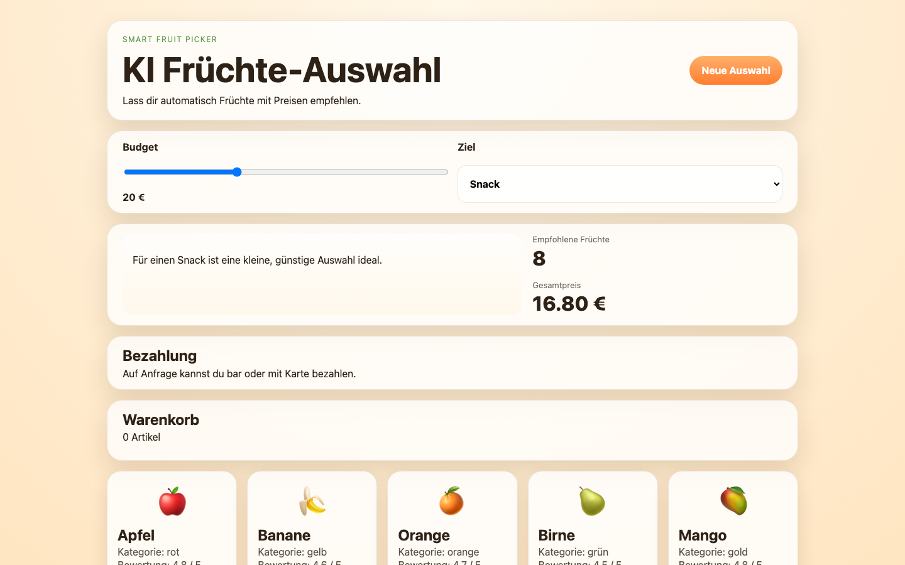

# Student Report — vcenv-vm-13

| | |
|---|---|
| Environment | `vcenv-vm-13` |
| Pi conversation history | Yes — 3 sessions (2026-07-08, 09:31 / 09:41 / 09:51 UTC), one continuous train of thought |
| Conversation language | German |
| Project outcome | Working "KI Früchte-Auswahl" fruit shop (budget slider, AI-style recommendation, clickable "bite" effect, cart, payment note) — pivoted away from an earlier fruit-catching game |
| Live check | ✅ Dev server running, site renders correctly |

## Summary

The student started by asking for a game where you catch fruit falling from trees, iterated on it a few times (bigger fruit, faster falling, better catching), then abruptly pivoted to a completely different project: an "AI" fruit shop with prices, a budget slider, a clickable bite effect, and a shopping cart. They gave short, goal-oriented instructions in German and let the agent do all the coding. The second half of the work ran into real friction: the agent's own edits corrupted the HTML twice (once breaking the build, once accidentally deleting the fruit list), and the student had to repeatedly tell it to put things back. The final site works but carries a small leftover artifact (a duplicated section container). No code was written by the student directly.

## How the student worked with the agent

**Approach.** The student worked purely conversationally, one plain-language wish at a time, never touching the code or naming a file, framework, or technical concept. They treated the agent like a builder they could keep nudging: *"die früchte sollen größer sein und sie sollen einzeln fallen und viel schneller fallen"* ("the fruits should be bigger and fall one at a time and much faster"). Requests were feature-shaped and incremental ("make it faster", "you can add to a cart", "you should be able to remove them again", "you should be able to pay, cash or card on request"). When the agent asked clarifying questions (e.g. what a "KI Früchte Website" should be, or where "67" should appear), the student answered briefly and let it proceed. Mid-project they changed direction entirely — from an arcade game to a shop — without any transition ("jetzt erstelle eine ki früchte website").

**Problems / friction.** This session shows markedly more turbulence than a smooth beginner run:

- **Agent broke its own output.** After adding the "bite" feature the build failed on a stray `]`; the student typed *"repariere die website"* ("repair the website") and the agent found and removed the extra bracket. Later, while adding the payment option, the agent mangled the cart markup and dropped the fruit list. The student noticed immediately: *"du hast die früchte entfernt"* ("you removed the fruits") and then *"nein setzte die früchte wieder zurück man soll sie sehen und kaufen könne"* ("no, put the fruits back, you should be able to see and buy them"). The agent restored them but left a **duplicated `<section class="cart">`** in the final HTML.
- **Tooling errors on the agent side.** `hypa_grep` failed twice because `rg` (ripgrep) was not installed on the VM; one `edit` call was rejected for missing arguments. These were invisible to the student and self-recovered.
- **Ambiguous requests.** The student asked the site to "offer 67" — *"die website soll auch 67 bieten"* and *"auf der website gibt es eine six seven frucht"* (a reference to the "six seven" meme). The agent could not find such a fruit and asked for clarification; this thread fizzled out without a concrete result.
- **Repeated instruction of the same idea.** The "bite on the fruit" feature took three tries to land ("a bite mark", then "no, a bite appears on the banana", then "a small bite hole appears when I click"), the student rephrasing each time rather than the agent getting it right up front.
- **Typos throughout**, e.g. *"sie sollen vielll schnelller fallen"*, *"auf anchfrage"*, *"kaufen könne"* — consistent with someone typing quickly and informally, not proofreading.

**Signals about the student.** A genuine beginner, curious and playful (fruit game → meme fruit → fruit shop), comfortable driving the agent by describing outcomes but with no interest in or awareness of the underlying code. They were, however, an attentive reviewer of the *result*: they spotted immediately when the fruit list disappeared and insisted it come back, showing they judged success visually in the browser rather than by reading code. Their willingness to keep rephrasing when the agent misunderstood (the "bite" feature) shows persistence rather than frustration.

## The app

A Vite + TypeScript static site. The final state is the "KI Früchte-Auswahl" shop (the earlier catching game was overwritten during the pivot). All code is agent-written.

- `index.html` — German shop UI: hero with an "AI" tagline ("Smart Fruit Picker"), a budget range slider, a goal `<select>` (snack / smoothie / family / premium), an assistant chat box, a summary panel (recommended count + total price), a payment note, a cart, and the fruit grid. Contains a **leftover bug**: two consecutive `<section class="cart">` blocks (one holding the payment text, one the real cart) — a scar from the restore-after-corruption episode.
- `index.ts` (~6.4 KB) — the app logic: a fixed array of eight fruits with price/rating/color, a `scoreFruit` heuristic that ranks fruit by the chosen "goal" and greedily fills the recommendation up to the budget (the "AI"), rendering of fruit cards, a click-to-add-a-bite-hole effect using per-fruit `biteShapes` coordinates, add-to-cart / remove-from-cart handlers, and a shuffle button. Reasonable, readable code; the "AI" is a deterministic scoring function rather than any real model.
- `style.css` (~4.2 KB) — warm orange/cream theme with glassy rounded cards, gradient buttons, responsive grid, and styling for the bite holes and cart items.
- `package.json` / `vite.config.ts` / `tsconfig.json` — unchanged starter scaffolding.

Quality is decent for agent-generated code and the app builds and runs, but the duplicated cart section is a visible remnant of the mid-session breakage that was never cleaned up.

## Live check

The dev server (`npm run dev`, Vite on `0.0.0.0:8080`) was already running when checked and the site loads at http://vcenv-vm-13.austriaeast.cloudapp.azure.com:8080/. I left it running.

The screenshot shows the finished shop: the "KI Früchte-Auswahl" header with a "Neue Auswahl" button, the budget slider and goal selector, an AI recommendation line with 8 recommended fruits totalling 16.80 €, the "Bezahlung" (payment) note, an empty cart, and the row of fruit cards (apple, banana, orange, pear, mango) below.
