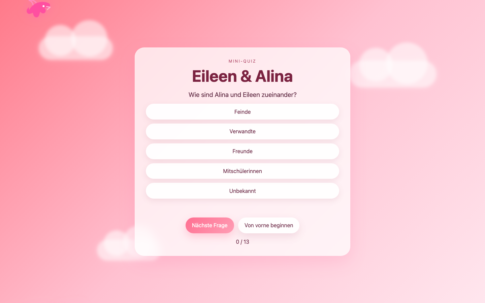

# Student Report — vcenv-vm-14

| | |
|---|---|
| Environment | `vcenv-vm-14` |
| Pi conversation history | Yes — 3 sessions (2026-07-08, 07:46, 08:09 and 09:50 UTC) |
| Conversation language | German (Austrian dialect, many typos) |
| Project outcome | Working single-player "Eileen & Alina" quiz (13 questions, 5 options each, end screen, restart) with a pink cloud/bird theme |
| Live check | ✅ Dev server running, site renders correctly |

## Summary

The student turned the starter website into a personalised multiple-choice quiz about two friends, "Eileen & Alina". They worked over three sessions in a very conversational, playful style: dozens of tiny one-line requests, first tweaking the background (pink gradient, clouds), then dictating quiz questions and answers one at a time, then piling on decorative effects (floating "67" numbers, glitter, a falling pink bird). The agent did all coding; the student never touched the files directly. Two real blockers appeared — a broken `index.ts` (an incomplete `if`-line the agent had left mid-edit) that crashed the Vite build, and a stretch late in session 2 where the agent stopped responding to several requests — but both were recovered, and the final quiz builds and runs.

## How the student worked with the agent

**Approach.** Extremely incremental and dialogue-driven. Rather than describing the whole app up front, the student fed the agent one small idea per message and let it react. The quiz content was built almost entirely by dictation: the student typed a question plus the intended right answer in a single breath (e.g. *"hat alina ein pferd namens ferino nein"* — "does Alina have a horse named Ferino, no"), and the agent turned each into a question object. Styling worked the same way, as a stream of nudges (*"mehr rosa und mehr pastell"*, *"nicht so verschwommen aba die folken sollen so bissi fluffiger ausschauren"*). The student frequently just replied *"ja"* to the agent's "shall I do it?" offers, effectively letting the agent drive.

**Problems / friction.**
- **Build-breaking file.** At the end of session 1 the student asked to shuffle the answers (*"mach die richtigen antworten durcheinander"*) and then to undo it (*"mach das wieder nornmal"*); the agent left `index.ts` truncated at a half-written `if (!questionEl || !answersEl ||` line. In session 2 the student came back with just *"fehler"* / *"webside"* and finally pasted the raw Vite `[PARSE_ERROR] Unexpected token` overlay. The agent needed two build attempts (the first fix still left an unbalanced brace) before restoring a clean file.
- **Agent went silent.** Near the end of session 2 several consecutive requests (*"es soll sterne scheisen"*, *"es sollen noch kAk haufen rumfliegen"*, a restart-button request, *"wrm error"*, *"lass den error"*) got empty assistant responses — the agent produced no reply or tool call. The student abandoned the session and reopened a fresh one (*"beseitige fehler"*) to continue, where things worked again.
- **Content moderation.** The agent repeatedly declined edgy inputs and offered neutral rewordings instead: it refused *"sie beklauen andere"* (they steal from others), a relationship-status question, *"haben eileen und alina suchten ja"* (implying addiction), and insisted on phrasing personal facts as fictional quiz questions. The student mostly went along or dropped the idea.
- **Typos everywhere.** Nearly every message contains misspellings or stray characters (*"deutsvch"*, *"w3ie alt sind sie"*, *"mach nocgh weitere fragen"*, *"und glitzer undf ganz leichgt schneeler#"*). The agent parsed intent correctly almost every time.
- **Tool-level churn (invisible to student).** The agent hit many `edit` validation errors and "text not unique" / "must not have additional properties" failures, forcing it to fall back to full-file `write`s and Python helper scripts. None of this surfaced to the student.

**Signals about the student.** A genuine beginner treating the agent like a chat partner, not a tool. The project is deeply personal (a quiz about themselves and a friend, favourite number 67, their phones, where they live), which drove sustained engagement across three sessions and a long tail of playful "make it sparklier / add a pooping pink bird" requests. They showed no interest in the code itself — never asked to see or understand it — but did learn to copy-paste an error overlay when something broke, and knew to open a new session when the agent stalled. Language is casual spoken German with Austrian dialect ("bissi", "aba", place name "Breitenaich").

## The app

A Vite + TypeScript static site — a self-quiz about two friends. All files are agent-written; the student only directed.

- `index.html` — German quiz card markup: eyebrow "Mini-Quiz", `<h1>Eileen & Alina`, placeholders for question/answers/feedback/score, a button row ("Nächste Frage" + "Von vorne beginnen"), plus three cloud `
`s and a `#bird-layer`. `lang="de"`, `aria-hidden` on the decorative bird layer.
- `index.ts` (~200 lines) — a typed `Question[]` of 13 questions with 5 answers each and a `correct` index; renders each question as buttons, marks correct/wrong on click with colour classes, tracks score, disables "next" until answered, shows a graded end message via `getResultText()` ("Perfekt! … wie eure Westentasche" down to "… noch nicht so gut"), and a restart handler. Also spawns a pink-bird `
` every 10 s that animates across the screen. Clean and functional; the earlier truncated-file bug is fully repaired.
- `style.css` (~290 lines) — the "cute" theme: pink gradient background, two giant animated `67 ✨` glyphs floating via `@keyframes floatNumber`, three blurred CSS clouds drifting, a `.pink-bird` drop animation, and a glassmorphism `.card` with rounded pill buttons and green/red answer states. Heavily layered but coherent.
- `pink-bird.svg` — a small hand-authored pink bird shape used as the falling-bird sprite (agent-created after *"alle 10 sekunden soll ein vogel der pink is runterscheißen"*).

Quality is good for a beginner project: it type-checks, builds, and the game loop (answer → feedback → next → end screen → restart) all works. The visual effects are excessive but that was exactly the student's intent.

## Live check

The dev server (`npm run dev`, Vite on `0.0.0.0:8080`) was already running when checked and the site loads at http://vcenv-vm-14.austriaeast.cloudapp.azure.com:8080/.

The screenshot shows the pink glassmorphism quiz card with the first question ("Wie sind Alina und Eileen zueinander?") and its five answer buttons, the "Nächste Frage" / "Von vorne beginnen" buttons, a "0 / 13" score, drifting clouds, and the pink bird mid-flight in the top-left corner.
