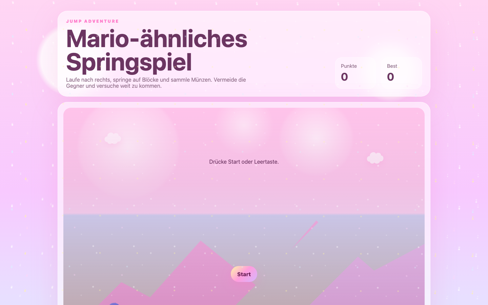

# Student Report — vcenv-vm-15

| | |
|---|---|
| Environment | `vcenv-vm-15` |
| Pi conversation history | Yes — 4 sessions (2026-07-08, 07:46 / 08:06 / 08:16 / 08:28 UTC) |
| Conversation language | German |
| Project outcome | Working Mario-style side-scrolling jump game ("Jump Adventure") with a pink/kawaii glitter theme, ~10-minute target run |
| Live check | ✅ Dev server running, site renders correctly (player sprite shows a broken emoji glyph) |

## Summary

The student explored intensively, cycling through many completely different project ideas across four sessions — a cake-recipe website, a cat game, a make-up/beauty figure, a two-player game, a car game, an anime character, and finally a jump game — letting the agent throw away and rebuild the whole site each time. Prompts were short, plain-language German, often just "ja" to accept the agent's next suggestion. The final result is a Mario-like jump-and-run with a heavily styled pink glitter theme. Along the way the student hit two real agent failures (corrupted emoji characters and literal `\n` / `\"` escape sequences leaking into the served HTML) which they noticed and reported in their own words, prompting several rounds of repair.

## How the student worked with the agent

**Approach.** The student worked in a fast, exploratory, goal-oriented style: name a new idea, accept whatever the agent proposed, then immediately pivot to a different idea. Almost every request was one short German sentence with no technical vocabulary and no implementation detail. The agent frequently offered a menu of options and asked the student to pick one, and the student's most common reply was a bare "ja" — meaning they often let the agent choose rather than deciding themselves.

- Representative opening prompts: *"erstelle mir einen kuchenwebsite wo ich meine eigene rezepte und tolle bilder von dem torten hinzufügen kann"* ("create me a cake website where I can add my own recipes and great pictures of the cakes"); *"erstelle mir ein figur den schmincken können"* ("create me a figure that can be made up [with make-up]"); *"erstelle mir einen springspiel"* ("create me a jump game").
- Late in the project the student iterated on duration and look rather than new features: *"das ist mir zu kurz ich möchte dass es einige minuten dauert plssssss"* ("that's too short for me, I want it to last a few minutes plssssss") — the agent bumped the target from 3 to 10 minutes.

**Problems / friction.**

- **The "ja" loop.** In session 2 the agent twice asked the student to choose an improvement ("mario-ähnlich / bessere figur / mehr levels / sound / mobilsteuerung"), and the student answered "ja" each time. The agent could not resolve "ja" into a choice and had to re-ask with a numbered list before the student finally typed *"mario änliche spiel"*.
- **Corrupted characters.** The student reported *"das spielt geht nicht mehr, nur noch sonderzeichen"* ("the game doesn't work anymore, only special characters"). The game's emoji (player, block, coin, enemy) were stored as mojibake — this is still visible in the source (`ð§¢`, `ð«`, `ðª`, `ð¾`) and in the live screenshot, where the player figure renders as a garbled glyph. The agent claimed to have fixed it but the corruption persisted.
- **Escape sequences in the HTML.** A genuine agent bug: at one point `index.html` was written with literal `\n` and `\"` text instead of real newlines and quotes. The student caught both, precisely: *"Im Webbrowser kommen lauter \n an"* ("lots of \n are showing up in the web browser") and *"Die \" sind mit \\ escaped"* ("the quotes are escaped with backslash"). This drove the entire fourth session, in which the student even instructed the agent to verify its own fix: *"prüfe es selbst durch curl auf http://…:8080/"* ("check it yourself with curl on …").
- **End of session 1** shows visible confusion/frustration: after "ja" the student typed *"bessere"* then *"haalloooo"* with no agent response recorded, and started a fresh session.
- **Trademark refusals.** Two requests were declined by the agent on IP grounds — *"ertelle mir ein hello kitty spiel"* and *"es soll wie in echt sein mit allen marken und so"* ("it should be like real with all the brands and stuff"). In both cases the student accepted the agent's original-content alternative with "ja".

**Signals about the student.** A clear beginner: no technical terms, frequent typos (*"ertelle"*, *"schmincken"*, *"mario änliche"*), reliance on the agent to make decisions, and idea-hopping rather than deepening one project. At the same time the student was an attentive tester — they noticed subtle output defects (stray `\n`, escaped quotes, garbled characters) and reported them accurately, and even pushed the agent to self-verify with curl, showing engaged trial-and-error rather than passive acceptance.

## The app

A Vite + TypeScript static site implementing a single-player side-scrolling jump-and-run, entirely agent-written across the pivots:

- `index.html` — German UI titled "Jump Adventure" / "Mario-ähnliches Springspiel": a HUD panel with score and best-score counters, the game stage (sky, clouds, parallax mountains, world, player, start overlay), and a controls legend. The player element still contains a corrupted emoji (`ð§¢`), a leftover of the encoding bug.
- `index.ts` (~200 lines) — the game loop: gravity/jump physics, left/right movement (arrows or A/D), a scrolling world, randomly spawned blocks/coins/enemies, AABB collision detection, score and localStorage best-score, game-over and win handling. A `targetTime` of `600000` ms encodes the student's requested ~10-minute run. The spawned entity emoji are also mojibake (`ð«`, `ðª`, `ð¾`), so blocks, coins and enemies render as broken glyphs.
- `style.css` (~200 lines) — the "glitzer / pink / pastell / kawaii / wolken" theme the student asked for: pink radial-gradient background, animated sparkle overlays (`body::before/::after` with `sparkleDrift`), translucent blurred "panel" cards, gradient buttons, clouds and a clip-path mountain range.
- `package.json` — unchanged Vite starter scripts (`dev` = `vite`).

The code is coherent and functional as a game, but carries two agent-introduced defects that were never fully resolved: the mojibake emoji throughout, and the earlier literal-escape leakage (the latter appears fixed in the current HTML). Quality of the generated CSS/TS is otherwise high and idiomatic.

## Live check

The dev server (`npm run dev`, Vite on `0.0.0.0:8080`) was already running when checked and the site loads at http://vcenv-vm-15.austriaeast.cloudapp.azure.com:8080/.

The screenshot shows the pink kawaii-themed "Mario-ähnliches Springspiel" start screen with score/best counters, clouds and mountains, a "Drücke Start oder Leertaste" overlay and Start button; the player character in the lower-left renders as a broken emoji glyph, confirming the unresolved encoding issue.
