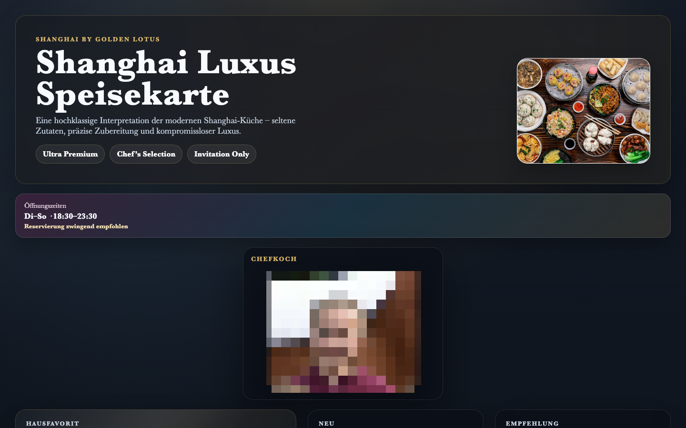

# Student Report — vcenv-vm-16

| | |
|---|---|
| Environment | `vcenv-vm-16` |
| Pi conversation history | Yes — 5 sessions (2026-07-08, 07:47–08:36 UTC) |
| Conversation language | German |
| Project outcome | Fictional luxury Chinese restaurant menu ("Shanghai Luxus Speisekarte") with a hotel advertisement |
| Live check | ✅ Dev server running, site renders correctly |

## Summary

The student spent a first exploratory session rapidly cycling through many game ideas (horse racing, Hay Day-style farming, mini golf, UNO), letting the agent rebuild the whole site from scratch each time but never settling on or refining any of them. From session 2 onward they abandoned games entirely and committed to a single project: a fictional, deliberately over-the-top luxury Chinese restaurant menu. Across four sessions they iterated on it dozens of times with very short German instructions — mostly about making it "more expensive," more luxurious, adding a rainbow color scheme, inserting their own uploaded photos, and finally bolting on a luxury hotel advertisement. All code was written by the agent; the student's contribution was directing look, content, and prices, plus manually uploading two image files.

## How the student worked with the agent

**Approach.** Two distinct phases. In session 1 the student "shopped" for a project idea, throwing out one or two-word game names (*"golf"*, *"Hay Day"*, *"erstelle mir uno"*) and accepting each fresh build without ever iterating on it — a scattershot, curiosity-driven start. From session 2 on they became goal-oriented and iterative on one artifact: the restaurant menu. Their prompting style stayed the same throughout — very short, plain-language German commands with no technical vocabulary, one change per turn, driven mostly by taste ("make it fancier / bigger / more expensive"). They leaned heavily on the agent's suggestions and let it choose all implementation details.

Characteristic prompts:
- *"mach mir das Spiel Hay Day wo man ernten und verkaufen muss"* ("make me the game Hay Day where you have to harvest and sell")
- *"erstelle mir eine chinesische Speisekarte"* ("create me a Chinese menu")
- *"mach es teurer für reiche menschen"* ("make it more expensive for rich people")
- *"noch mehr wie Shanghai luxus teurer"* ("even more like Shanghai luxury, more expensive")
- *"mache einen liebesraum dazu"* ("add a love room to it")

The pricing theme became a running motif: *"mache die preise um das 4 fache teuriger"*, *"das restaurant und das hotel mus um das 10 fache teuriger werden"*, *"mache die zimmer um das 15 fache teuriger"* — hence the final menu with dishes priced in the tens of thousands of euros.

**Problems / friction.** Little hard friction, but clear beginner patterns:
- Heavy misspellings throughout (*"teuriger"* for teurer, *"speiße"* for Speise, *"ortne"* for ordne, *"vorspeiße hauptspeiße und beilage"*, *"hotel anzeiige"*). The agent understood them all regardless.
- The exploratory game phase was essentially wasted effort: five different games were each fully built and then discarded, with the student never once trying to run or refine one before jumping to the next idea.
- Layout requests came in small, repetitive increments (*"mach alle übersichtlich bitte"*, *"mach es größer damit alles platz hat"*, *"ortne die gerichte untereinander und alle preise daneben"*), suggesting the student was nudging the design by feel rather than describing a target.
- Photos were handled by the student uploading their own files (`shanghaifood.jpg` and a personal `Screenshot ...emma.png`) and then asking the agent to insert them — a sensible workaround, since the agent cannot fetch images from the internet.
- No tool errors or agent failures appeared in any session; every request completed cleanly.

**Signals about the student.** A genuine beginner having a smooth, playful experience: no interest in how the code works, full trust in the agent, and iteration driven by aesthetics and a sense of humor (ever-escalating prices, a "Liebesraum Deluxe" hotel room, a rainbow-flag color request). The personal screenshot used as the "Chefkoch" photo suggests the student was enjoying personalizing the page. The scattered start followed by sustained focus on one idea shows them gradually learning what the tool is good for.

## The app

A Vite + TypeScript static site — a single-page fictional luxury restaurant menu, entirely agent-written:

- `index.html` — German-language menu markup: hero section with the uploaded food photo and "Ultra Premium / Chef's Selection / Invitation Only" tags, an opening-hours badge, a "Chefkoch" photo card (the student's own uploaded image), three highlight dishes, three menu categories (Vorspeisen / Hauptgerichte / Beilagen & Desserts) with absurd luxury prices, a footer note, and a large hotel-advertisement section with five room types including a featured "Liebesraum Deluxe."
- `index.ts` — reduced to a single comment: `// Keine Logik nötig – die Speisekarte ist statisch.` ("No logic needed – the menu is static."). The earlier game logic was fully stripped out when the project pivoted.
- `style.css` (~500 lines) — a polished dark "fine-dining" theme: gold-on-near-black palette, glassmorphism cards with `backdrop-filter` blur, radial-gradient backgrounds, a serif font stack, responsive grid layouts with three media-query breakpoints, and a subtle multi-color gradient on the opening-hours badge (the residue of the "rainbow" request). Good quality for agent-generated CSS.
- Assets: `shanghaifood.jpg` and `Screenshot 2026-07-08 101408emma.png`, both uploaded by the student and referenced from the HTML.

The result is coherent and visually strong. The requested "rainbow" styling survives only as a faint gradient accent — the final look reads as dark luxury rather than colorful, reflecting the tension between the student's "regenbogen" and "luxus/teurer" requests, with the latter winning out.

## Live check

The dev server (`npm run dev`, Vite on `0.0.0.0:8080`) was already running when checked and the site loads at http://vcenv-vm-16.austriaeast.cloudapp.azure.com:8080/.

The screenshot shows the dark-gold luxury menu: the "Shanghai Luxus Speisekarte" hero with a real Chinese-food photo, an opening-hours badge, and a "Chefkoch" card featuring the student's own uploaded portrait photo.
