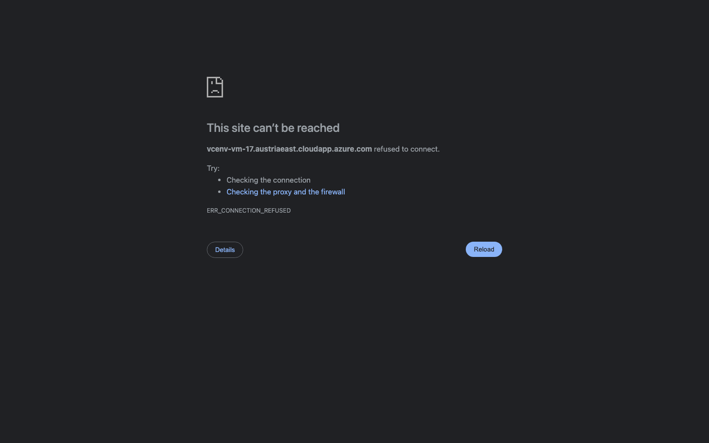

# Student Report — vcenv-vm-17

| | |
|---|---|
| Environment | `vcenv-vm-17` |
| Pi conversation history | Yes — 6 sessions (2026-07-08, 07:46–09:33 UTC) |
| Conversation language | German |
| Project outcome | Elaborate Italian restaurant site ("La Tavola") that was reworked into a 5-star Tuscany hotel ("Villa Romantica") — then the student deleted the whole project and the "restore" left only a minimal placeholder page |
| Live check | ❌ Site unreachable — dev server orphaned, `node_modules`/`package.json` deleted, nothing listening on :8080 |

## Summary

The student ran a long, ambitious, iterative build entirely in German, driving the agent through many small one-line requests to grow a plain starter into a rich Italian restaurant landing page ("La Tavola") — hero, gallery, menu, wine list, dessert menu, Impressum — and then pivoted the whole concept into a luxury Tuscany hotel ("Villa Romantica") with suites, a 5-star restaurant, drinks, and inflated prices. The student even uploaded their own photo (`toskana.jpg`) to embed. All implementation was done by the agent; the student only gave content and styling directions. In the final two sessions the student typed *"lösche alles"* ("delete everything"), which the agent obediently executed — wiping every project file including the build tooling — and then *"wiederherstelle die website"* ("restore the website"), which the agent could only satisfy by writing a fresh minimal placeholder scaffold, since there was no snapshot to restore from. The elaborate work was lost and the site no longer runs.

## How the student worked with the agent

**Approach.** Classic beginner style: many short, goal-oriented, natural-language prompts, one change at a time, no technical vocabulary, and full trust in the agent to implement. The student iterated rapidly on both content ("mehr wein", "alkoholfrei Getränke", "nachspeisenkarte mit tiramisu") and appearance ("neues Design", "verwende ein schönes Baby blau für den Hintergrund", "ändere alle Überschriften blau"). They treated the site like a living document, freely changing its entire identity mid-stream — from a Roman trattoria to a Tuscan luxury hotel — without hesitation. They also discovered how to bring in their own asset, uploading `toskana.jpg` and repeatedly asking the agent to place it ("füge dieses bild ein", "lösche das Bett und füge unser Toskana bild ein !!!").

Characteristic prompts (verbatim, with translations):
- *"erstelle eine Website für ein Italienisches Restaurant"* — "create a website for an Italian restaurant".
- *"verwandle das in ein Hotel in der Toskana mit einem 5 sterne Restaurant"* — "turn this into a hotel in Tuscany with a 5-star restaurant".
- *"mache alle preise um das doppelte teurer"* — "make all prices twice as expensive".
- *"lösche alles"* / *"wiederherstelle die website"* — "delete everything" / "restore the website".

**Problems / friction.**
- **Frequent typos**, consistent with a fast, informal typist: *"füge ein Impressung daz"* (Impressum dazu), *"ändere die Bolder"*, *"mehr traditionelle speisen hizufügen"*, *"fügen eien Buttler hizu"*, *"füge unseer Ausblick bild"*. The agent understood all of them from context.
- **Ambiguous request handled loosely.** *"ändere die Bolder"* was interpreted by the agent as "borders" and it only bumped one CSS variable (`--border` opacity) — a minimal, possibly-not-what-was-meant response (the word could also have been "Bilder"/images).
- **Image path mismatch.** The uploaded file was `toskana.jpg`, but at one point the markup referenced `/toskana-bild.jpg`, so the image would not have displayed until later reconciled.
- **A destructive command taken literally.** *"lösche alles"* caused the agent to `rm -rf` everything except `.git`/`.vite` — including `package.json`, `node_modules`, and the Vite/TypeScript config. The agent asked only whether to also remove hidden files; it did not warn that this would break the project or offer to back up first.
- **"Restore" could not actually restore.** After *"wiederherstelle die website"*, the agent found nothing to recover and simply wrote a brand-new stub reading "Die Website ist wieder da." ("The website is back."). The student's hours of restaurant/hotel work were gone, and the missing `package.json`/`node_modules` were never reinstated, leaving the dev server unable to run.
- Minor agent-side tool noise (an `rg`/ripgrep "No such file" error, a broken-pipe on `find`) — invisible to the student and self-recovered.

**Signals about the student.** A confident, playful beginner who explored the tool fully: many iterations, a bold concept pivot, self-service image upload, and even price/business-detail edits (owner "Detlef Bambini", 10 000 €/night, doubled prices). They clearly enjoyed the creative loop but had no mental model of the project's fragility — that "delete everything" is unrecoverable and destroys the build tooling — which is exactly the kind of gap a non-coder would have.

## The app

The project currently contains only the post-"restore" placeholder (the rich restaurant/hotel version exists only in the conversation history, not on disk):

- `index.html` (289 bytes) — bare Vite shell: `

` and a module script tag; `lang="de"`, title "Website". Agent-written stub.
- `index.ts` (390 bytes) — injects a small "card" via `innerHTML` reading "Die Website ist wieder da." / "Die Grundstruktur von HTML, TypeScript und CSS wurde neu angelegt." plus a dead "Los geht's" link. Agent-written stub.
- `style.css` (1 225 bytes) — a dark blue radial-gradient theme with a single centered glass card (`.page`/`.card`/`.eyebrow`/`.lead`/`.button`). Agent-written stub, competent but generic.
- **Missing:** `package.json`, `package-lock.json`, `tsconfig.json`, `vite.config.ts`, `node_modules/`, `AGENTS.md`, and the uploaded `toskana.jpg` — all deleted by "lösche alles" and never recreated. As a result the site cannot be built or served in its current state.

During the sessions the agent had produced genuinely polished, coherent code (semantic HTML sections, CSS custom properties, responsive grids, tasteful serif/`Inter` typography, glassmorphism) for the restaurant and hotel versions — quality well above the beginner's own ability — but none of that survives on disk.

## Live check

A `vite` process was still listed as running (`ALREADY-RUNNING`), but it is a stale orphan: it points at `node_modules/.bin/vite`, which no longer exists, and nothing is listening on port 8080 (`curl localhost:8080` → `000`). Because the server was already "running", it was left untouched. The public URL http://vcenv-vm-17.austriaeast.cloudapp.azure.com:8080/ is not reachable.

The screenshot shows Chrome's "This site can't be reached — ERR_CONNECTION_REFUSED" error page rather than any website, confirming the dev server is down after the delete/restore.
