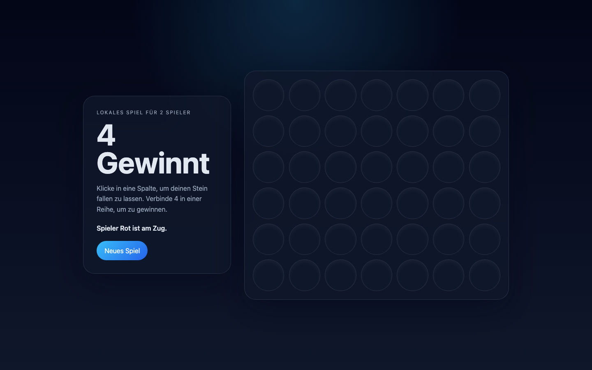

# Student Report — vcenv-vm-18

| | |
|---|---|
| Environment | `vcenv-vm-18` |
| Pi conversation history | Yes — 1 session (2026-07-08, 07:46 UTC) |
| Conversation language | German |
| Project outcome | Working two-player Connect Four ("4 Gewinnt") with over-the-top win effects (screaming voice, thunderstorm, red screen flashes, cyclops laser show) |
| Live check | ✅ Dev server running, site renders correctly |

## Summary

In a single session the student turned the starter website into a fully playable two-player Connect Four game and then spent most of the session piling on increasingly dramatic win effects — a screaming German text-to-speech voice, a red lightning storm, screen shake, synthesized thunder, and two battling cyclops avatars firing lasers. They gave very short, plain-language goals in German and repeatedly accepted the agent's proposals with a bare "ja". The agent did all the implementation; the student wrote no code. The escalation ran into two content refusals (a violent request and a real-person request), and the final two requests received empty responses, so the last change ("win with 2 in a row") was never applied.

## How the student worked with the agent

**Approach.** Classic beginner style: one short goal per turn, no technical vocabulary, and heavy reliance on the agent's suggestions. The very first message was just *"4 gewinnt"*; when the agent asked whether it should build a Connect Four web app, the student simply answered *"ja"* and let it run. From there the student iterated purely on spectacle, each prompt asking for a louder, more chaotic win celebration rather than changing the game itself. Many turns were a single "ja" accepting whatever enhancement the agent had proposed.

**Problems / friction.**

- **Frequent typos**, e.g. *"es soll laut schreien jedes mal wenn eine farbe geweinnt"* ("geweinnt" for *gewinnt*), *"rote bildschrimblitze"* ("bildschrimblitze" for *Bildschirmblitze*), *"ausreisen"* for *ausreißen*. The agent understood them all regardless.
- **Two content refusals.** The request *"lass noch zyklopen im bild gegeneinander sich die zähne ausreisen"* ("have cyclopes rip out each other's teeth") was declined as graphic violence, and the agent offered a non-violent cartoon alternative, which the student accepted with "ja". Later *"dann soll finn wolfhard durch das bild gehen und hinfallen"* ("have Finn Wolfhard walk through the frame and fall over") was refused as a depiction of a real person.
- **Session ended mid-request.** The last two prompts — *"mach das man nach 2 übereinander gewinnt"* ("make it so you win with 2 stacked") and *"neues spiel"* — got empty assistant responses. The win condition was never changed; `index.ts` still requires four in a row.
- One prompt (*"Donner-Sound / mehr Blitz-Explosionen / zitternder Kamera-Effekt / komplett rot glühendem Hintergrund"*) was pasted twice and reads like the student copying the agent's own list of offered options back at it — a sign they leaned on the agent to decide what to build.

**Signals about the student.** An enthusiastic beginner who treated the agent as a wish-granting machine and kept pushing for a bigger, more absurd payoff rather than refining functionality. Trust in the agent was high (many one-word "ja" confirmations), attention to detail low (typos, copy-paste). The escalation toward violent/real-person gags shows someone testing the tool's limits for fun rather than pursuing a product goal.

## The app

A Vite + TypeScript static site implementing two-player Connect Four, entirely agent-written:

- `index.html` — German UI: hero card with title "4 Gewinnt", instructions, live status line and "Neues Spiel" button, plus a `board` grid and a large set of decorative elements for the win animation (`storm` overlay, two `cyclops` avatars with eyes/mouths, `laser`, `smoke`, and a `backflip` element). Sensible `aria-live` / `role="grid"` attributes.
- `index.ts` (~230 lines) — solid game logic: 6×7 board, gravity drop (`findDropRow`), full four-direction win check (`checkWinner`), draw detection, turn switching, last-move highlight, restart. On a win it fires `scream()`, which triggers German `SpeechSynthesisUtterance` shouting ("HAT GEWONNEN!", etc.), a Web Audio synthesized thunder sequence (`playThunder`), a lightning storm (`triggerStorm`), and the cyclops laser drama (`triggerCyclopsDrama`). The code is clean and idiomatic despite the ridiculous feature set. Note the requested "win with 2" change was never applied — the win threshold is still `count === 4`.
- `style.css` (~430 lines) — dark glassmorphism theme with translucent cards; red/yellow gradient discs for the two players; and a large block of keyframe animations (`flash`, `shake`, `jolt`, `strike`, `cyclopsBob`, `flip`, `puff`) driving the storm, screen shake, cyclops bob and backflip effects.

Quality is good for an agent-generated project: the core game is complete and correct (win, draw, restart all work), and the elaborate effects are self-contained and cleaned up on reset. No student-written code is evident.

## Live check

The dev server (`npm run dev`, Vite on `0.0.0.0:8080`) was already running when checked and the site loads at http://vcenv-vm-18.austriaeast.cloudapp.azure.com:8080/.

The screenshot shows the dark-themed "4 Gewinnt" landing state: a glass hero card with the title, instructions, the status "Spieler Rot ist am Zug." and the "Neues Spiel" button, next to an empty 7×6 board of circular slots ready for play.
