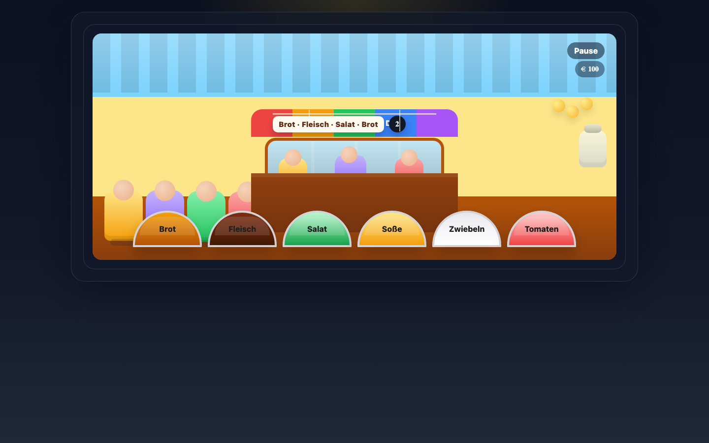

# Student Report — vcenv-vm-19

| | |
|---|---|
| Environment | `vcenv-vm-19` |
| Pi conversation history | Yes — 16 sessions (2026-07-08, 07:42–09:59 UTC) |
| Conversation language | German |
| Project outcome | Working "Döner-Stand" (kebab-stall) time-pressure game; pushed to GitHub as `foodstand` |
| Live check | ✅ Dev server already running, site renders correctly |

## Summary

Over 16 back-to-back sessions in a single ~2.5-hour sitting, the student explored several game ideas — first "Mensch ärgere dich nicht", then Tic-Tac-Toe, then an obstacle-runner — before settling on an original concept: a Döner (kebab) stand where the player assembles orders from ingredient bowls against a timer for money. The bulk of the work was iterative refinement of that one game: dozens of tiny, plain-language change requests about layout, scoring, the timer, colors and the order-ticket. The student never wrote or read code themselves; they drove entirely by describing what they wanted and reacting to the running result. The final app is a polished, fully working game that they had the agent publish to GitHub via the `gh` CLI.

## How the student worked with the agent

**Approach.** The student worked as a pure "director": short, informal German requests, one idea at a time, no technical vocabulary. Early sessions show a beginner testing what is possible ("geht das?" — "is that possible?") and freely discarding whole projects ("lösche das tic tac toe", "lösche das mensch ärger dich nicht"). Once committed to the Döner idea, they iterated in very small increments, watching the live site and asking for the next tweak — an extremely tight feedback loop of tens of micro-prompts. Characteristic prompts:

- *"erstelle mir ein mensch ärger dich nicht. geht das?"* ("create me a 'Mensch ärgere dich nicht' [board game]. is that possible?")
- *"erstelle ein Spiel in dem man döner machen kann"* ("create a game in which you can make döner")
- *"die Schrift soll im Bildschirm weg sein nur der Bestellzettel und die Zutaten sollen eine Schrift haben"* ("the text on the screen should go away, only the order-ticket and the ingredients should have text")

Requests grew steadily more precise as the game matured — scoring rules ("man starten mit 100 Punkte für jede fertige bestellung bekommt man zusätzlich 10 Punkte…"), timer behaviour ("nach anhalten der zeit nicht die zeit zurücksetzten sonder von der zeit an der man angehalten hat weiter spielen"), and ordering constraints ("man kann die zutaten nur in der angegeben reihenfolge anklicken") — showing the student learning to specify behaviour explicitly.

**Problems / friction.** Mostly small, and largely on the tooling/agent side rather than blocking the student:

- Heavy spelling/typing errors throughout ("tik tak toe", "komputer", "strichmensch", "Hindernisslauf", "ounkte", "frabe", "zurücksetzten"). The agent understood them all regardless.
- A `/quit` typo — the student typed `quite`, the agent asked for clarification, then the student sent `quit`.
- The timer feature caused repeated churn: it was added, removed, re-added and re-tuned many times across sessions ("lösche den timer" → "es soll ein 15 sekunden timer sein" → "timer entfernen" → "10 sekunden timer hinzufügen"), reflecting the student changing their mind rather than any failure.
- One real runtime bug surfaced, and the student handled it well: they pasted the raw browser console error back to the agent — *"Es tritt beim Klicken auf die Zutaten dieser Fehler auf: …Uncaught ReferenceError: gameOver is not defined"* — and the agent fixed it (the final `index.ts` declares `gameOver` correctly).
- In the final git session the agent stumbled on `gh`/git details (committed on `master`, tried a non-existent `--branch` flag, hit "repository not found") but self-recovered: it ran `git branch -M main` and `gh repo create foodstand --public --source=. --push`, successfully publishing to `github.com/magdalenafuchs68-cell/foodstand`.

**Signals about the student.** A genuine no-code beginner who is nonetheless persistent, product-minded and unafraid to iterate. They think entirely in terms of visible behaviour and appearance ("das fenster soll größer sein", "der tresen soll kleiner sein", "die farbe bei Zwiebel soll weiß sein"), not code. They abandoned three earlier game ideas without hesitation and then showed real stamina refining a single game across a dozen sessions. Notably, they knew to copy a console error message back to the agent to get a bug fixed, and finished by asking for the project to be shipped to GitHub — a sign of wanting a real, sharable result.

## The app

A Vite + TypeScript static site: a single-screen "Döner-Stand" game. Entirely agent-written, but shaped move-by-move by the student's requests.

- `index.html` — the scene as pure markup: a market stall with a striped awning ("DÖNER STAND"), a customer queue and customers visible through a window, a counter, an order-ticket on a string with a timer, a score display (€ 100), Pause / Neustart / Servieren buttons, and a bar of six ingredient bowls (Brot, Fleisch, Salat, Soße, Zwiebeln, Tomaten). German throughout.
- `index.ts` (~280 lines) — the game logic: 20 predefined orders, an ingredient `stack` the player builds by clicking bowls, order-matching that must respect the exact sequence, live green highlighting of matched items on the ticket, a countdown timer that shortens each round to ramp difficulty, scoring (+10 correct, −5 wrong ingredient, −20 on timeout, "verloren" at 0), pause/resume that preserves remaining time, and restart. Reasonably structured with small named functions; the earlier `gameOver` bug is fixed.
- `style.css` (~427 lines) — an elaborate hand-styled scene: awning stripes, gradient sky, wooden counter, rounded ingredient "bowls" in distinct colors, customer silhouettes, the hanging ticket, and animated states (`selected`, `served`, `paid`). This is where most of the student's per-prompt tweaks landed (colors, sizes, positions, which text is visible).

Quality is solid for a beginner-directed project: the game is coherent and fully playable, though the CSS carries some leftover complexity from the many revert/re-add cycles (e.g. remnants around removed on-screen text).

## Live check

The dev server (`npm run dev`, Vite on `0.0.0.0:8080`) was already running when checked and the site loads at http://vcenv-vm-19.austriaeast.cloudapp.azure.com:8080/.

The screenshot shows the finished game: a bright kebab stall with a striped awning, customers queued and framed in the window, the order-ticket "Brot · Fleisch · Salat · Brot" with a countdown, a Pause button and € 100 score, and the row of six clickable ingredient bowls along the counter.
