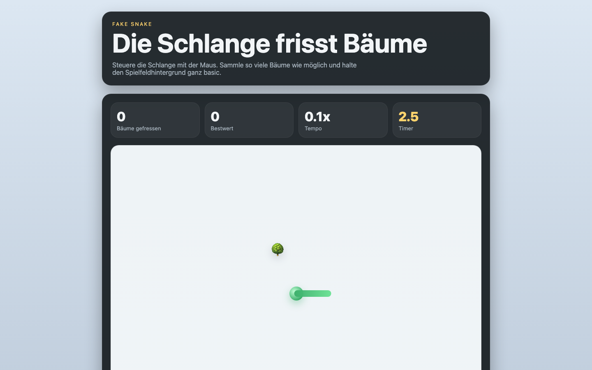

# Student Report — vcenv-vm-20

| | |
|---|---|
| Environment | `vcenv-vm-20` |
| Pi conversation history | Yes — 9 sessions (2026-07-08, 07:42–09:45 UTC) |
| Conversation language | German |
| Project outcome | "Fake Snake" — a mouse-controlled snake that eats trees; renders, but gameplay is broken by an unresolved runtime bug |
| Live check | ✅ Dev server running, start screen renders correctly |

## Summary

Over nine sessions the student cycled rapidly through many playful game ideas — a tree-shredder, a "find the perfect wife for Magguschhh" designer, a fishing game, a fake HayDay clone — before settling on "Fake Snake", a game where a mouse-steered snake eats trees against a plain background. They gave short, imaginative, high-level prompts in German and let the agent implement everything. The snake game grew feature by feature (game over / you won, snake grows per tree, wiggle movement, 2.5-second timer, rare "steak" power-ups, spacebar start), but then a regression appeared: the snake stopped following the mouse. The final third of the history is a long, ultimately unsuccessful debugging effort in which the agent poured huge amounts of `console.log` debug output into the code without ever finding the actual root cause — a one-character property bug (`state.snake.target.x` instead of `state.target.x`) that crashes the animation loop as soon as the game starts. The student's engagement faded at the very end into gibberish and vague one-word replies.

## How the student worked with the agent

**Approach.** The student worked in a fast, playful, goal-oriented style: one plain-language idea per turn, no technical vocabulary, lots of confirmations ("ja"). They treated the agent as an idea-executor and iterated on gameplay feel ("noch schwieriger mit mehr bäumen", "die snake soll pro gegessenem baum länger werden", "die schlange soll schlängelbewegungen machen"). Ideas were creative and personal — several featured in-jokes and names of friends (Magguschhh, Lorena, Isabel) and cultural references (hobby horsing, hobby dogging). When things broke, the student stayed with the agent and even proposed a real debugging strategy of their own.

- **Session 1** — *"erstelle ein spiel wo man bäume schreddern kann"* ("create a game where you can shred trees"). Iterated toward realism and background runners bringing new trees, then "o no" and abandoned it.
- **Sessions 2–4** — three completely different game concepts in quick succession (partner-designer, fishing, fake HayDay), each a fresh one-line pitch.
- **Session 5** — *"erstelle ein Fake Snake spiel wo die snake bäume essen muss und man muss sie mit der maus steuern und der hintergrund soll basic sein"* — the concept that stuck; built up over several tightening requests.
- **Sessions 6–9** — a drawn-out fight with the "snake no longer follows the mouse" regression, plus a `fix build errors` session after the file was left syntactically truncated.

**Problems / friction.** This student hit far more friction than a typical beginner, mostly on the agent's side:

- **A genuine, unresolved bug.** After the growth/steak features were added, the snake stopped following the mouse. The real cause was a typo in the animation loop — `state.snake.target.x` (which is `undefined.x` and throws every frame the game is running). The agent never identified it; instead it added round after round of debug logging (`[snake-debug] ...` messages litter the entire file to this day) and kept guessing at causes (spacebar start, Vite cache, CSS blocking movement). The student patiently followed instructions, checked the console, and even offered the server URL for the agent to `curl`.
- **Debug console confusion.** The console appeared empty because the logs used `console.debug` (filtered by default); a whole exchange was spent switching to `console.log` and telling the student to enable "All levels".
- **A broken build.** One session left `index.ts` truncated mid-function (`Expected } but found EOF`); a separate `fix build errors` session was needed to close the handler and re-add the `animate()` call.
- **Tooling errors on the agent side**, invisible to the student: `hypa_grep` repeatedly failed with `rg ... No such file or directory`.
- **Typos and slash-command confusion**: the student wrote `/New` and `/new#` trying to start a fresh session, and repeatedly misspelled "Schlange" as *"schlanben" / "schlanbe" / "schlagne"*.
- **Disengagement at the end.** The final session trails off into *"xccxdqw cqse xwesc vsde"* (keyboard mashing), then one-word replies ("jam", "ja"), and the agent looping back with "what exactly do you need help with?" — the mouse-follow bug was never fixed.

**Signals about the student.** A creative, energetic beginner who is great at generating ideas but has no way to judge or verify the agent's technical work. They accept whatever is produced, iterate on it verbally, and when it breaks they can describe the symptom well (*"Die Schlange folgt der Maus nicht mehr"*) but depend entirely on the agent to diagnose it. One notably mature moment: *"Leider nicht, wie können wir den Fehler am besten finden? Willst du Debug Output einbauen"* ("No luck, how can we best find the bug? Do you want to add debug output") — the student proposed the debugging approach the agent then (unsuccessfully) ran with. The long, fruitless debug loop clearly wore them down, ending in disengagement.

## The app

A Vite + TypeScript static site — "Fake Snake", a single-screen arcade game. Entirely agent-written; the student never edited code directly.

- `index.html` — German UI: hero header ("Die Schlange frisst Bäume"), a four-tile stats row (Bäume gefressen / Bestwert / Tempo / Timer), a playfield containing the snake, a tree emoji 🌳, a hidden steak emoji 🥩 and a cursor hint, plus a message line, an overlay for GAME OVER / win, and a "Neu starten" button. Clean and reasonable markup. (Note: two emoji show as mojibake in the raw file, `ð³`/`ð¥©`, though the served page renders them correctly.)
- `style.css` — a polished dark-card / light-playfield theme: gradient background, rounded translucent cards, a gradient grid on the playfield, a radial-gradient snake head with a tail pseudo-element and wiggle rotation, win/lose overlay colours, responsive breakpoint. Good visual quality for a beginner project.
- `index.ts` (~260 lines) — the game loop: `requestAnimationFrame` animation, mouse/pointer steering, a per-tree 2.5-second countdown, snake-grows-on-eat, rare steak power-ups, best-score persistence via `localStorage`, spacebar-to-start. **The file is saturated with `[snake-debug]` `console.log` statements** left over from the failed debugging effort — it is not clean production code. Critically, it still contains the root-cause bug on the steak-distance line: `Math.hypot(state.snake.x - state.snake.target.x, ...)` references `state.snake.target`, which does not exist, so the animation loop throws a `TypeError` on the first playing frame. This is why the snake never moves once the game starts — the bug the agent never found.

The result is a good-looking start screen backed by non-functional gameplay: the game renders but crashes the moment you press space to play.

## Live check

The dev server (`npm run dev`, Vite on `0.0.0.0:8080`) was already running when checked and the site loads at http://vcenv-vm-20.austriaeast.cloudapp.azure.com:8080/. It was left running (not started by this review).

The screenshot shows the polished start screen — title, the four stat tiles (0 / 0 / 0.1x / 2.5), and the light playfield with a tree emoji and the green snake head-and-tail — which renders cleanly; the underlying gameplay bug only manifests once the game is started with the spacebar.
