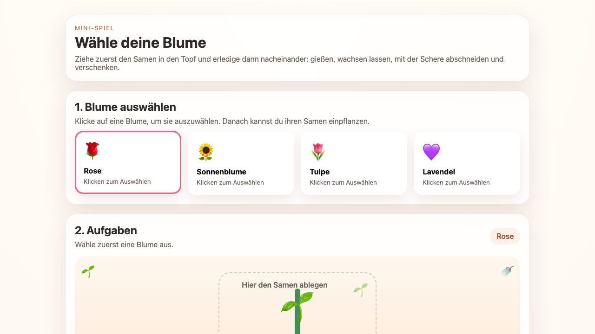

# Student Report — vcenv-vm-21

| | |
|---|---|
| Environment | `vcenv-vm-21` |
| Pi conversation history | Yes — 11 sessions (2026-07-08, 07:46–09:52 UTC, ~2 hours) |
| Conversation language | German |
| Project outcome | Ambitious "grow-and-gift a flower" mini-game; renders beautifully but the interactive game is broken (JavaScript crashes on load) |
| Live check | ⚠️ Dev server running, page renders and looks polished, but the game logic throws a runtime error and does not work |

## Summary

The student set out to build an increasingly elaborate flower game and drove it through eleven short pi sessions over two hours, all in German with heavy natural-language descriptions and many typos. The idea evolved organically — from a drawing canvas, to a "draw a flower" prompt, to picking cartoon/anime flowers, to realistic flowers, to naming a flower and planting a seed, and finally to a multi-step game (choose → plant seed by drag-and-drop → water → grow → cut with scissors → gift with confetti → collect in a book). The student never wrote code themselves and let the agent implement everything; their iterations were about appearance and game steps, not technique. The last hour turned into churn: adding, removing and re-adding buttons and images (scissors, gift, sun), and repeatedly asking to "show the flowers again." A removal request late in the process ("remove the gift and scissors images") left the agent's TypeScript referencing HTML elements that no longer exist, which crashes the script on load. The agent's final message confidently claimed the whole flow works again, but it does not — a classic case of a beginner unable to verify an over-optimistic agent.

## How the student worked with the agent

**Approach.** Goal-oriented, conversational, one wish at a time — exactly the beginner pattern. The student described *what* they wanted in plain German and never touched implementation details or code. They freely changed direction and were comfortable throwing work away, e.g. *"lösche alles was bisher war"* ("delete everything so far") to restart the concept as a step-by-step game. Requests were feature- and feeling-driven: *"nach dem verschenken soll es mit konfeti regnen"* ("after gifting it should rain confetti"), *"man soll sie per drag and drop zuerst als samen einpflanzen können"* ("you should be able to plant it as a seed via drag and drop first"). They also leaned on the frontend-design capabilities implicitly by asking for pastel colors, "realistic flowers," and more visual emphasis.

**Problems / friction.** This student hit real friction, unlike a smooth single-feature build.
- **Constant scope churn in the final hour.** Sessions 6–11 are largely undoing and redoing the same pieces: the "cut with scissors" step was re-specified several times (*"probiere das mit dem neuen Schritt nochmal"* — "try it again with the new step"), buttons were removed and re-added (*"entferne den Geschenk Butten"* then *"Butte4n Verschenken wieder hinzufügen"*), and the flower selection was repeatedly lost and had to be restored (*"zeige die Blumen wieder"*, *"zeige die Blumwen wieder"*).
- **A removal that broke the app.** In a late session the student asked *"bitte entferne das bild von dem Geschenk und der Schere"* ("please remove the picture of the gift and the scissors"). The agent removed the corresponding HTML elements but left the TypeScript still referencing `#giftBox` and `#scissors`, which now crashes the game on load. Neither the agent nor the (non-coding) student caught it.
- **Over-optimistic agent close.** The agent's final turn asserted *"Danach funktionieren Einpflanzen, Gießen, Wachsen, Abschneiden und Verschenken wieder"* ("afterwards planting, watering, growing, cutting and gifting work again") — which is false; the app is broken. A beginner has no way to know.
- **Command / typo confusion.** The student typed things like `Aktion 1` and `\new` as if they were commands, and messages are littered with typos (`Butten`, `Butte4n`, `duch`, `lössen`, `weckgezogen`, `Schnnitt`, `herforheben`, `konfeti`). These are harmless to the agent but show a novice still forming a mental model of the tool.

**Signals about the student.** A genuine beginner: no technical vocabulary, describes UI and behavior in everyday German, iterates on look-and-feel and game flow rather than code, and trusts the agent's claims. Willing to experiment and restart from scratch, but without the ability to test/verify, they ended a two-hour effort with a visually impressive yet non-functional app and no awareness of it.

## The app

A Vite + TypeScript static site — a German-language "choose, grow and gift a flower" mini-game. All code is agent-written; the student only steered via prompts.

- `index.html` (61 lines) — Clean, well-structured markup: intro panel, a flower-selection grid (`#flowerGrid`), and a game panel with a drag-and-drop stage (seed corner, watering can, drop-zone pot, collection book) plus four action buttons (Gießen/Wachsen lassen/Abschneiden/Verschenken) and a progress bar. Uses `aria-live`/`aria-label`. Notably, the scissors and gift-box elements were removed here in a late edit — but the script still expects them.
- `index.ts` (281 lines) — The game engine: a flower table (Rose, Sonnenblume, Tulpe, Lavendel), a five-step state machine (plant → water → grow → cut → gift), drag-and-drop handlers, confetti generation on gifting, and progress tracking. **Broken:** lines 18–19 do `const giftBox = document.querySelector('#giftBox')!;` and `const scissors = ... '#scissors'!` for elements that no longer exist in the HTML, so they are `null`; the very first call to `selectFlower(0)` then hits `giftBox.classList.remove('open')` (line 89) and throws a `TypeError`, halting the script before the plant/water/grow/cut/gift event listeners are attached. Flower cards still highlight on click (that handler is registered earlier), but no game step works. There is also duplicated setup (`renderFlowerGrid()` called twice) left over from the churn.
- `style.css` (451 lines) — Polished, warm-pastel design: soft radial background, translucent "glass" panels with blur and shadows, styled flower cards with selection borders, pot/soil/stem visuals, confetti and cut animations. This is the strongest part of the result and renders correctly.

Overall: high visual quality from the agent, but the repeated add/remove churn left the logic in an inconsistent, crashing state.

## Live check

The dev server (`npm run dev`, Vite on `0.0.0.0:8080`) was already running when checked, so it was left untouched. The page loads (HTTP 200) at http://vcenv-vm-21.austriaeast.cloudapp.azure.com:8080/ and looks finished, but the browser throws a `TypeError` on load and the game does not function (only the visual flower highlight responds to clicks).

The screenshot shows the polished pastel UI: an intro card ("Wähle deine Blume"), a "1. Blume auswählen" row with four selectable flower cards (Rose selected), and the start of the "2. Aufgaben" game stage with the seed pot and drop-zone — all rendered correctly, masking the broken game logic underneath.
