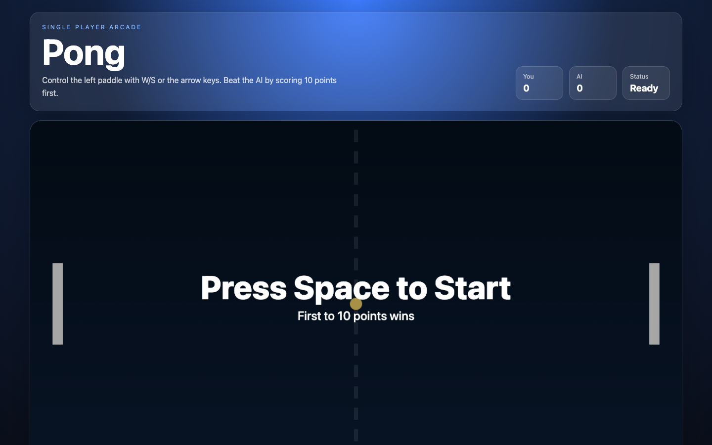

# Student Report — vcenv-vm-22

| | |
|---|---|
| Environment | `vcenv-vm-22` |
| Pi conversation history | Yes — 30 sessions (2026-07-08, 07:47–09:53 UTC) |
| Conversation language | Mixed — started German, switched to mostly English, German again at the end |
| Project outcome | Working single-player Pong game (player vs. AI paddle) |
| Live check | ✅ Dev server running, site renders correctly |

## Summary

This student was highly exploratory: across 30 short sessions in roughly two hours they asked the agent to build a huge variety of games — Connect Four, Snake, Tic-Tac-Toe, Pac-Man, a horror maze, Dungeons & Dragons, Minecraft, a dressing/dress-up game, Uno, the Chrome dino game, zombie shooters, a cat-feeding game, Memory, Hello Kitty, a cooking game, Lego building, Tetris, a forest survival/labyrinth game, Geometry Dash, several Roblox-style "obby" jump games, a two-player Fireboy-and-Watergirl clone, and chess — before finally settling on Pong. Each new idea usually meant a fresh session (via `/clear` or `/new`), so the current website is simply whatever the last request produced. The student gave very short, goal-only prompts and let the agent do all implementation; they rarely iterated deeply on any single game, instead abandoning it and jumping to the next idea. At one point they explicitly asked the agent "welche spiele kann ich machen" ("which games can I make") and "was soll ich machen" ("what should I do"), and the agent's suggestion of Pong is what became the final app.

## How the student worked with the agent

**Approach.** Fast, breadth-first, and idea-driven. The student typed one plain-language game request per session — no technical vocabulary, no file names, no implementation detail — accepted whatever the agent produced, and then moved on to a completely different game rather than refining. A minority of sessions show iteration on a single game, and those are the most detailed prompts: for the zombie game they followed up with *"the person should move, zombie animations, better gun recoil, health bar and score only adds once they kill a zombie"*, and for Geometry Dash they nudged the physics (*"make the jump higher"*, *"make the distance of things higher"*, then *"puut it like it was before"* to undo a change they disliked). Most sessions, though, were a single throwaway prompt.

**Problems / friction.**

- **Frequent typos**, consistent with fast, casual typing: `ölooks` (looks), `ür` (für), `gfloor` (floor), `wiuth` (with), `puut` (put), `fot` (for), `srry` (sorry), and `/nwe` instead of the `/new` command.
- **An unexplained error moment.** In the second session, after requesting a Dungeons & Dragons game, the student typed *"what error?"* — apparently reacting to something broken on screen. The agent's final turn there was effectively empty; the student gave up on that session and simply re-issued *"make a dungeon and dragons game thank you"* in a brand-new session.
- **Uncertainty about direction.** Near the end the student asked the agent for help deciding what to do at all (*"was soll ich machen"*, *"welche spiele kann ich machen"*), showing they had run out of their own ideas and leaned on the agent to propose options.
- **Content guardrails.** Requests for a "horror game" and realistic zombie/killer games were gently reframed by the agent into non-graphic, spooky web-game versions; the student went along with this without pushback.
- **Rapid session churn** meant almost none of the games were polished — the value was in the exploration, not in a finished product until the final Pong.

**Signals about the student.** A curious beginner treating the agent as an instant game generator: pop-culture and kid-friendly references dominate (Hello Kitty, Roblox obby, Fireboy & Watergirl, Geometry Dash, Minecraft), suggesting a young or games-oriented user. They trust the agent completely, never inspect or edit code themselves, and measure success by "does a game appear." Characteristic prompts: *"Mach ein 4 gewinnt spiel"* ("Make a Connect Four game"), *"make a cooking game where a chef person serves food his customer like pizza, ramen, pancakes, muffin background is the kitchen and dialog options ... and animations"*, and *"welche spiele kann ich machen"* ("which games can I make"). The final working app came directly from taking the agent's Pong suggestion.

## The app

A Vite + TypeScript static site implementing single-player Pong (player vs. AI), entirely agent-written in the final session (*"ping pong game for 1 player"*):

- `index.html` — English arcade UI: "Single Player Arcade / Pong" header, control instructions, a live scoreboard (You / AI / Status), a `<canvas id="game">` game board with `aria-label`, a help line, and a Restart button.
- `index.ts` (~230 lines) — a complete, well-structured game loop: typed `Paddle`/`Ball`/`GameState`, `requestAnimationFrame` loop with delta-time, player paddle on W/S or arrow keys, an AI paddle that tracks the ball at a capped speed, circle-vs-rectangle collision with angle-based bounce off paddle hit position, wall bounces, serving with randomized angle, scoring to 10 with win/lose states, canvas overlay text ("Press Space to Start" / "You Win!" / "AI Wins"), and Space/click/Restart controls. Clean and idiomatic — clearly agent-authored, not beginner code.
- `style.css` — dark blue arcade theme: radial-gradient background, glassmorphism topbar and game shell (blur, translucency, rounded corners), responsive canvas via `aspect-ratio: 16/9`, a gradient Restart button, and a mobile breakpoint.

The code is coherent and the game is fully playable (start, scoring, win/loss, restart all handled). There is no evidence of student hand-editing.

## Live check

The dev server (`npm run dev`, Vite on `0.0.0.0:8080`) was already running when checked and the site loads at http://vcenv-vm-22.austriaeast.cloudapp.azure.com:8080/. I left it running.

The screenshot shows the Pong start screen: the "Pong / Single Player Arcade" header, a You/AI/Status scoreboard all at 0/Ready, two white paddles and a dashed center line on a dark board, the ball at center, and the "Press Space to Start — First to 10 points wins" overlay.
