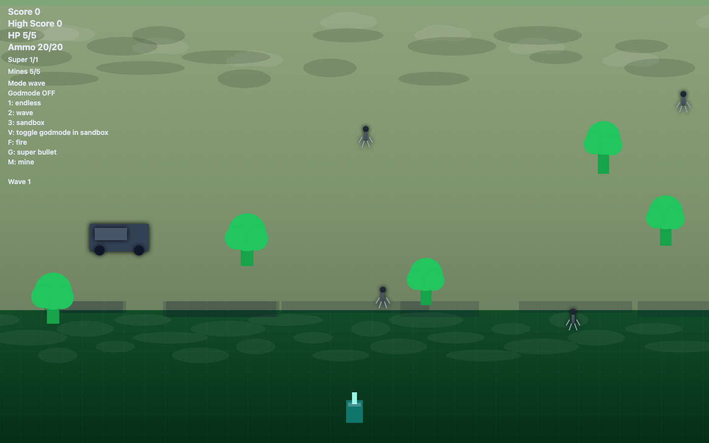

# Student Report — vcenv-vm-23

| | |
|---|---|
| Environment | `vcenv-vm-23` |
| Pi conversation history | Yes — 19 sessions (2026-07-08, 07:46–10:04 UTC) |
| Conversation language | English (heavily typo-laden); final request in German |
| Project outcome | Elaborate top-down "Tank Battle" arcade game (canvas), pushed to GitHub |
| Live check | ✅ Dev server running, game renders and plays correctly |

## Summary

Over roughly two and a half hours and 19 short pi sessions, the student built a surprisingly deep browser game. They started with a Doodle Jump clone ("create doode jump"), iterated on it heavily, then abandoned it mid-way and pivoted to a top-down tank shooter that grew — one small feature request at a time — into a full "Tank Battle" game with three modes (endless, wave, sandbox), mines, a charged "super bullet", pickups, obstacles (trees/trucks/infantry), a lobby, an Esc pause menu, high scores, and a godmode. The student never wrote code themselves; they drove everything through a long stream of very short, informal natural-language instructions and relentless bug-report follow-ups. The final session asked the agent (in German) to create a `.gitignore`, make a GitHub repo via the `gh` CLI, and push — which succeeded to `github.com/David463038/tankbattle`.

## How the student worked with the agent

**Approach.** Pure conversational, feature-at-a-time driving. The student almost never asked for more than one small change per message and let the agent handle every implementation detail. They think in terms of game behavior, not code: "make the tank fire with space and lay mines with m", "add a ammo counter the player shouldn´t be able to shoot without ammonition starting ammo should be 5", "add a new mechanic that allows you to charge up a super charged bullet". They frequently corrected the agent's course in tiny increments ("make the starting ammo counter 10", "max ammo should be 20"). The scope grew organically — there was no upfront plan; each session added or fixed one thing. Notably the student twice restarted from scratch: after growing frustrated with Doodle Jump they asked to "make a new game without deleting the old one make it so that you can choose between them", then "make the game (not doode jump) completly empty", then "create a tank game".

**Problems / friction.** This transcript is dominated by friction, and it is a good window into a beginner's experience:

- **Persistent bug loops.** The student repeatedly hit issues that took many back-and-forth turns to resolve, restating the same complaint in slightly different words: enemy bullets not hitting the player ("they still should to the bottom make it shoot me" → "they should hit the player" → "the bullets from the enemies should hit me" → "they are flying in the opposite direction"); a health/game-over bug ("i have a bug with the health fix it" → "its still there" → "the bug is still there with 0 hp" → "it keeps wiggling at the end fix it" → "remove any remaning wobbling"); sandbox enemies refusing to act ("they still wont fire or move" → "they still dont move nor fire in sandboxmode"); and a hard crash near the end ("the game crashes when iam using f fix that" → "still crashes" → "still crahses").
- **Vocabulary gaps and typos everywhere.** The student is clearly not a native English speaker and typed fast: "bitter" for "bigger" ("make the battle area bitter", "make the battle area way bitter it should take up the entire screen"), "obsticals", "ammonution", "dissapear", "seperate", "visable", "crahses". The agent generally inferred intent correctly despite this.
- **UI-nudging micro-iterations.** A whole session was spent nudging a HUD label around: "the text on the side gliches a little fix that" → "that sandbo text" → "move it to the bootom but it should be only visable only in sandboxmode" → "make it to the side not the bottom" → "remove the black box" → "to the left side" → "under m mine".
- **Trust-but-verify moments.** At one point the student pushed back on the agent: "already did that look at the code", showing they were at least tracking whether requests had actually landed.

**Signals about the student.** A genuine beginner with strong game-design intuition and a lot of persistence. They knew exactly what game feel they wanted (recoil removal, mouse aiming, wave scaling, drop tables, a sandbox with godmode) and kept pushing until each piece worked, tolerating long debugging loops without giving up. They have essentially no coding vocabulary — everything is described in player-facing terms — and no apparent awareness of the underlying code, aside from the one "look at the code" nudge. The switch to German for the final Git/GitHub request ("bitte erstelle eine passende .gitignore, lege über die gh cli ein repo namens tankbattle an und pushe alles auf main" — "please create a suitable .gitignore, create a repo called tankbattle via the gh CLI and push everything to main") confirms German as their first language and shows they understood, at a high level, that the finished work should be version-controlled and published.

## The app

A Vite + TypeScript single-canvas game. Everything visible is agent-written; the student only ever issued instructions.

- `index.html` — Minimal: a single `<canvas id="game">` inside a `.game-shell`, title "Tank Battle", loads `/index.ts` as a module. The original starter heading/paragraph were replaced entirely.
- `index.ts` (~1070 lines, 35 KB) — The whole game. A `requestAnimationFrame` loop with `update(dt)`/`render()`; state machine (`lobby` / `playing` / `paused` / `gameover`); three game modes (`endless`, `wave`, `sandbox`); player tank with WASD movement and mouse aiming; normal fire (F), a piercing "super bullet" (G) with an explosion radius, and mines (M); enemy tanks that chase and shoot; obstacles (trees, trucks with a custom hitbox, infantry); heal/ammo pickups and rare super-ammo/mine boxes; screen shake, explosions, terrain/sky/grid rendering; per-mode high scores; and a sandbox godmode (V) plus manual enemy spawning (C). The code is coherent and works, but shows its incremental origin: lots of duplicated drop-table blocks, defensive `Number.isFinite` guards scattered around the fire logic (residue from the crash-fixing sessions), some dead variables (`chargeTimer`, `chargingShot`, `gameOver` tracked redundantly with `gameState`), and an `ctx.antialias = 'gray' as any` non-standard assignment. Functional quality is high for a beginner-driven project; internal tidiness is what you'd expect from ~40 stacked one-line feature requests.
- `style.css` — Small: dark theme, full-viewport canvas (`100vw`/`100vh`), radial-gradient page background. The canvas fills the screen so the CSS does little beyond layout.
- `.gitignore` — Added in the final session (node_modules, dist, .vite, logs).

The project was committed and pushed to GitHub (`origin` → `github.com/David463038/tankbattle`, single "Initial commit"). Note the commit includes the `.pi/` skills folder and `AGENTS.md`, since the agent ran `git add .` from the project root.

## Live check

The dev server (`npm run dev`, Vite on `0.0.0.0:8080`) was already running when checked, so it was left untouched. The site loads (HTTP 200) at http://vcenv-vm-23.austriaeast.cloudapp.azure.com:8080/.

The screenshot shows the game running in wave mode: the full HUD (Score, High Score, HP 5/5, Ammo 20/20, Super, Mines, mode/controls legend, "Wave 1"), a green battlefield with trees, a grey truck and several infantry figures scattered across the field, and the teal player tank at the bottom center — confirming the game renders and is playable.
