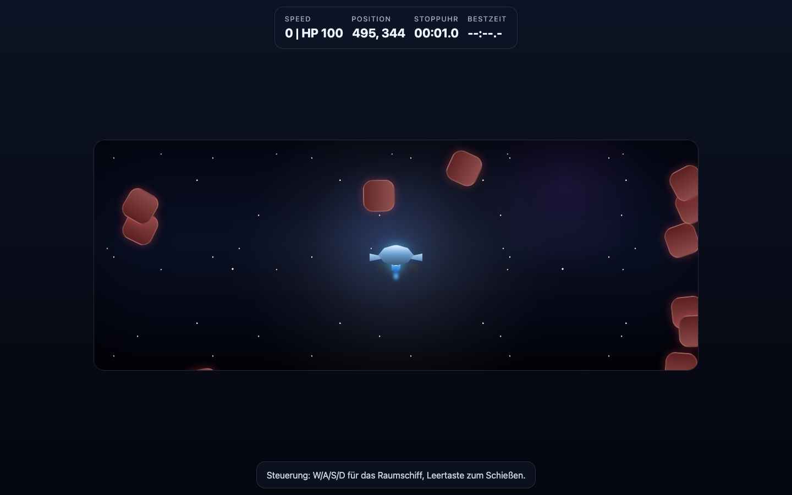

# Student Report — vcenv-vm-24

| | |
|---|---|
| Environment | `vcenv-vm-24` |
| Pi conversation history | Yes — 14 sessions (2026-07-08, 07:42–09:38 UTC, ~2 hours) |
| Conversation language | German |
| Project outcome | A browser survival game: a glowing spaceship dodging waves of red enemies, with stopwatch, best-time saving and synthesized background music |
| Live check | ✅ Dev server already running, site renders correctly |

## Summary

The student spent about two hours across 14 short pi sessions building a single arcade game, giving one-line German instructions and letting the agent do all the coding. The most striking feature is how radically the concept drifted: it began as a first-person "egoshooter", became a top-down tank game, was restarted from scratch several times, turned into a side-view 2D driving game with a jeep in the desert, and finally landed as a top-down spaceship survival game. The student never wrote code themselves and never specified implementation details — they steered purely by naming features to add, remove or fix ("füge … hinzu", "lösche …", "behebe den error"). Progress was incremental and iterative, with frequent small course corrections and a few dead ends (repeated "start over" requests, build errors the agent had to fix, and a failed attempt to use copyrighted YouTube music).

## How the student worked with the agent

**Approach.** The student worked in a fast, feature-at-a-time style: very short imperative German prompts, usually a single sentence, one idea per turn. They rarely explained *why* and never described *how* — they simply named the next thing they wanted. Typical sequences read like a running to-do list: *"füge eine shotgun in das spiel hinzu"* ("add a shotgun to the game"), *"füge gegner hinzu"* ("add enemies"), *"lasse die gegner schießen"* ("let the enemies shoot"). When something looked wrong they said so in equally plain terms — *"mache die hindernisse sichtbar"* ("make the obstacles visible"), *"es soll weniger gegner geben"* ("there should be fewer enemies"). The student clearly treated the agent as the implementer and themselves as the director, iterating on the result they saw on screen rather than on the code.

**Problems / friction.** Considerable, but mostly absorbed by the agent:

- **Constant concept churn.** The project never settled. At least three times the student explicitly restarted — *"ich möchte noch mal ganz von vorne beginnen"* and *"fange noch mal ganz von vorne an"* ("I want to start over from the very beginning" / "start over from scratch"). The theme wandered egoshooter → tank → side-view → 2D → desert car → jeep → spaceship, which is why leftovers remain in the code (page title still "Panzerfahrer", the best-time storage key is still `panzerfahrer-besttime-ms`).
- **Build errors.** Editing back and forth left the project broken more than once; the student noticed only the symptom and delegated the fix: *"es giebt einen error. behebe diesen"* and *"behebe den eror"*. The agent traced these to a stray `}` in `index.ts` and broken CSS edit fragments (`@@`, `-.help p`) and repaired them.
- **Copyright dead end.** The student twice tried to bolt real music onto the game by pasting YouTube links (*"https://youtu.be/… als hintergrundmusik verwenden"*, *"mache eine havymetal hintergrund-musik"*, *"harte gitarrenriffs"*). The agent declined to use the copyrighted audio, explained licensing, and instead generated a synthesized Web-Audio "metal-ish" loop as a substitute.
- **Many typos.** Frequent misspellings — *"gegener"*, *"eindn"*, *"ssand"*, *"cheep"* (for Jeep), *"havymetal"*, *"hitox"*, *"giebt"*, *"eror"* — but the agent understood every one and the student never had to correct itself.

**Signals about the student.** A genuine beginner, experimenting playfully and led by curiosity rather than a plan. They think in terms of visible game features, not software structure, and are comfortable throwing work away and restarting. They trust the agent completely: they never inspect code, they report problems in everyday language, and they expect the agent to both diagnose and fix. The ambition (enemies, waves, collisions, camera that follows the player, gravity, best-time persistence, background music) is high for a two-hour first attempt, which is exactly why the concept kept shifting under its own weight.

## The app

A Vite + TypeScript static site. The current build is a top-down 2D survival game rendered with DOM elements inside a `#world` container:

- `index.html` (~43 lines) — German HUD showing Speed/HP, Position, Stoppuhr (stopwatch) and Bestzeit (best time), a "Neue Bestzeit!" toast, the game world container, a control hint ("W/A/S/D für das Raumschiff, Leertaste zum Schießen") and a hidden Restart button. The `<title>` is still "Panzerfahrer", a fossil from the tank phase. Agent-written.
- `index.ts` (~487 lines) — the whole game engine: keyboard state, a `requestAnimationFrame` loop, the player ship (`createCar`/`renderCar` — names left over from the car phase), enemy spawning in waves, bullets, `rectsOverlap` collision detection, game-over on capture, a stopwatch, best-time persistence via `localStorage`, and a hand-built Web-Audio background-music generator (oscillators playing a repeating "metal" riff) plus a best-time sound. Notably `createObstacles()` is now an empty stub (`return`) — a remnant of the deleted obstacle/hay-bale feature. Agent-written and reasonably structured given how many times it was reshaped.
- `style.css` (~263 lines) — dark space theme: gradient background, starfield, glassmorphism HUD panels, glowing blue ship, red enemy blobs, best-time toast animation. Agent-written.

The code is entirely agent-authored. It is functional and coherent for the final concept, but carries visible scars of the many pivots (mismatched names, the empty `createObstacles`, the "Panzerfahrer" title and storage key) — an honest reflection of a project that changed identity half a dozen times.

## Live check

The dev server (`npm run dev`, Vite on `0.0.0.0:8080`) was already running when checked and the site loads at http://vcenv-vm-24.austriaeast.cloudapp.azure.com:8080/. It was left running.

The screenshot shows the running game: a glowing blue spaceship centered in a starfield, red enemy blobs closing in from the edges, and the HUD reading Speed 0 / HP 100, Position, a running stopwatch and an as-yet-unset best time.
