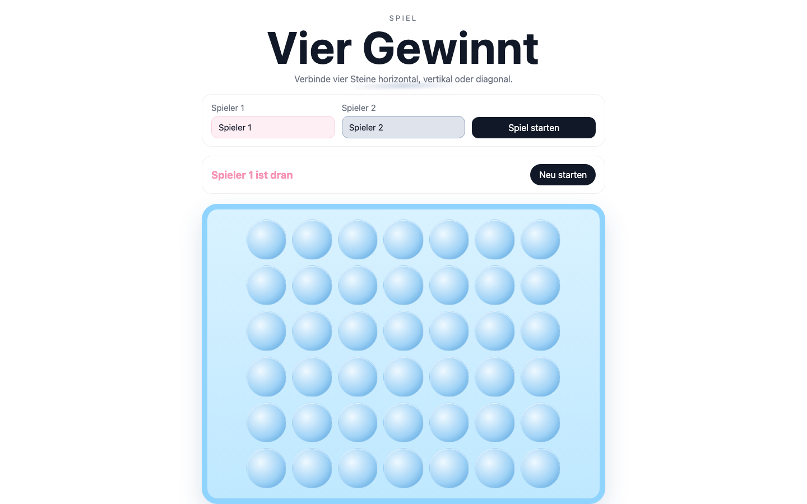

# Student Report — vcenv-vm-25

| | |
|---|---|
| Environment | `vcenv-vm-25` |
| Pi conversation history | Yes — 4 sessions (2026-07-08, 07:46 / 08:12 / 08:18 / 08:21 UTC) |
| Conversation language | German |
| Project outcome | Working two-player "Vier Gewinnt" (Connect Four) game with custom names, colored discs, winner banner and confetti |
| Live check | ✅ Dev server running, site renders correctly |

## Summary

The student turned the starter website into a complete, working two-player Connect Four game across four pi sessions. They worked almost entirely through short German styling and feature requests and let the agent do all the implementation. The bulk of the effort — and the student's real learning experience — was a long, stubborn CSS bug where the board buttons collapsed to 0×0 pixels; the student spent three of the four sessions trying to get the agent to fix it, even uploading a screenshot (`fehler.jpg`) and reporting a manual workaround they had discovered themselves. The game is now fully functional and visually polished.

## How the student worked with the agent

**Approach.** The student worked in a goal-oriented, conversational style typical of a beginner: one short plain-language request at a time, no technical vocabulary, heavy focus on look-and-feel. Session 1 was a rapid-fire styling exploration — the agent built a playable Connect Four from *"Erstelle ein Viergewinnt"* ("Create a Connect Four") in a single pass, and the student then iterated many times on colors, backgrounds and effects (green/dark-blue discs, white background, "wood look", stronger grain, cooler/darker wood, light blue field, pink vs. dark blue, confetti/fireworks on win, a centered winner banner, editable player names, a more playful title font, and once an undo: *"mache den letzten schritt rückgängig"*). The student never specified implementation details and trusted the agent's output, iterating on appearance rather than logic.

**Problems / friction.** A single CSS bug dominated the experience. Starting in session 2 the board rendered as a thin line and the cells collapsed:

- *"Das Spielfeld ist eine dünne linie, keine kästchen"* ("The board is a thin line, not squares")
- *"Die buttons haben eine Größe von 0x0"* ("The buttons have a size of 0×0")
- *"gib ihnen mal eine fixe höhe und breite, es geht immer noch nicht"* ("give them a fixed height and width, it still doesn't work")

In session 3 the student escalated by taking a screenshot and uploading it: *"Schau dir fehler.jpg an. Dann siehst du, dass das Spielfeld nicht richtig angezeigt wird"* ("Look at fehler.jpg, then you'll see the board isn't displayed correctly"). Notably, **the agent's model could not process images** ("Current model does not support images. The image will be omitted"), so this attempt was wasted — the agent answered blind. The student even diagnosed a workaround on their own: *"Die `<button>` haben immer noch größe 0x0. Wenn ich manuell width 20px und height 20px eintragen, geht es"* ("The buttons are still 0×0. If I manually enter width 20px and height 20px, it works"). The agent went through several unsuccessful attempts before, in session 4, the student demanded a rebuild — *"Wir müssen das ganze nochmal von Grund auf ändern. Die Buttons haben auch nach vielen Versuchen noch immer eine Größe von 0x0"* ("We have to redo the whole thing from scratch. After many attempts the buttons still have a size of 0×0") — after which the agent set explicit min-sizes and fixed a broken `h1` CSS block, and the board finally rendered. Minor invisible tooling friction also occurred on the agent's side (`rg` not installed, a broken-pipe `find` error), self-recovered and irrelevant to the student.

**Signals about the student.** Evidence of a genuine beginner who is nonetheless observant and persistent. They lack the vocabulary to fix CSS themselves but were precise about symptoms ("0×0", "thin line, not squares"), escalated sensibly (screenshot, then a from-scratch request), and even found a partial fix through manual experimentation — showing real engagement rather than passive acceptance. Their patience through a frustrating, repeated failure is the standout trait.

## The app

A Vite + TypeScript static site implementing two-player Connect Four ("Vier Gewinnt"):

- `index.html` — German UI (agent-written): title/eyebrow/subtitle hero, a setup section with two editable player-name inputs and a "Spiel starten" button, a status bar ("Spieler 1 ist dran") with a "Neu starten" button, and a board wrapper containing the grid, a confetti layer and a winner banner. Sensible `aria-live` / `aria-label` usage.
- `index.ts` (~200 lines, agent-written) — clean, correct game logic: 6×7 board model, gravity-based `dropPiece`, four-direction win detection via a `countInDirection` helper, draw detection, editable player names synced from the inputs, per-player status coloring, a winner banner, and two confetti effects (a burst around the banner plus full-screen falling confetti).
- `style.css` — the file that caused all the trouble; now a polished light-blue board with glossy circular slots, pink (player 1) and dark-blue (player 2) discs, colored name inputs, a "Fredoka" display font for the title, a winner-banner popup and confetti keyframes, plus a mobile media query. It carries scars of the debugging: an `@import` for the Google font placed mid-file (invalid — must precede other rules, so the font may not load reliably) and a duplicated `.hero` block. The board now uses `grid-template-columns: repeat(7, minmax(44px, 1fr))` with `grid-auto-rows` and cell `min-width/min-height: 44px`, which is what finally resolved the 0×0 collapse.
- `fehler.jpg` — a screenshot the student uploaded to illustrate the layout bug (the agent could not read it).

The code is entirely agent-written but coherent and idiomatic, and the game is fully functional (drop, win in all directions, draw, custom names, restart, and celebration effects).

## Live check

The dev server (`npm run dev`, Vite on `0.0.0.0:8080`) was already running when checked and the site loads at http://vcenv-vm-25.austriaeast.cloudapp.azure.com:8080/.

The screenshot shows the finished game: the "Vier Gewinnt" title, the two colored name inputs with "Spiel starten", the "Spieler 1 ist dran" status bar, and a correctly rendered 7×6 light-blue board full of empty circular slots — confirming the long-running 0×0 button bug is resolved.
