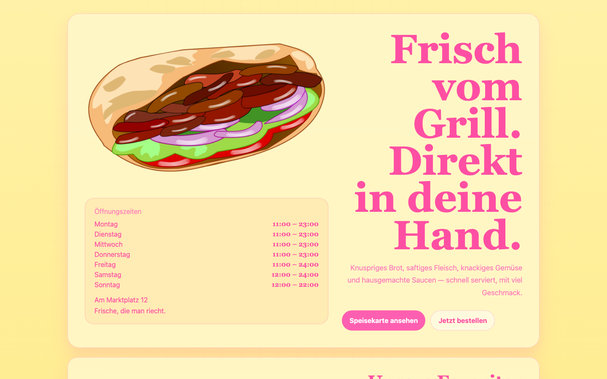

# Student Report — vcenv-vm-26

| | |
|---|---|
| Environment | `vcenv-vm-26` |
| Pi conversation history | Yes — 2 sessions (2026-07-08, 07:47 and 08:11 UTC) |
| Conversation language | German |
| Project outcome | Landing page for a kebab stand ("Kebap König") with menu, prices, opening hours, a football-World-Cup offers box and a "sponsors" box |
| Live check | ✅ Dev server running, site renders correctly |

## Summary

The student turned the starter website into a fairly rich single-page site for a fictional kebab stand across two pi sessions, working entirely through short, plain-language German instructions. They never touched code themselves; instead they iterated in many small, concrete visual steps — add a thing, move it, make it bigger, change a color, add prices — reacting to what they saw in the browser and dropping their own image files into the project folder for the agent to wire in. The result is a coherent, functional landing page, and the student showed real persistence in nudging the layout toward what they had in mind, even when the agent's first attempt did not match their intent.

## How the student worked with the agent

**Approach.** The student worked in a highly iterative, feedback-driven loop typical of a beginner who judges results by eye rather than by code. The opening prompt was a single high-level goal — *"mach mir eine startseite eines kebap standes"* ("make me a home page for a kebab stand") — after which the agent built the whole page in one pass. From there almost every prompt was a small, targeted tweak: add player name tiles, add face images, remove them again, recolor the whole site, embed an uploaded image, resize it, move a box, add a World-Cup offers section, add a sponsors box, add prices, make them cheaper, add all weekdays to the opening hours, change one heading to green. The student clearly uploaded their own assets (`grill.jpg`, `donerkebab.png`, `judebellingham.jpg`, `Gessime_Yassine2.jpg`) between prompts and then asked the agent to place them by filename.

**Problems / friction.** The friction was mostly on the layout-intent side, not the tooling side:
- The student repeatedly had to correct the agent's sizing. When asking for a bigger image the agent shrank the text instead, prompting an emphatic clarification: *"du musst das bild so groß wie der text machen. Verkleinere NICHT den text, sondern vergrößere das bild"* ("you must make the image as big as the text. Do NOT shrink the text, enlarge the image"). Several follow-ups kept pushing the same point (*"mache das bild noch viel größer, damit nicht so viel leerer platz besteht"*).
- The student built things up and tore them down: the Jude Bellingham / Gessime Yassine name tiles were added, given face images, then removed entirely (*"ja bitte"* when the agent offered to delete them) — only for both footballers to reappear later as "sponsors" with uploaded photos and captions. This trial-and-error shows the student exploring rather than following a fixed plan.
- One precise correction showed good attention to detail: after asking for the sponsors heading to be green, the color leaked onto the offers box too, and the student pushed back — *"nein. es soll nur grün bei den speziellen SPONSOREN sein, nicht angebote"* ("no. it should only be green on the special SPONSORS, not offers").
- Agent-side glitches were invisible to the student and self-recovered: the `rg`/`hypa_grep` tool failed repeatedly ("No such file or directory"), the `hypa_ls` tool was rejected by schema validation, and a couple of `edit` calls missed on exact-match whitespace before retrying. The agent fell back to `bash`/`find` each time.
- The student made minor typos (*"mach es günstuger"* for "günstiger"), which the agent understood without trouble.

**Signals about the student.** A genuine beginner with no coding vocabulary but a clear visual sense and persistence. They never asked how anything worked, never mentioned HTML/CSS, and drove the whole project purely by describing what they wanted to see. They were comfortable adding their own image files to the machine and confidently referred to them by exact filename. They gave content direction like a small business owner (opening hours per weekday, prices, "make it cheaper", World Cup 2026 tie-in, sponsors), and they were willing to correct the agent firmly and repeatedly when the output missed their intent.

## The app

A Vite + TypeScript static site (no client-side logic) presenting a kebab-stand landing page in German:

- `index.html` — the whole page. A hero with the uploaded döner illustration on the left, an opening-hours card listing all seven weekdays with times plus address, and the large pink headline "Frisch vom Grill. Direkt in deine Hand." on the right. Below: a "Unsere Favoriten" menu grid (three items with prices), a combined section holding a "Fußball Weltmeisterschaft 2026 – Spezielle Angebote" offers box and an "Unsere spezielle Sponsoren" box with the two footballer photos and captions, and a contact section. Semantic markup with `aria-label`/`figure`/`figcaption` — agent-contributed quality.
- `index.ts` — a 52-byte placeholder comment only ("Static site: no client-side behavior needed yet."); the site is purely static.
- `style.css` — the design the student iterated on: a light-yellow background with pink text and accents (a deliberately loud palette the student requested), a serif display face for headings, glassmorphism-style cards, a responsive grid hero, and the one green heading for the sponsors box. Some churn is visible from the many resize/move requests but the file is coherent.
- Uploaded assets: `donerkebab.png` (hero image), `grill.jpg` (added then removed, still on disk), `judebellingham.jpg` and `Gessime_Yassine2.jpg` (sponsor photos; the latter is a 14 MB unoptimized JPG).

The code is entirely agent-written; the student contributed the direction, the content decisions, and the image files. The page is complete and functional, though it carries some leftover/unused assets and one very large image.

## Live check

The dev server (`npm run dev`, Vite on `0.0.0.0:8080`) was already running when checked and the site loads at http://vcenv-vm-26.austriaeast.cloudapp.azure.com:8080/.

The screenshot shows the yellow-and-pink hero: the large döner illustration on the left, the weekday opening-hours card beneath it, and the big pink serif headline "Frisch vom Grill. Direkt in deine Hand." with two call-to-action buttons on the right.
