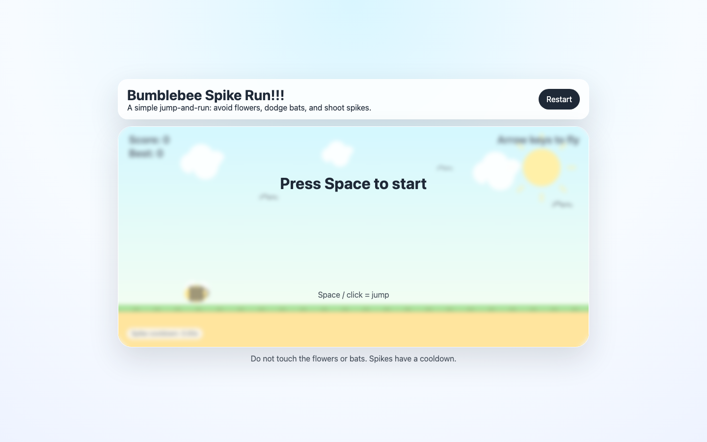

# Student Report — vcenv-vm-27

| | |
|---|---|
| Environment | `vcenv-vm-27` |
| Pi conversation history | Yes — 5 sessions (2026-07-08, 07:42–09:49 UTC) |
| Conversation language | Mostly English, switching to German for the compiler-fix and Git/deployment sessions |
| Project outcome | Working 2D canvas jump-and-run ("Bumblebee Spike Run") with a controllable bee, flower/bat hazards, flame projectiles, scoring and cooldown |
| Live check | ✅ Site renders correctly (dev server had to be started manually — it was not running) |

## Summary

The student built a genuinely elaborate 2D arcade game from the plain starter template across five pi sessions, driving it entirely through short natural-language requests and letting the agent write and edit all the code. They started from a one-line brief ("a jump n run with a bumblebee") and then iterated in many small, visual, taste-driven steps — adding a sun, drifting clouds, flying birds, prettier flowers, bats as enemies, spike-then-flame projectiles, continuous flight controls and an on-screen cooldown. The experience was mostly smooth but included two real pain points a beginner would feel: a feature that "crashed the game" (dragons, which they simply asked to delete) and repeated TypeScript compile errors they could not diagnose themselves. The final two sessions moved beyond the game into real developer tooling — creating a GitHub repo and a GitHub Pages deploy Action — where they hit an environment-configuration error (Pages not enabled) that the agent could only partly resolve for them.

## How the student worked with the agent

**Approach.** Classic beginner "director" style: the student never touched code or discussed implementation, only described the desired outcome in everyday language and reacted to what they saw. Requests were short, incremental and overwhelmingly about look-and-feel ("make the grass less spiky", "slower", "bigger more flame looking flames"). They frequently accepted the agent's offered follow-ups ("yes please do that", "yes let the sun pulse…"), letting the agent's suggestions steer the roadmap. Over time the requests grew more precise and game-designer-like (separate points for shot bats, a 1.5-second cooldown, continuous hold-to-fly movement instead of stepped movement, cooldown shown "bottom left" with "only two numbers after the second").

**Problems / friction.**

- **A feature broke the game.** After *"put dragons in the sky that fly towards us and can kill us"*, the next message was *"delete the dragons. they crashed the game"* — the student experienced a real runtime failure and resolved it the only way they knew: by reverting the feature. They then re-approached the same idea more safely (*"put bats in the position the dragons were"*), which worked.
- **Compile errors they couldn't read.** Session 4 opens with just *"Compilerfeler"* and then *"Compile error"* with no detail; the agent asked for the error text, and the student pushed back with *"come on, try it yourself. do not be lazy!"* The agent then inspected and fixed a broken `drawBat()` block itself. A separate compile error (*"compilerfehler, bitte fixen"*) in session 3 was a duplicated `const cooldownText` line. This is the clearest beginner signal: unable to interpret or copy a compiler message, the student treated the agent as the one responsible for making it build.
- **Deployment/config wall.** In the final session the GitHub Action failed at the Pages deploy step (`HttpError: Not Found` — Pages not enabled in repo settings). The agent correctly diagnosed it but the fix required a manual click in GitHub's web settings that the agent cannot do; the session ended with the student saying *"ich glaub, ich habs"* ("I think I've got it") and the agent re-running the workflow — outcome left unconfirmed.
- Minor agent-side noise invisible to the student: `hypa_grep` repeatedly failed because `rg` (ripgrep) was not installed on the VM; the agent fell back to reading files directly.

**Signals about the student.** A curious, iterative beginner with clear aesthetic intent but no code-reading ability. They think in terms of the game (dragons, bats, flames, cooldowns, points), not in terms of functions or types. Language use is telling: English for the creative game-building, but a reflexive switch to German at moments of stress or seriousness ("Compilerfeler", "bitte fixen", the whole Git/deployment session written formally in German). Characteristic prompts: *"make the bee fly and be controlled by the arrow keys that point up and down"*, *"delete the dragons. they crashed the game"*, and *"come on, try it yourself. do not be lazy!"* The last session shows real ambition for a beginner — wanting the game version-controlled on GitHub and publicly deployed — even though the deployment tooling exceeded what they could self-serve.

## The app

A Vite + TypeScript single-page canvas game. All code is agent-written; the student never edited files directly.

- `index.html` — Game shell: title "Bumblebee Spike Run!!!", instruction subtitle, a Restart button, a 900×420 `<canvas>`, and a start/game-over overlay ("Press Space to start"). Clean and semantic (`aria-label` on the canvas). The heading with trailing "!!!" reflects the student's playful register.
- `index.ts` (~430 lines) — The whole game engine, hand-grown over the sessions: a fixed-timestep `requestAnimationFrame` loop; a bee controlled by hold-to-fly Up/Down; obstacle spawning of two kinds (ground `flower` hazards and flying `bat` enemies via a discriminated union); `Space` to fire flame projectiles with a 1.5s cooldown; AABB collision for death and for spikes killing bats; escalating per-bat scoring; and a lot of procedural drawing (gradient sky, pulsing sun, drifting clouds, flapping birds, layered grass, animated bee wings, petal-and-stem flowers, bats with a burn effect, gradient flame projectiles, and a HUD with a boxed cooldown readout). Quality is reasonable for generated code: typed, uses a non-null `g` alias for the context (introduced to satisfy strict null checks after a compile error), and the removed-dragon episode left the union clean. It is well beyond a beginner's own reach and clearly the product of many guided iterations.
- `style.css` — Glassmorphism framing around the canvas: soft radial page background, translucent HUD/overlay panels with `backdrop-filter` blur, rounded card with layered shadow, responsive `aspect-ratio` canvas. Agent-written.
- `vite.config.ts` — Dev server bound to `0.0.0.0:8080` with `strictPort` and `allowedHosts: true`; `base: './'` was added by the agent in the last session so the build works under GitHub Pages.
- `.github/workflows/deploy.yml` — Agent-generated GitHub Action to build with `npm run build` and publish `dist/` via `actions/deploy-pages` (the deploy that failed on the un-enabled Pages setting).

## Live check

The Vite dev server was **not** running when checked (an initial `pgrep` gave a false "already running" because the pattern matched its own command line; port 8080 had no listener). Starting `npm run dev` manually brought the site up cleanly (HTTP 200) at http://vcenv-vm-27.austriaeast.cloudapp.azure.com:8080/, after which the server was stopped again.

The screenshot shows the game's start screen: a bright sky with a pulsing sun and clouds, a green grass strip over sandy ground, the bee at the left, a Score/Best HUD, an "Arrow keys to fly" hint, the boxed spike-cooldown indicator bottom-left, and the "Press Space to start" overlay.
