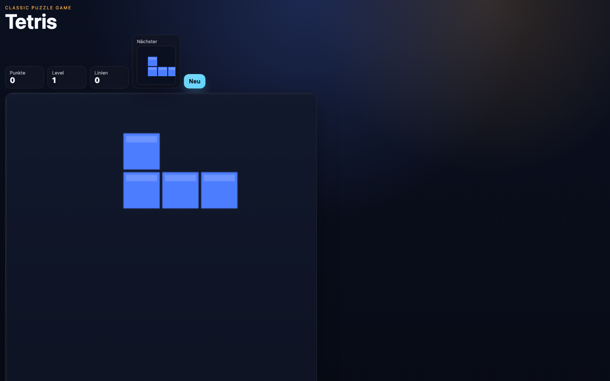

# Student Report — vcenv-vm-28

| | |
|---|---|
| Environment | `vcenv-vm-28` |
| Pi conversation history | Yes — 10 sessions (2026-07-08, 07:46–09:45 UTC) |
| Conversation language | German (many typos / phonetic spellings) |
| Project outcome | Working browser Tetris game (dark theme, compact left-aligned layout) — the last of ~9 different games attempted |
| Live check | ✅ Dev server already running, Tetris renders and plays correctly |

## Summary

The student treated the workshop as a rapid tour through popular games rather than building one project: across ten short sessions they asked the agent to recreate a jump-and-run, Geometry Dash, Hill Climb Racing, Slither.io, a racing game (eventually with Three.js), a Hole.io clone, and finally Tetris — each new idea overwriting the previous game in the same three files. Prompts were very short German fragments full of typos, describing the desired game by name or feel, never touching implementation. The agent did all the coding; the student iterated by naming the next game or a single tweak. The dominant source of friction was not the code but the workflow: the student repeatedly did not know how to view the running app ("wo öffnen"), and occasionally reacted with frustration ("geht nichttt", "pipi") when a result did not appear as expected. The final delivered app, Tetris, works.

## How the student worked with the agent

**Approach.** Highly exploratory and goal-by-name. Each session typically opened with a two-to-four-word request naming a game to clone (*"mach slither io nach"*, *"mach geometry dash nach"*, *"tetris machen"*), the agent rebuilt the whole project, and the student either moved on to another game in a fresh session or asked for one incremental change (more levels, harder, bigger map, "make everything smaller"). There was no attempt to specify implementation, no technical vocabulary, and no interest in the code itself — only in the visible result.

**Problems / friction.**

- **Not knowing how to open the app.** By far the most recurring issue. The student asked *"wo kann ich es öffnen"* / *"wo öffnen"* / *"öffnen"* at least eight times across sessions; each time the agent had to repeat the dev-server URL. The concept of "the app runs on a server you open in the browser" clearly never became second nature.
- **Frustration / noise inputs.** When the Slither.io clone didn't behave, the student typed *"geht nicht"*, then *"pipi"*, then *"geht nichttt"*. The agent misread "geht nicht" as a code error and even reported "the build works," while the real problem was the student not opening/finding the running page (port 8080 was already in use). One genuine bug did occur — in a Hill Climb session the student reported *"man kann nicht mehr fahren"* (can't drive anymore) after an upgrade change.
- **Typos and phonetic spelling forced the agent to guess.** *"limk"* → *"link"* → the agent correctly inferred the student meant *"links"* (left-align) and asked for confirmation twice before acting. Other examples: *"kebad"*, *"kebap"*, *"geschwinkeit"*, *"schneeler"*, *"rennspieL"*.
- **Agent-side tool hiccups (invisible to student):** several `edit` calls failed with "could not find exact text" and the agent recovered by re-reading and rewriting the whole file; one `write` no-op and one `hypa_ls` early on. None blocked progress.

**Signals about the student.** A clear beginner enjoying the "wish a game into existence" experience: fast, low-effort prompts, trust in the agent, restarting from scratch rather than deepening one project, and iterating on surface qualities (size, colours, difficulty, "left-align"). The heavy typos and the repeated "where do I open it" show someone comfortable describing what they want but not yet comfortable with the surrounding developer tooling. Characteristic prompts:

- *"jump and run mit kebad hindernissen"* — "jump and run with kebab obstacles"
- *"mach geometry dash nach mit echten hindernissen und level system"* — "recreate Geometry Dash with real obstacles and a level system"
- *"wo kann ich es öffnen"* — "where can I open it"

## The app

A Vite + TypeScript static site; the current state is a self-contained 2D **Tetris** implemented on a `<canvas>`. All files are agent-written and were fully replaced in the final session; earlier games left no trace.

- `index.html` — German UI: "Tetris" heading, compact HUD showing Punkte / Level / Linien and a "Nächster" (next-piece) preview canvas, a "Neu" (restart) button, the 240×480 game canvas, a key-hint line (← → move · ↑ rotate · space drop), and a hidden game-over overlay. `aria-label` on the canvas.
- `index.ts` (~236 lines) — complete Tetris logic: all seven tetromino definitions with rotation states and colours, a 10×20 grid, gravity with a drop interval, collision/lock, line clearing with score, level, and line counters, next-piece rendering, hard drop, and game-over/restart handling. Coherent and idiomatic.
- `style.css` — dark glassmorphism theme (radial blue/orange glows, translucent blurred HUD panels, gradient buttons, rounded glowing canvas). Progressively edited down in the final session per the student's "make everything smaller" and "left-align" requests (`.compact` variants, `#app` no longer centred).

Quality is good for a generated game — the code is clean and the game is fully playable (movement, rotation, line clears, scoring, restart). Nothing was written or modified directly by the student; all changes came through the agent.

## Live check

The dev server (`npm run dev`, Vite on `0.0.0.0:8080`) was already running when checked (I left it untouched) and the site loads at http://vcenv-vm-28.austriaeast.cloudapp.azure.com:8080/.

The screenshot shows the dark-themed Tetris page, left-aligned as requested: the "Tetris" title, the Punkte/Level/Linien HUD with a next-piece preview and "Neu" button, and a J-shaped tetromino falling on the board.
