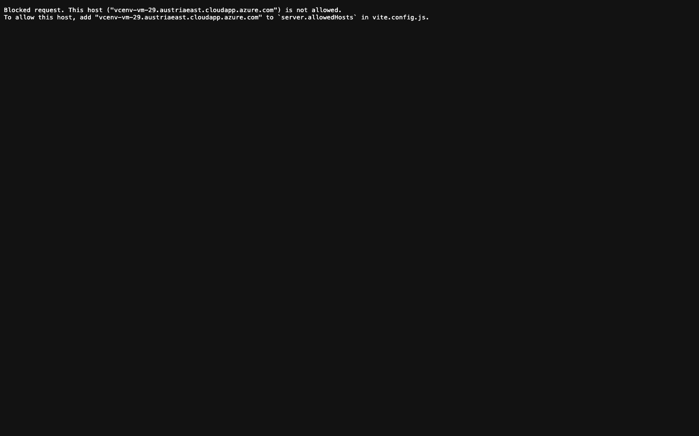

# Student Report — vcenv-vm-29

| | |
|---|---|
| Environment | `vcenv-vm-29` |
| Pi conversation history | Yes — 4 sessions (2026-07-08, 07:46 / 08:38 / 09:17 / 09:27 UTC) |
| Conversation language | German |
| Project outcome | Empty — the student reset the project to the bare Vite starter at the end |
| Live check | ⚠️ Dev server running, but the public URL is blocked by Vite (`allowedHosts`); only the reset starter page would render |

## Summary

Over four sessions the student built three different canvas games — a "Flappy Bird" clone with a table (later a toilet, then a cucumber) as the player, a Geometry Dash runner, and a lion jump-and-run — driving the agent entirely through short, playful German feature requests. The work was creative and fast-moving, but repeatedly hit a wall: several of the agent's edits left the TypeScript in a broken state, and the student's reaction to breakage was always the same terse "repariere die website" ("fix the website"), which the agent often "answered" by running `npm run build` and declaring success without actually restoring a working game. Each game arc ended in a breakage and a reset, and the final act of the last session was "setze alles zurück" — so the machine now holds only the untouched Vite starter ("Projekt zurückgesetzt.").

## How the student worked with the agent

**Approach.** Purely goal-and-vibe driven, never technical. The student opened each arc with a one-line concept (*"Erstelle ein ganz normales einfaches Flappy Bird spiel, aber ersetze den Vogel mit einem Tisch"* — "Create a completely normal simple Flappy Bird game, but replace the bird with a table") and then steered with a stream of small, imaginative tweaks: make it fall slower, put it in a school, green floor, turn the pipes into mean teachers, swap the table for a toilet, then a cucumber, add angry teachers/headmasters sitting on coconut palms, make the whole background move. Difficulty tuning was a recurring theme in the Geometry Dash arc ("alles langsamer", "bitte wenigere hindernisse", "viel leichter"). The student never asked to see or understand the code and let the agent make every implementation decision.

**Problems / friction.** This is the defining feature of the session, and most of it originated on the agent's side:

- **Broken edits after renames/features.** When the player object was renamed `table` → `toilet` → `cucumber`, the agent left stale `table.vy` / `table.y` references behind, which the student noticed as *"repairire die website es geht nichts mehr :("* ("repair the website, nothing works anymore :(" — note the misspelling and the sad face). The lion "ducking" feature was worse: the agent introduced a `'branch'` obstacle kind never added to the type, a duplicated `isCrouching = false`, and a truncated `ctx.rotate(tilt` line (missing parenthesis and body) — leaving `drawLion` syntactically broken.
- **"Fixing" that didn't fix.** To the repeated *"repariere die website"* / *"bitte reparieren"*, the agent typically ran `npm run build`, saw it pass, and reassured the student it was fine — but Vite's build does not type-check, so the runtime-broken game was never truly repaired. Session 1 ended with the agent producing two completely empty responses to *"repariere die website"* and *"setze die website bis auf das erste zurück"*.
- **Agent losing the thread at session boundaries.** Session 2 opened with *"es soll schneller gehen"* ("it should go faster") against an already-broken/empty project; the agent had no context and asked what should be faster, then produced a duplicated, rambling clarification. The student's follow-ups *"ja"* and *"die gurke"* ("the cucumber") went nowhere until they gave up and asked to reset.
- **Typos / minimal phrasing.** Characteristic beginner input: *"langsameer"* (agent had to confirm "do you mean slower?"), *"repairire"*, and one-word replies.
- **The reset backfired.** The final "reset everything" rewrote `vite.config.ts` and dropped the `allowedHosts: true` line the original project needed, so the public FQDN now returns Vite's "Blocked request … is not allowed" page even though the dev server runs.

**Signals about the student.** A confident, experimental beginner enjoying the creative loop — rapid, whimsical ideas (cucumber, teachers on palm trees, lion in a savanna) rather than a single planned product. They treated the agent as a black box: no interest in the code, full trust that "repariere" would undo any damage. When things broke they did not debug or ask questions; they either reissued the same fix command or wiped the slate clean and started a new concept. The result is a session rich in ambition but with nothing surviving at the end.

## The app

Final on-disk state is the bare Vite + TypeScript starter that the agent wrote during the last "reset everything" request — none of the games remain:

- `index.html` — minimal starter: `
` mounts the script, title "Vite App", links `style.css`. Agent-written (reset).
- `index.ts` — 9 lines: sets `#app` innerHTML to a card with "Vite + TypeScript" and the German text "Projekt zurückgesetzt." ("Project reset."). Agent-written (reset).
- `style.css` — small centered-card layout, light theme, box-shadowed white card. Agent-written (reset).
- `vite.config.ts` — dev server on `0.0.0.0:8080`, but **missing** the `allowedHosts: true` that the original scaffold had, which is why the public URL is now blocked. Agent-written during reset (regression).
- `package.json`, `tsconfig.json`, `AGENTS.md` — restored to their scaffold defaults.

During the sessions the games themselves were competent, coherent canvas code (gravity/jump physics, obstacle spawning and collision boxes, particle effects, per-type obstacle rendering, a hand-drawn lion), all entirely agent-authored — but that code was repeatedly broken by follow-up edits and ultimately deleted, so none of it is present anymore.

## Live check

The Vite dev server (`npm run dev` on `0.0.0.0:8080`) was already running when checked; `curl` to `localhost:8080` returns HTTP 200. However, the public URL http://vcenv-vm-29.austriaeast.cloudapp.azure.com:8080/ does **not** show the app — because the reset dropped `allowedHosts`, Vite serves a "Blocked request. This host … is not allowed" error page instead of the reset starter.

The screenshot shows Vite's white-on-black "Blocked request … add … to `server.allowedHosts`" message rather than the intended "Projekt zurückgesetzt." starter card.
