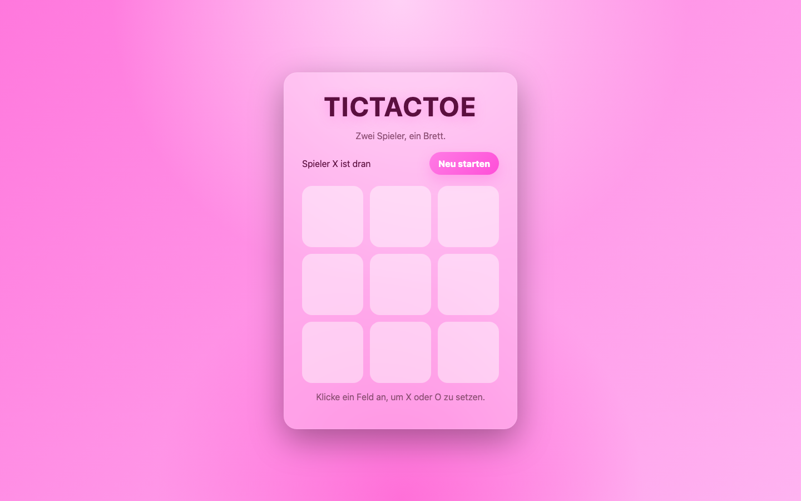

# Student Report — vcenv-vm-30

**Note**: This account was the teacher's demonstration account (presented on the beamer).

| | |
|---|---|
| Environment | `vcenv-vm-30` |
| Pi conversation history | Yes — 2 sessions (2026-07-08, 07:42 and 07:46 UTC) |
| Conversation language | German |
| Project outcome | Working two-player TicTacToe game with custom "ultrapink" design |
| Live check | ✅ Dev server running, site renders correctly |

## Summary

The student transformed the starter website into a complete, working two-player TicTacToe game using two short, focused pi sessions. They gave high-level goals in German and let the agent do all the implementation work, then iterated once on visual style ("Mache es ultrapink"). No coding was done by the student directly (apart from a small pre-agent edit to the starter heading), and no real blockers occurred.

## How the student worked with the agent

**Approach.** The student worked in a goal-oriented, conversational style typical for a beginner: one plain-language request per session, no technical vocabulary, no attempt to specify implementation details.

- **Session 1** — *"Mach aus meiner Webseite ein einfaches TicTacToe Spiel. Geht das?"* ("Turn my website into a simple TicTacToe game. Is that possible?"). The agent rewrote all three project files (`index.html`, `index.ts`, `style.css`) in a single pass and explained how to run and view the result. The student accepted the result without follow-up questions.
- **Session 2** — *"Mache es ultrapink"* ("Make it ultrapink"). A pure styling iteration; the agent adjusted the CSS color scheme.

**Problems / friction.** Essentially none on the student's side:

- The student typed `/quite` instead of `/quit` — a harmless CLI typo the agent caught and clarified.
- One tool-validation error occurred on the agent's side (`hypa_ls` rejected an argument), invisible to the student and self-recovered.
- The student used `/clear` at the end of session 2, suggesting they understood the session lifecycle of the tool.

**Signals about the student.** Evidence of a genuine beginner having a smooth first experience: minimal prompts, trust in the agent's output, iteration on appearance rather than functionality. Before the first session they had manually edited the starter heading ("Hello, workshop!!!!!!!!"), indicating some hands-on exploration of the editor first.

## The app

A Vite + TypeScript static site implementing two-player TicTacToe:

- `index.html` — German-language UI: title, status line ("Spieler X ist dran"), restart button, 3×3 board container, hint text; sensible use of `aria-live` / `aria-label` (agent-contributed quality).
- `index.ts` (~90 lines) — clean game logic: winning-line table, turn switching, win/draw detection, board re-render on every move, restart handling.
- `style.css` — "ultrapink" glassmorphism theme: radial pink gradient background, translucent rounded card, hover animations on cells.

The code is entirely agent-written but coherent and idiomatic; the game is fully functional (win, draw, and restart all handled).

## Live check

The dev server (`npm run dev`, Vite on `0.0.0.0:8080`) was already running when checked and the site loads at http://vcenv-vm-30.austriaeast.cloudapp.azure.com:8080/.

