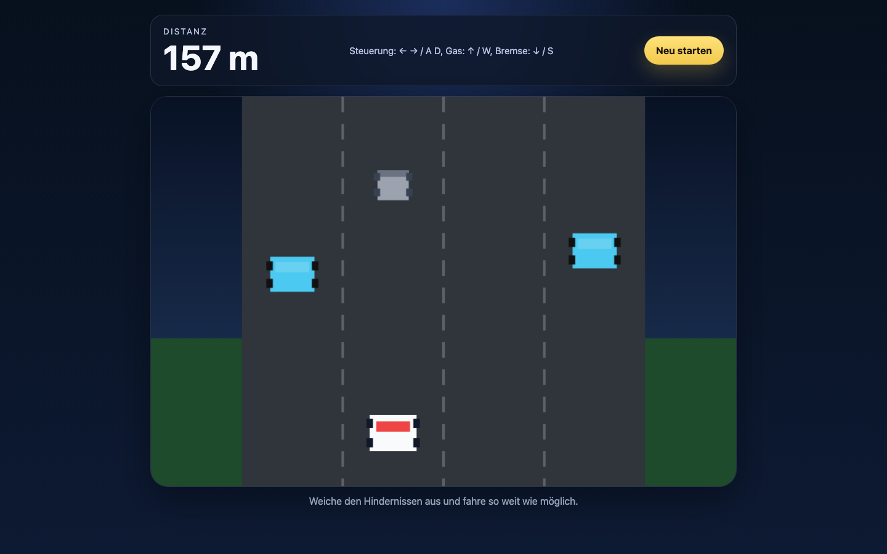

# Student Report — vcenv-vm-5

| | |
|---|---|
| Environment | `vcenv-vm-5` |
| Pi conversation history | Yes — 1 session (2026-07-08, 09:29 UTC), 6 user turns |
| Conversation language | German |
| Project outcome | Working top-down "Obstacle Drive" driving game (dodge obstacles, distance score) |
| Live check | ✅ Dev server running, game renders and plays |

## Summary

In a single continuous session the student steered the agent through a series of game concepts, arriving at a working top-down driving game where you dodge obstacles and rack up distance. They started from a completely different idea (a "fruit cutter" clone with coins), pivoted to a racing game, then reshaped that racing game step by step until it became the obstacle-dodging driver they actually wanted. Every prompt was a short, plain-language German instruction; the student never touched the code themselves and let the agent rewrite all three files on each turn. The experience shows a beginner using the agent almost like a "wish machine" — refining by describing the desired feel ("make it more realistic", "make it half as slow") rather than any technical detail.

## How the student worked with the agent

**Approach.** The student worked in one long exploratory session, giving one plain-language goal per turn and accepting each full rewrite without inspecting it. Their prompting is idea-driven and playful — they repeatedly asked for one game "but with X replaced by Y", treating the agent as a creative generator:

- **Turn 1** — *"erstelle ein spiel wie fruitcutter aber ersetze äpfel mit münzen"* ("create a game like fruit cutter but replace apples with coins"). The agent built a full Fruit-Ninja-style coin-slicing game.
- **Turn 2** — *"erstelle ein autorennen aber ersetze die hälfte der autos mit tropischen obst"* ("create a car race but replace half the cars with tropical fruit"). Complete pivot; the agent rebuilt everything into a racing game with fruit rivals.
- **Turn 3** — *"mache es realistischer und erkläre wie man steuert"* ("make it more realistic and explain how to steer"). A refinement on feel plus a request for in-game instructions.
- **Turn 4** — *"wie komme ich nach vorne"* ("how do I get to the front"). Not a build request but a genuine confusion question — the student expected to drive forward and the game did not allow it.
- **Turn 5** — *"erstelle ein autorennen wo man fahren kann ohne gegner nur mit hindernissen"* ("create a car race where you can drive, with no opponents, only obstacles"). This resolved the confusion: the agent built the current obstacle-dodging driver with real gas/brake/steer controls.
- **Turn 6** — *"lasse das auto um die hälfte langsamer fahren"* ("make the car drive half as slow"). Left incomplete.

**Problems / friction.** The main friction was conceptual, not technical. The student's turn-4 question *"wie komme ich nach vorne"* reveals a mismatch between the mental model (a real drivable racing game) and what the agent had built (an auto-scrolling race where you only switch lanes). The agent recognized this, explained the limitation in plain German, and offered to rebuild with true acceleration — which the student then requested. The final turn is the one visible failure: after the student asked to halve the car's speed, the agent only **read** `index.ts` and the session ended with no follow-up write. The speed change was never applied — the on-disk code still has the original values — so the student's last wish went unfulfilled (likely the session was simply abandoned or ran out of time). Every build the agent did run compiled cleanly (`npm run build` succeeded on all four rebuilds).

**Signals about the student.** A clear beginner having a fluent, low-friction experience: no technical vocabulary, no direct code editing, high trust in the agent's output, and iteration expressed entirely through desired outcomes ("more realistic", "half as slow", "replace X with Y"). The frequent full pivots suggest the student was exploring and playing with possibilities rather than pursuing one fixed spec, and the turn-4 question shows they were actually playing each build and noticing when it did not match expectations.

## The app

A Vite + TypeScript static site implementing a single-player top-down "Obstacle Drive" game. All code is agent-written; the student modified nothing directly.

- `index.html` — German UI: a HUD showing "Distanz" (distance) and a control legend (← → / A D, gas ↑/W, brake ↓/S), a "Neu starten" button, a `<canvas>` game surface, and a start overlay card explaining the game and controls. Clean, semantic, `aria-label` on the canvas.
- `index.ts` (~180 lines) — the full game engine: a 4-lane road, obstacles of three kinds (`car`, `cone`, `barrel`) that spawn and scroll toward the player, keyboard handling for lane changes plus accelerate/brake, gradual auto-acceleration, collision detection producing an "Unfall!" (crash) game-over overlay with the final distance, and a `requestAnimationFrame` render loop drawing road, obstacles, and the player car with canvas primitives. Coherent and idiomatic; a minor dead spot is the `gameOver` flag being set but never read.
- `style.css` — dark arcade theme: blue radial/linear gradient background, translucent blurred HUD panel, rounded game shell with shadow, yellow pill buttons, responsive `aspect-ratio` canvas. Consistent design carried across all the game iterations.

The game is fully functional: it starts, spawns and scrolls obstacles, tracks distance, detects crashes, and restarts. Note the final requested tweak (halving speed) was never implemented, so the car still runs at the original speed.

## Live check

The dev server (`npm run dev`, Vite on `0.0.0.0:8080`) was already running when checked and the site loads at http://vcenv-vm-5.austriaeast.cloudapp.azure.com:8080/ (HTTP 200); it was left running.

The screenshot shows the game mid-play at 157 m: a four-lane top-down road with the white/red player car at the bottom, two blue obstacle cars and a grey barrel ahead, the "Distanz" HUD, and the control legend.
