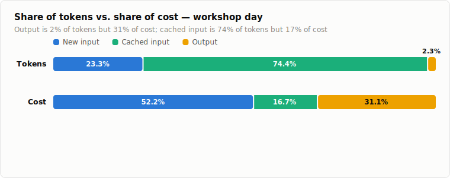
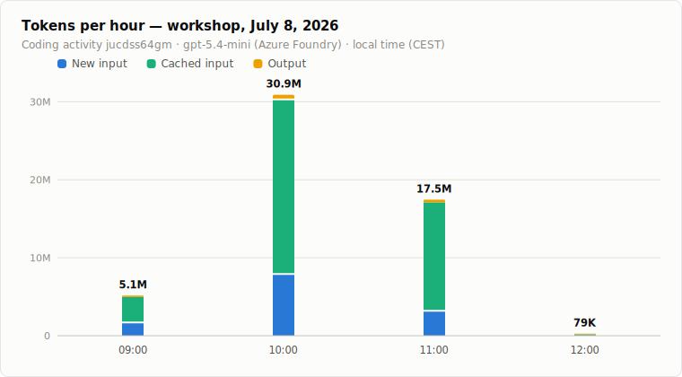
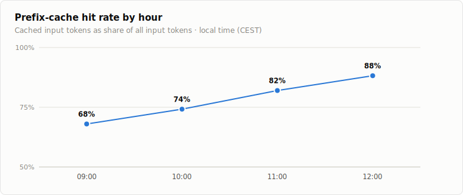
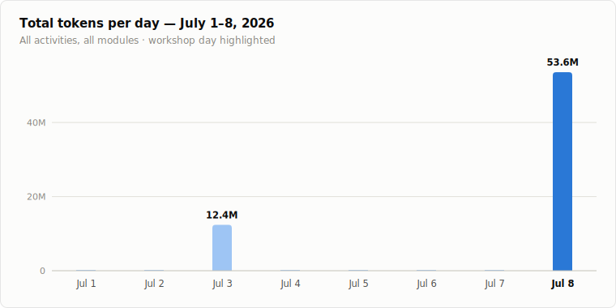

# Token usage report — student workshop, July 8, 2026

**TL;DR:** The workshop ran on a single coding activity (`jucdss64gm`, "Web dev assistant — HTML/CSS/TS/Vite") pinned to **gpt-5.4-mini on Azure Foundry**. Between 09:00 and 12:00 local time (CEST) the students consumed **53.6 million tokens**, which at the given prices cost **$17.93**. Prefix caching absorbed 76 % of all input tokens and cut the bill by roughly 60 % — without it the same session would have cost about $44.84.

All data comes from the production `novedu_usage_by_code` table (hourly aggregates). The coding module is always anonymous and its API path carries no user identity, so `novedu_usage_by_user` has no rows for the day — per-student numbers are not available by design.

## Totals

| Metric | Tokens | Share | Price / 1M | Cost |
|---|---:|---:|---:|---:|
| New input | 12,474,782 | 23.3 % | $0.75 | $9.36 |
| Cached input | 39,861,504 | 74.4 % | $0.075 | $2.99 |
| Output (incl. reasoning) | 1,240,469 | 2.3 % | $4.50 | $5.58 |
| **Total** | **53,576,755** | 100 % | | **$17.93** |

Two things stand out in the cost structure: output tokens are only 2.3 % of the volume but 31 % of the cost (they are 60× the cached-input price), and cached input is three quarters of the volume but only 17 % of the cost.

## Usage over the morning

Activity peaked in the 10:00 hour, which alone accounts for 58 % of the day's tokens. By 12:00 the workshop was winding down.

| Hour (CEST) | New input | Cached input | Output | Total tokens | Cost |
|---|---:|---:|---:|---:|---:|
| 09:00–10:00 | 1,587,224 | 3,376,128 | 184,863 | 5,148,215 | $2.28 |
| 10:00–11:00 | 7,796,740 | 22,391,424 | 710,205 | 30,898,369 | $10.72 |
| 11:00–12:00 | 3,081,529 | 14,024,832 | 344,489 | 17,450,850 | $4.91 |
| 12:00–13:00 | 9,289 | 69,120 | 912 | 79,321 | $0.02 |
| **Total** | **12,474,782** | **39,861,504** | **1,240,469** | **53,576,755** | **$17.93** |

(The stored buckets are UTC 07:00–10:00; shown here in local time.)

## Cache efficiency

The prefix-cache hit rate climbed steadily as the students' sessions accumulated context — from 68 % in the first hour to 88 % at the end:

In money terms: the 39.9M cached input tokens cost $2.99 instead of the $29.90 they would have cost as fresh input — a saving of **$26.91**. The effective blended price for the whole session was about **$0.33 per million tokens**.

## Context: how the day compares

July 8 was by far the biggest usage day of the month so far — 53.6M tokens versus a typical background day of well under 200K. The only comparable day, July 3 (12.4M tokens), was a coding run on the SCCH provider — effectively the rehearsal for this workshop.

| Day | Total tokens | Note |
|---|---:|---|
| Jul 1 | 11,095 | background (tutor/quiz/writing tests) |
| Jul 2 | 49,700 | background |
| Jul 3 | 12,386,561 | coding rehearsal (SCCH) |
| Jul 4 | 9,085 | background |
| Jul 5 | 114,324 | background |
| Jul 6 | 19,219 | background |
| Jul 7 | 174,073 | background |
| **Jul 8** | **53,576,755** | **workshop (Azure Foundry, gpt-5.4-mini)** |

## Notes

- This reports directory contains 26 `student-N` folders; if those correspond to the workshop participants, the average cost was roughly **$0.69 per student** for the morning.
- The coding endpoint is metered per code only (no user attribution, no message content) — the numbers above are the complete record of the day.
- `tool_calls`, `user_messages`, `quiz_answers`, and `writing_saves` are all zero for this code: the coding proxy counts tokens only, and no other module was used during the workshop.

*Prices used: $0.75 / 1M new input, $0.075 / 1M cached input, $4.50 / 1M output. Data queried from `ng-workshop.database.windows.net / WizardAcademy` on July 8, 2026.*
