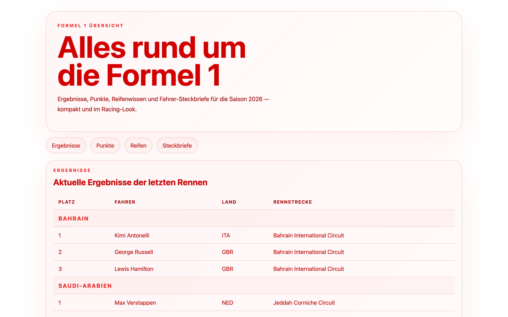
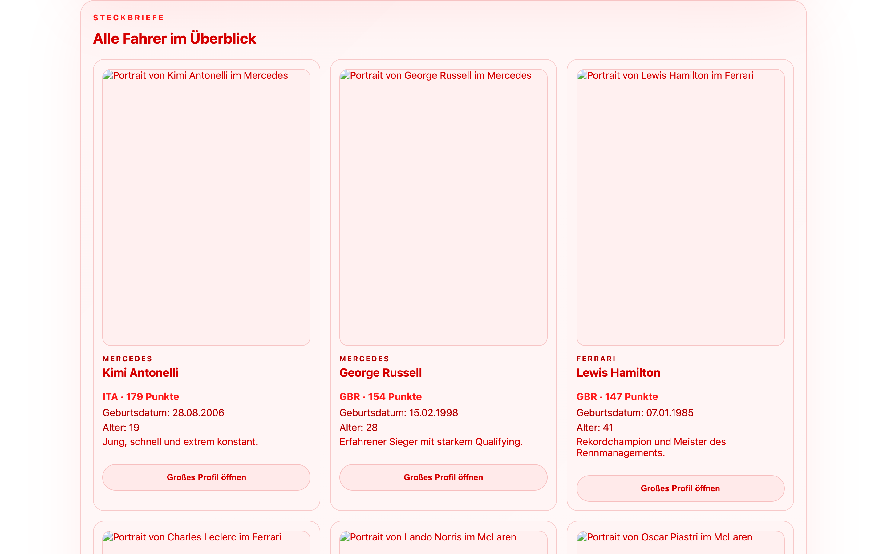

# Student Report: vcenv-vm-1

| | |
|---|---|
| Environment | `vcenv-vm-1` |
| Pi conversation history | Yes, 3 sessions (2026-07-14, 06:45–13:28 UTC; edits continued to ~14:23 UTC) |
| Conversation language | Mixed, first game prompt in English, the entire main project in German |
| Project outcome | An "F1 Hub" Formula 1 information website for the 2026 season (results, team points with logos, tyre guide, driver profiles). Earlier a Tic-Tac-Toe game and a brief race-simulator experiment, neither kept. |
| Live check | ⚠️ Partial, page loads and all sections render, but the 22 driver photos are broken (missing placeholder file) and the "open profile" popup does nothing (no handlers wired) |

## Summary

Across three sessions in one day the student produced three different things, keeping only the last big one. They opened with a quick English one-liner that built a playable Tic-Tac-Toe game (morning), then spent by far the most effort (one very long German session of ~50 turns) building an elaborate "F1 Hub" information site for the 2026 Formula 1 season: race results from Bahrain to Silverstone, current team standings with logos, a tyre explainer, and clickable driver "Steckbriefe" (profile cards) with a popup. Late in the day they also tried a small F1 race simulator in a separate session ("Baue mir einen Formel 1 Rennsimulator"), but that was abandoned and the F1 Hub is what remains on disk and live. The student never wrote code themselves; instead they drove the agent with precise, opinionated German instructions and, notably, uploaded their own team-logo image files one by one and told the agent each filename to wire in. The arc is one of constant refinement and reversals: build, delete, rebuild, restyle, delete a category, add another, a persistent, detail-focused student who kept pushing on things the agent struggled to deliver (real driver faces, local logos, a working popup).

## How the student worked with the agent

**Approach.** Iterative and highly directive. The student gave one concrete German instruction per turn and let the agent do every edit, but their prompts were unusually specific about layout, content, and styling rather than just "make a game." They restructured the site into named sub-pages (*"Erstelle mir folgende Unterkategorien: Ergebnisse, derzeitige Punkte der Fahrer und Teams, Reifen ... welche Fahrer und Teans 2026 fahren"*, "Create these sub-categories: Results, current driver and team points, Tyres, which drivers and teams race in 2026"), demanded exact visual changes (*"Mach mir alle Schriften rot und den Hintergrund der Website weiß"*, "Make all the text red and the website background white"; *"Bitte entferne die roten geschtrichelten Linien"*, "Please remove the red dashed lines"), and repeatedly deleted and re-added sections (*"Lösche mir: Derzeitige Punkte der Fahrer"*, "Delete: current driver points"). They were also hands-on with assets: they created logo files themselves and fed the agent filenames turn by turn (*"Ich hab für Haas auch ein Logo. Bitte füge es bei den Teams ein. Die Datei heißt OIP.webp"*, "I also have a logo for Haas. Please add it to the teams. The file is called OIP.webp").

**Problems / friction.**

- **Driver faces were never really delivered.** The student pushed hard for real photos: *"Bitte füge mir pro Fahrer ein Foto hinzu"*, then in frustration *"Ich will die Gesichter der Fahrer sehen!!!!!"* ("I want to see the drivers' faces!!!!!"), then *"Ich will die Fotos als Ganzkörperfoto haben"* ("I want the photos as full-body shots"). The agent cycled through official-URL portraits and "full-body" crops, but the final on-disk code points every driver at `placeholder-driver.webp`, a file that does not exist, so all 22 photos render broken.
- **The agent kept hitting message-size limits on the large `index.ts`.** Several turns show the agent claiming the file was "too long for one message," producing a broken half-written `index.ts` with **duplicate `const raceResults` / `teamStandings` / `resultsBody` declarations** (visible in the transcript diffs) that broke the build. This triggered a cycle of *"Bitte erstelle mir die Website noch einmal"* ("Please create the website again") → *"Jetzt ergänze mir die Informationen noch einmal"* → *"Ja, ergänze ALLES"* ("Yes, add EVERYTHING") → *"Lösch es wieder"* ("Delete it again"), with the agent repeatedly resetting to "the last stable state" and finally reporting a clean `npm run build`.
- **The local-logo swap broke the whole team list.** When moving from image links to local files the agent over-trimmed `index.ts` and the teams disappeared: *"Irgendwie sind jetzt alle Teams weg :-("* ("Somehow all the teams are gone now :-("). The agent restored them.
- **Filename churn, especially Williams.** The agent guessed wrong names (it wrote `Rad Bull Racing.webp` for Red Bull, `Ferarri.webp` for Ferrari), and Williams' logo was set **four separate times** (`R(1)` → `R(1).png` → `g15459.png` → `Williams_F1_logo_2026.png`) as the student kept correcting the filename.
- **The popup was never wired up.** Despite repeated requests (*"Ich will bei Klick das größere Fahrerprofil öffnen können."*, "I want to be able to open the bigger driver profile on click"), the final `index.ts` declares all the dialog elements but contains **no `addEventListener` / `showModal` at all**, so the "Großes Profil öffnen" button and card clicks are dead.

**Signals about the student.** A patient, opinionated, detail-driven student with real domain knowledge: they knew the 2026 F1 grid, the tyre compounds, and the season's races, and they cared about exact colours, exact categories, and exact filenames. They engaged emotionally (multiple exclamation marks, a *":-("* when things broke) and were persistent through the agent's repeated stumbles rather than pivoting away. They trusted the agent to write all the code but took ownership of the visual assets, sourcing and naming logo files themselves. Characteristic prompts: *"Mach mir eine Website, bei der man alle Ergebnisse der Formel 1 Ergebnisse sehen kann, mit dem Logo."* ("Make me a website where you can see all the Formula 1 results, with the logo.") and *"Schreibe mir bei Aktuelle Ergebnisse der letzten Rennen zu jedem Rennen von 2026 also Bahrain bis Silverstone die ersten drei Plätze von jedem einzelnen Rennen hin"* ("For the latest race results, write the top three of every single 2026 race from Bahrain to Silverstone").

## The app

A Vite + TypeScript static site titled **"F1 Hub"**: a single-page, multi-section 2026 Formula 1 information site. All code is agent-written; the student contributed image files and filenames but did not hand-edit the code.

- `index.html` (86 lines), clean German markup: a hero ("Alles rund um die Formel 1"), an anchor nav (Ergebnisse / Punkte / Reifen / Steckbriefe), four `<section>`s with empty containers filled by JS, and a `<dialog id="driver-dialog">` for the intended driver popup.
- `index.ts` (206 lines), data + rendering: arrays for teams, team colours, team standings, local team-logo filenames, tyre descriptions, the 2026 lineup, 22 driver profiles (name, team, nationality, points, bio, birthdate, age), and race results (top 3 for Bahrain→Großbritannien). It renders the results table, the team-points list (logos loaded via `new URL(logo, import.meta.url).href`), the tyre cards, and the driver cards. **The dialog variables are declared but never used (there is no click/close handler), so the popup is non-functional.** Every driver card also references the missing `placeholder-driver.webp`.
- `style.css` (81 lines), a white background with red text/accents (the student's requested "alle Schriften rot, Hintergrund weiß" scheme): rounded card blocks, a pill nav, a responsive results table, a 3-up tyre/profile grid with tall `3/4` photo frames, and styling for the (unused) dialog. Coherent and consistent.

**Does it work?** Partially. The page loads and the results table, team standings (with real local logos), and tyre guide all render correctly. The driver cards render their text but with **broken photos** (the referenced placeholder file is missing; Vite serves its HTML fallback for the request, so the `` is broken), and the profile **popup does nothing**. So the two features the student pushed hardest for (driver faces and a click-to-open profile) are the two that are broken in the final state. The team logos, which the student supplied as files, do work.

## Live check

The dev server (`npm run dev`, Vite on `0.0.0.0:8080`) was already running when checked and the site loads at http://vcenv-vm-1.austriaeast.cloudapp.azure.com:8080/ (HTTP 200, title "F1 Hub"). I left it running.

The screenshot shows the white-and-red "F1 Hub" page: the "Alles rund um die Formel 1" hero, the category nav, the "Aktuelle Ergebnisse der letzten Rennen" results table (races with their top-3 podiums), and the "Derzeitige Punkte der Teams" standings list where each team is shown with its local logo.

The second screenshot scrolls to the "Alle Fahrer im Überblick" (Steckbriefe) section: the driver cards carry names, teams, points, birthdates and ages, but every portrait renders as a broken-image placeholder (only the alt text, e.g. "Portrait von Kimi Antonelli im Mercedes", is shown), the missing `placeholder-driver.webp` the student pushed hardest for.
