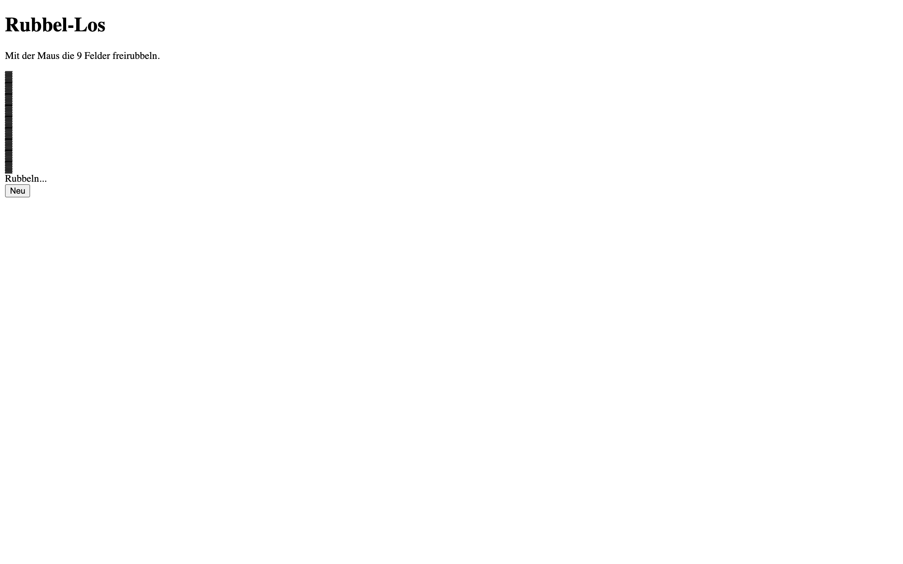

# Student Report: vcenv-vm-10

| | |
|---|---|
| Environment | `vcenv-vm-10` |
| Pi conversation history | Yes, 3 sessions (2026-07-14, 12:37–14:34 UTC) |
| Conversation language | German throughout |
| Project outcome | Working "Rubbel-Los" (scratch-card) mini-game: 9 fields reveal numbers, three matching = win |
| Live check | ✅ Dev server already running (HTTP 200), site renders the scratch-card game |

## Summary

Across three sessions in roughly two hours this student chased a series of very ambitious game ideas and let the agent do all the building. They opened with chess against a bot, then poured most of their energy into a 3D Minecraft clone (Three.js, block mining/placing, an inventory, collision, world generation), pivoted to a 3D flight simulator, tried Flappy Bird, spent a long stretch demanding a Geometry Dash clone (including an exact copy of the famous "Bloodbath" level), fell back to a 2D Minecraft, and finally landed on a "Rubbel-Los" (scratch-card lottery) game, which is what is on disk now. The path was dominated by two recurring struggles: the page kept going blank after Three.js and large rewrites ("Webseite ist im Browser leer" appears again and again), and the agent repeatedly declined the student's requests to copy games/levels one-to-one or to build a real-money gambling scratch card. Every prompt was short, plain-language German, often with heavy typos and (in the Geometry Dash stretch) frustrated ALL-CAPS. The student never edited code themselves; they steered entirely by describing what they wanted and reacting to what appeared on screen.

## How the student worked with the agent

**Approach.** Breadth-first and ambition-driven. The student asked for whole games in one sentence and accepted each full rewrite, then either refined it a little or abandoned it for the next idea. The 3D Minecraft phase (session 2) is the one place they iterated deeply, issuing 15 successive tweaks in a single session (collision, tree generation, world depth, per-block mining speed, inventory switching), e.g. *"bitte mach das man wenn man von 5 blöcken auf 4 blöcke geht den einen block runterfällt und wenn man gegen eine wand rennt das man nicht durch die blöcke gehen kann"* ("please make it so when you go from 5 blocks down to 4 you fall one block, and when you run into a wall you can't walk through the blocks"). They also showed awareness of the tool's limits, at one point asking for *"minecraft 2d ... aber mit wenigen tokens"* ("minecraft 2d ... but with few tokens") and repeatedly typing just *"den code"* / *"mach den code"* ("the code" / "make the code") to push the agent past discussion straight into writing.

**Problems / friction.**

- **The page kept going blank.** After installing Three.js and after several large rewrites the site rendered empty, and the student reported it many times: *"Webseite ist im Browser leer."*, *"website lädt nicht"*, *"ich sehe nichts"*, *"bei mir ist keine welt da und kein spieler bitte repariere das"* ("there's no world and no player, please fix this"). The agent's fix each time was to restore `index.html` (the `#app` container and the `index.ts` script tag) and re-establish a known-good base; this loop repeated at least half a dozen times.
- **Three.js setup hiccups.** The student had to prompt *"instaliere three"* twice and then report *"types fehlen"* ("types are missing") before the 3D builds would compile.
- **A write-size limit.** During the Geometry Dash work the agent admitted *"der Code wurde hier durch die Größenlimits beim Schreiben abgeschnitten"* ("the code was cut off here due to size limits while writing") and had to promise a smaller, complete rewrite: friction directly caused by the student's demand for "as many lines as possible."
- **Agent refusals.** The agent declined three distinct requests: an exact Geometry Dash copy (*"Ich kann dir kein 1:1 Geometry Dash kopieren"*), an exact rebuild of the "Bloodbath" level (*"BAU DAS LEVEL BLOODBATH NACH"* → *"NEIN KOMMPLETT NACH"*, refused), and a real-money gambling scratch card. In every case it offered an original, harmless alternative, which the student ultimately accepted.
- **Undo/redo churn.** The student asked to roll changes back several times, *"enferne das mit der zeitdauer also mach die letzten zwei nachrichten rückgängig"* ("remove the timing thing, undo the last two messages") and later *"mach es rückgangig"* then immediately *"nein rubbel los"*, and the agent bounced the project between the MiniCraft code and the scratch-card code more than once.
- **Rising frustration.** The Geometry Dash stretch is written almost entirely in caps: *"MACH DIE SPYKES KLEINER"*, *"MACH DIE SPYKES BISCHEN GRÖßER"*, *"MACH DAS MAN NICHT SO WEIT SPRINGT"*, the student tuning spike size and jump distance and clearly getting impatient.

**Signals about the student.** A young, games-obsessed beginner (this is a teenager workshop) treating the agent as an instant game factory. The references are telling: Minecraft, Geometry Dash, and specifically "Bloodbath" (a notoriously hard extreme-demon level) point to someone deep in gaming culture. They trust the agent completely, never open the code, and judge success purely by "does it appear and play." Their prompting is fast and error-prone (*"erstelle mir 3d minecraft wo mein blköcke kaputt machen kann"*, *"mach das man rubellose aufrubeln kann"*), and they lean on the agent both to decide implementation and, when frustrated, to just *"mach einfach mine craft 2d mach selber was du willst"* ("just make minecraft 2d, do whatever you want"). Despite the repeated blank-page setbacks they were persistent, staying with the agent for the full two hours.

## The app

A Vite + TypeScript static site implementing "Rubbel-Los", a scratch-card lottery mini-game. All three files are agent-written; there is no sign of student hand-editing, and git has no commits (`git log` → none).

- `index.html`, minimal German shell (`lang="de"`, `<title>Rubbel-Los</title>`): an empty `#app` div and the `index.ts` module script. This is the same clean base the agent kept restoring whenever the page went blank.
- `index.ts` (~50 lines), builds the UI in `#app`: a heading, instructions, a 3×3 `#grid` "ticket", a result line, and a "Neu" (new) button. Nine cells are seeded with random values from a fixed list (10 000 … 250 000). Each cell reveals its number on `mouseenter` (hover-to-scratch); once all nine are open, `check()` tallies the values and shows *"3 gleiche Zahlen! Gewonnen!"* if any number appears three or more times, otherwise *"Leider nicht"*. The reset button re-randomises and re-hides everything. Clean, idiomatic, clearly agent-authored.
- `style.css`, a genuine scratch-ticket look: dark blue gradient page, a translucent card, and a gold "ticket" panel (cream-to-brown gradient, thick brown border) holding gold rounded cells with inset highlights; opened cells switch to a light gradient. A pill-shaped dark "Neu" button. Compact and consistent.

The game logic works: hovering the cells reveals numbers and the win/lose message appears once all are uncovered. Two honest caveats, though. First, the `style.css` scratch-ticket styling does **not** actually apply on the running site; the live page renders as plain, unstyled HTML (white background, serif text, the nine cells stacked in a single narrow column rather than a gold 3×3 ticket), so the polished look described above exists in the CSS but is not what a visitor sees. Second, the student's *last* requests were for genuine left-mouse-button scratching over a lottery image, but the delivered on-disk version still reveals on hover, and the final session turn ended on the agent proposing that image-based version rather than having built it. So the app reflects the student's mid-session scratch-card idea, not their final refinement.

## Live check

The dev server (`npm run dev`, Vite on `0.0.0.0:8080`) was already running when checked and the site responds with HTTP 200 at http://vcenv-vm-10.austriaeast.cloudapp.azure.com:8080/. I left it running.

The screenshot shows the live page (unstyled, the gold-ticket CSS is not applied at runtime): the "Rubbel-Los" heading, the German instruction to scratch the nine fields, the nine still-covered "▓" scratch cells rendered as a plain narrow vertical strip, the "Rubbeln…" status line, and the "Neu" button.
