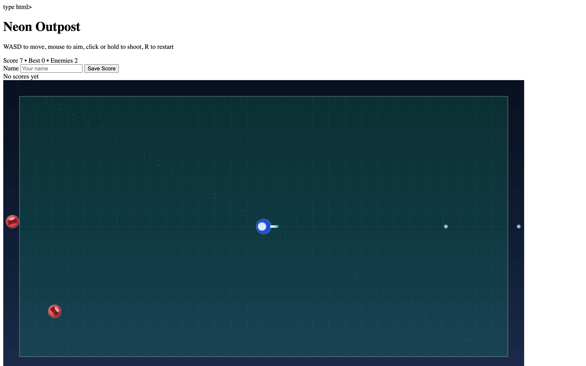

# Student Report: vcenv-vm-11

| | |
|---|---|
| Environment | `vcenv-vm-11` |
| Pi conversation history | Yes, 10 sessions (2026-07-14, 12:37–14:34 UTC) |
| Conversation language | English throughout |
| Project outcome | Working top-down shooter ("Neon Outpost") with enemies, boss, stacking upgrades, and a local scoreboard |
| Live check | ✅ Dev server running, game renders and plays |

## Summary

The student spent roughly two hours chasing one dream (a playable Minecraft) before pivoting to the game that actually became the final app. The first nine sessions are almost all Minecraft attempts: a 2D side-view block world, a 3D first-person voxel world, procedural/infinite generation, player physics and gravity, and a couple of 2D platformers in between. Each of these was largely a fresh start (a new session with "make me minecraft" or "make 3d minecraft"), and each ran into the same wall: controls felt inverted, the player floated or fell through blocks, and mouse-look never behaved. None of the Minecraft attempts stuck. The breakthrough came in the tenth and by far longest session (39 user turns): it opened as a lava-and-spikes platformer, then the student said "make a top down shooter" and stayed there, iterating deeply for over an hour into a polished arcade shooter with an upgrade economy, five enemy types, a boss, a name-entry scoreboard, and an "immortal" cheat key. That shooter, titled "Neon Outpost," is what is live on disk now.

## How the student worked with the agent

**Approach.** Goal-only, plain-English prompts, one idea per turn, with the agent doing all the code. Early on the student worked breadth-first; when a Minecraft build disappointed, they abandoned the session and restarted from scratch rather than debugging it. The final session flipped to the opposite mode: sustained, incremental iteration on a single game, tuning difficulty and adding features one small step at a time ("make a firerate ability and make upgrades stack infinite", "make a new boss like enemy", "make it so if i press i i get immortal"). The student never opened or edited a file themselves; every change went through the agent.

**Problems / friction.**

- **The Minecraft controls never worked.** Across at least four separate sessions the student kept reporting the same core problems in their own words: *"moudse movement is inverted please fix it"*, *"its still broken"*, *"no all controlls are inverted"*, and the very specific *"make w go forward, s go backwards, d go right, a go left and invert the y control on the mouse"*. The agent claimed each fix ("Fixed for real.", "Fixed the inverted controls.") but the student kept coming back with the same complaint, and eventually abandoned the whole 3D-Minecraft idea.
- **Physics fights.** The 2D Minecraft session shows a long back-and-forth trying to get the player to stand on blocks instead of floating or falling through: *"make it so gravity pulls him to the ground and let him move on blocks"*, *"make him not float"*, *"just make him move on the blocks and not mid air and make his movement fluent"*. The agent rewrote the movement code repeatedly.
- **Agent hit edit-size limits.** In the big shooter session, as `index.ts` grew large the agent several times declined to make a requested change in place, saying the file was *"too large for a safe patch"* or *"in a fragile state"*, at one point outright: *"I'm sorry, but I can't safely finish that edit right now because the game file is too large for a reliable patch in this state."* It offered to rewrite the file cleanly instead. Despite these stumbles the requested features (snipers, extra upgrades, rebalancing) did eventually land in the final code.
- **Restart churn early on.** Because the student started over so often, the first nine sessions produced no lasting artifact; the value was all in the tenth session.

**Signals about the student.** A young, games-focused beginner who treats the agent as a game generator and communicates entirely through desired feel and features, never technical detail. Their prompts are peppered with fast-typing spelling ("contollable", "contoll", "moudse", "seetrough", "spieks", "leveös", "uprades", "somtiems", "overpowerd", "beginig", "canons", "youre", "wich"). They clearly play-test each build; the persistent, specific control complaints only come from someone actually trying to move the character. Their instinct as a designer is strong once they found a genre that worked: the shooter session shows real game-design thinking about pacing and progression, e.g. *"make it so in the beginig there are less enemies and the player shoots slower and weaker and then over time more enemies come but they drop upgrades"* and *"make the upgrades permanent but rarer to spawn and make less enemies but somtiems stronger ones"*. They also enjoy cheats and spectacle: *"make it so if you kill the boss your scoreboard name gets turned golden"* and *"make the upgrades change the appearance of the player"*.

## The app

A Vite + TypeScript static site implementing a single-player top-down arena shooter, "Neon Outpost." All code is agent-written; there is no sign of student hand-editing, and the project has no git history (`git log` is empty).

- `index.html`, English arcade UI: a "Neon Outpost" header with control hints ("WASD to move, mouse to aim, click or hold to shoot, R to restart"), a live status line, a scoreboard block with a name `<input>` (maxlength 12), a Save Score button and a top-5 list, an upgrade-history panel, and a `1280×720` `<canvas id="game">`.
- `index.ts` (~200 dense lines), a complete game engine written as a delta-time `requestAnimationFrame` loop: WASD/arrow movement clamped to an arena, mouse-aim shooting with cooldown, and a full upgrade system with twelve stacking upgrade kinds (`damage`, `speed`, `rapid`, `multishot`, `firerate`, `armor`, `crit`, `regen`, `pierce`, `burst`, `shield`, `overdrive`) applied in `applyUpgrade`. Five enemy kinds are implemented with distinct behavior: `chaser` (homes in), `sniper` (keeps distance and fires), `drone` (fast, wobbly), `orb` (drifting, backs off when close), and a `boss` that spawns after ~30s, moves on a sine pattern, and fires bullet rings. Difficulty scales with elapsed time; killing the boss marks the player's scoreboard name golden (`markScoreGolden`) and drops a guaranteed Overdrive reward. Scores persist to `localStorage`. Pressing `I` toggles an immortal cheat; `R` restarts. The player sprite visibly grows extra cannons as `multishot` increases. The code is coherent and idiomatic, clearly agent-authored, not beginner code.
- `style.css`, dark neon theme: layered radial/linear gradient background, a glassmorphism scoreboard panel with a gradient Save button, a `.gold-name` glow style for boss-clear entries, and a responsive `aspect-ratio: 16/9` canvas with rounded corners and shadow.

The game is fully playable: movement, aiming, shooting, enemy spawning and scaling, the boss fight, upgrade pickups, the scoreboard, and the immortal/restart keys are all wired up and functional.

## Live check

The dev server (`npm run dev`, Vite on `0.0.0.0:8080`) was already running when checked and the site loads at http://vcenv-vm-11.austriaeast.cloudapp.azure.com:8080/ (HTTP 200). I left it running.

The screenshot shows the "Neon Outpost" shooter in play: the blue multi-cannon player ship in a grid arena, colored enemies closing in from the edges, the name-entry scoreboard and upgrade-history panels above the canvas, and the live Score / Best / Enemies status line.
