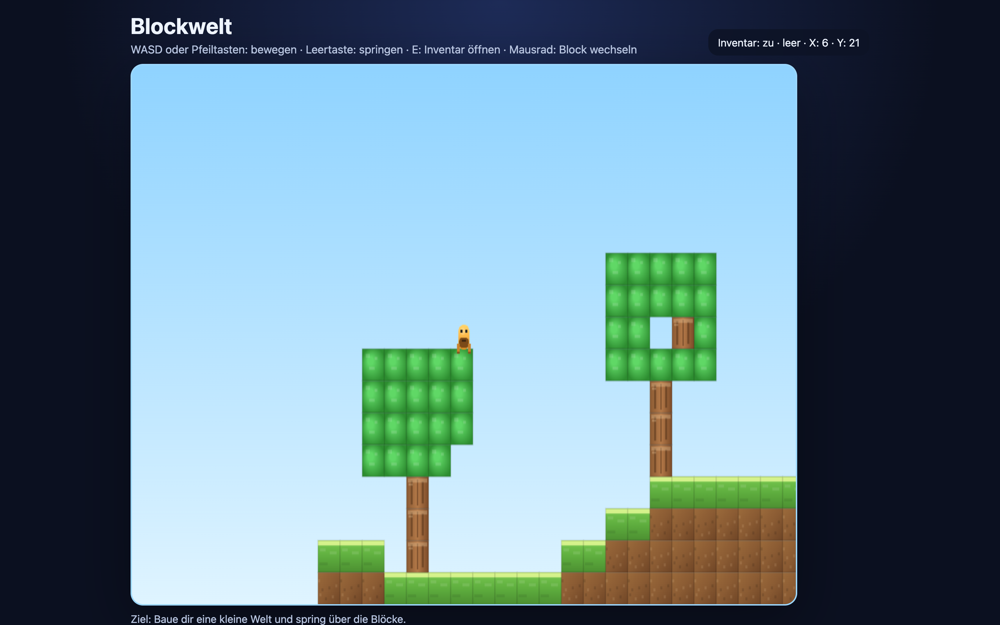
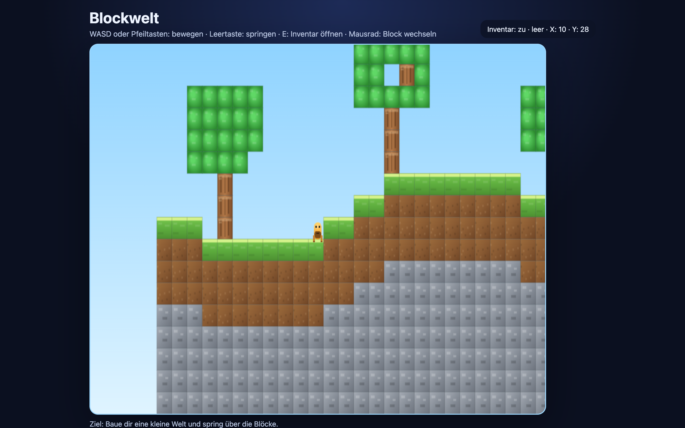

# Student Report: vcenv-vm-12

| | |
|---|---|
| Environment | `vcenv-vm-12` |
| Pi conversation history | Yes, 2 sessions (2026-07-14, 12:37–14:29 UTC) |
| Conversation language | German (prompts); agent replied mostly in German, occasionally English |
| Project outcome | Working 2D Minecraft-style block game: mineable/placeable blocks, inventory, 2×2 crafting, a second "crystal" biome; committed and pushed to GitHub |
| Live check | ✅ Dev server running (HTTP 200), game renders and plays |

## Summary

Across two sessions in just under two hours, this student built a single, ever-growing project: a 2D Minecraft-inspired block game. Unlike a breadth-first explorer, they stuck with one idea and iterated on it relentlessly, starting from *"erstelle mir ein 2d block spiel wie minecraft"* and layering on trees with leaves, a survival-style inventory (empty at start, filled by mining), a 2×2 crafting grid that turns 4 wood into a crafting table, a bigger world, and an entirely new "crystal biome" in the second half of the map with red-leaved trees, blue earth, and yellow crystals. The work is heavily art-directed: the student gave precise, opinionated feedback on how blocks should look (crystals yellow not the earth, max 3 blocks tall with some 1- and 2-tall, pointed triangular tops, fewer of them, only where no trees grow). They tested each build in the browser, caught regressions the agent had introduced, and repeatedly pushed back when something didn't actually work. The session ended with the student authenticating GitHub CLI themselves and having the agent commit and push the game to their own repo (`Felix48692/minecraft-kinder_uni`).

## How the student worked with the agent

**Approach.** Depth-first and iterative. One project, ~40 short German instructions building on each other. The student described features and visual details in plain language, let the agent write all the code, then played the result and reported back concretely. They increasingly demanded verification, at one point instructing the agent to keep notes on how it works and to check its own fixes rather than just claiming success. They also engaged with real tooling at the end: pasting browser console errors verbatim for the agent to diagnose, and driving a git commit + push to GitHub.

**Problems / friction.**

- **Crafting drag-and-drop was a long, painful loop.** The student wanted to drag inventory blocks into the 2×2 crafting field, and this broke over and over. Prompts trace the struggle: *"wenn ich ein holz stück mit drag und drop nehme kann ich es nicht in das crafting feld platzieren fix das bitte"*, then *"Das Crafting-Feld funktioniert nicht."*, then *"jetzt kann man nicht mal mehr drag/drop aufheben..."* ("now you can't even pick up drag/drop anymore"). The agent claimed "fixed / Build erfolgreich" repeatedly while the feature stayed broken, until the interaction was finally simplified to *"statt rechte taste loslassen mach das ich die linke taste drücken muss um es in den slot darunter zu bewegen"*.
- **Inventory wouldn't close.** *"das inventar lässt sich nicht schliessen"* and then the pointed *"ne es schliesst sich nicht versuche es nochmal und checke es dann selber"* ("no it doesn't close, try again and check it yourself this time"). Resolved by splitting open/close onto two keys (E to open, R to close).
- **A runtime crash and HMR noise.** The student pasted a real console error, `Uncaught ReferenceError: craftingGrid is not defined at render (index.ts:437)`, which the agent fixed by adding the missing state and removing a duplicated function. They also pasted the Vite WebSocket/HMR `ERR_CONNECTION_REFUSED` errors several times; the agent diagnosed it as an HMR host mismatch and updated `vite.config.ts` to point HMR at the public FQDN.
- **A quick pivot and undo.** *"mach das 3d"* → the agent produced an isometric 2.5D look → *"mach es wieder rückgängig"* reverted it. The student knew immediately it wasn't what they wanted.
- **Code grew too big to write safely.** The agent noted at one point that a write was truncated because of file size and that `index.ts` was in a "half rebuilt" state: a sign the single-file game had outgrown clean incremental edits.
- **GitHub push blocked on auth.** The first push failed (*"You are not logged into any GitHub hosts"*); the student then logged in themselves (*"Jetzt habe ich gh authentifiziert"*) and the agent pushed successfully.

**Signals about the student.** A persistent, detail-oriented young builder who treats the agent as a collaborator to be supervised, not a magic box. They test every build, notice regressions, and give remarkably specific art direction. Representative prompts: *"die kristalle gelb machen und weniger bäume platzieren und kristalle nur dort platzieren wo keine bäume sind und kristalle maximal 3 blöcke hoch aber auch ein paar nur 2 und 1 blöcke hoch"* ("make the crystals yellow, place fewer trees, and put crystals only where there are no trees, crystals max 3 blocks tall but also some just 2 and 1 blocks tall"); *"weniger kristalle und an der spitze also am obersten block eines kristales spitz machen dreiecksform"* ("fewer crystals and make the top, the topmost block of a crystal, pointed, triangle shape"); and *"mache dir ab jetzt immer notitzen wie du arbeitest"* ("from now on always keep notes on how you work"). Their instinct to demand self-checking (*"checke es dann selber"*) and to version-control the result shows a maturity beyond just wanting a game to appear.

## The app

A Vite + TypeScript static site implementing a 2D side-view block game. All code is agent-written across many incremental edits; there's no sign of direct student hand-editing.

- `index.html`, German UI: a HUD with the title "Blockwelt" and a control legend (WASD/arrows move, space jump, E inventory, mouse-wheel switch block), a `960×540` `<canvas id="game">` with `aria-label`, and a stats readout. Clean and semantic.
- `index.ts` (~460+ lines), the whole game in one file: typed block/item/player models, a procedural world generator (`WORLD_W=140 × WORLD_H=60`) that builds a normal grass/dirt/stone/tree half and, from the midpoint on, a crystal biome with `blueearth` ground, `redleaf` trees, and variable-height `yellowcrystal` formations; gravity/jump/AABB collision physics; mining with break particles; a survival inventory (`giveItem`) where you only own what you've mined; a 2×2 `craftingGrid` that yields a `crafting_table` when filled with wood; and a canvas render loop with hand-drawn gradient block sprites for each type. Coherent and clearly agent-authored.
- `style.css`, a dark "space blue" theme: radial-gradient background, glassmorphism HUD panel (blur, translucency, rounded corners), responsive canvas capped at 960px. Consistent throughout.

The game builds and runs. A couple of honest caveats visible on disk: the in-world `mousedown` handler has both branches guarded by `e.button === 0`, so the intended right-click *placement* path (`else if (e.button === 0)`) is unreachable dead code; placing mined blocks back into the world by clicking is effectively broken, though mining, inventory, and crafting work. There's also a leftover unused `crystal` draw case (superseded by `yellowcrystal`). These are agent artifacts from the many rapid rewrites, not student edits. The project was committed (`0d94d0d Game`, `f8af2b6 Refine biomes and inventory drag interactions`) and pushed to `https://github.com/Felix48692/minecraft-kinder_uni.git`.

## Live check

The dev server (`npm run dev`, Vite on `0.0.0.0:8080`) was already running when checked and the game loads at http://vcenv-vm-12.austriaeast.cloudapp.azure.com:8080/ (HTTP 200). I left it running.

The screenshot shows the "Blockwelt" game: the side-view block world with the player character on grass/dirt/stone terrain and trees, the HUD title and control legend at top, and the inventory/stats line, with the crystal biome (blue earth, red-leaved trees, yellow crystals) reachable by walking to the right half of the map.

The second screenshot shows the game rendered with its Minecraft-style textured block sprites (the character standing on grass/dirt/stone terrain with leaf-topped trees) and the HUD reading "Inventar: zu · leer · X: 10 · Y: 28".
