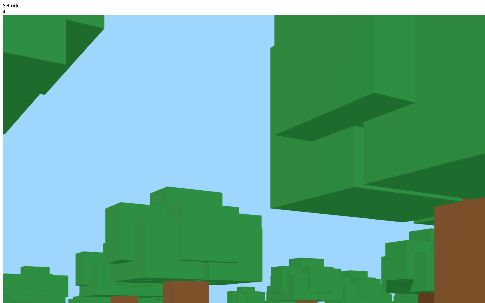

# Student Report: vcenv-vm-13

| | |
|---|---|
| Environment | `vcenv-vm-13` |
| Pi conversation history | Yes, 9 sessions (2026-07-14, 12:38–14:31 UTC) |
| Conversation language | Mostly German, with a few English prompts early on |
| Project outcome | Working Three.js 3D voxel world (Minecraft-style): walk with WASD, mouse-look, first/third person, endless terrain with grass/sand biomes, trees, puddles, cacti, pyramids, and a step counter |
| Live check | ✅ Dev server running, 3D world renders and is controllable |

## Summary

This student pursued one goal (a Minecraft-like game) with real persistence, working through eight short, often frustrating warm-up sessions before nailing it in a final, hour-long marathon. The early sessions (12:38–13:25) are a string of false starts: a neon-pink 2D Mario scene, several attempts at a flat 2D "Minecraft" with a movable figure, a couple of green-platform experiments, and repeated full resets back to "Hello World" when things looked broken or blank. Each of these was abandoned quickly, usually because the student couldn't see or control what they expected. Then, at 13:25, they changed tactics completely: instead of asking for a finished game, they opened with a *plan*, "erstelle einen ganz einfachen ersten Prototyp" ("make a very simple first prototype"), explicitly told the agent to use Three.js, and then built the whole thing up incrementally over 39 prompts: one block, then a 16×16 platform, then zoom, then WASD, then mouse-look, then flying, then removing flying, then collision, a visible character, biomes, decorations, and finally a step counter and desert pyramids. That final session is the entire current app, and it works.

## How the student worked with the agent

**Approach.** Two distinct modes. In the early sessions the student worked like many beginners: one plain-language wish per session ("mache mir ein 2d minecraft ähnliches spiel"), accept or reject the result at a glance, and reset if it looked wrong. But the final session shows a noticeably more mature, engineering-style approach: they set a plan first, chose the technology deliberately, asked for the smallest possible prototype, and then drove dozens of tiny, well-scoped refinements one at a time. They were clearly *playing* each build and reporting back precisely what felt wrong ("ich kann immer noch fliegen", "wenn ich d drücke soll ich nach rechts und nicht nach links gehen"). The student never edited code themselves (all changes were the agent's) but they directed the design tightly.

**Problems / friction.**

- **Blank / invisible output repeatedly derailed the early sessions.** The student kept seeing empty or near-empty pages: *"die website ist einfach nur weiss und in der ecke steht A / D laufen · W springen ich kann es nicht spielen behebe bitte das problem"* ("the website is just white and in the corner it says A / D walk · W jump, I can't play it, please fix the problem"), and *"es ist nicht neues hinzugefügt worden behebe den fehler"* ("nothing new was added, fix the error"). Several sessions ended with the student giving up and asking for a reset to Hello World.
- **"You did nothing."** In one session the student flatly told the agent it hadn't acted: *"du hast nichts gemacht mache bitte"* ("you did nothing, please do it"). The agent had been answering with clarifying questions instead of building.
- **Controls and orientation bugs in the 3D game.** Even in the successful session there was steady friction the student had to catch and correct: flying when they wanted walking, falling through the platform, seeing under the world, inverted A/D strafing, and a step counter that at first didn't render (*"der zähler existiert nicht"*, "the counter doesn't exist"), which took the agent two more tries to make visible.
- **One garbled prompt.** The student once typed just `+-www`; the agent couldn't interpret it and asked for a one-sentence clarification, and the student moved on.

**Signals about the student.** This is a persistent, systematic learner, more advanced than a pure "wish-machine" beginner. The turning point, opening the final session with an explicit plan and a technology choice ("nimm bitte three.js"), shows they understand that a hard project is built up from a minimal prototype, not requested whole. They test rigorously and give precise, incremental feedback, and they don't give up: eight failed or abandoned attempts didn't stop them from committing to a much harder 3D approach and seeing it through for over an hour. Representative prompts: *"mein plan ist die erstellung eines einfachen 3d minecraft spiels. wähle eine passende technologie und mache einen ganz einfachen ersten prototyp"* ("my plan is to create a simple 3D Minecraft game. choose a suitable technology and make a very simple first prototype"), *"erstelle eine kleine platform mit diesen einem block die platform soll 16 dieser blöcke breit und 16 dieser blöcke lang sein"* ("create a small platform from this block, 16 of these blocks wide and 16 long"), and *"ich soll nicht mehr fliegen können ich soll mich nur mit wasd bewegen können wenn ich von der platform runterfalle soll mein charakter dorthin zurückgesetzt werden wo ich am anfang war"* ("I shouldn't be able to fly anymore, I should only move with WASD, and if I fall off the platform my character should reset to where I started").

## The app

A Vite + TypeScript static site rendering a full Three.js 3D voxel world. All code is agent-written across the final session; there is no evidence of student hand-editing (a single git commit, `e5aa8f3 .`, holds the state).

- `index.html`, minimal: `lang="de"`, title "Three.js Vollbild Block", a single `#app` mount, and the module script. All UI is injected from TypeScript.
- `index.ts` (~390 lines), the whole game. It builds a Three.js scene with ambient + directional (shadow-casting) lighting, a chunked, effectively infinite world (`ensureChunk` generates 16×16 block chunks around the player as they move), two biomes selected by world X (`biomeAt`: grass vs. sand at `x >= 36`), and procedural decoration: grass/dirt blocks, blue water puddles, trees (grass biome only), cacti and layered pyramids (sand biome only, placed via a pseudo-random seed so they're irregular and rare). A box-figure `character` (body + head) is controlled with WASD relative to view direction; a pointer-drag mouse-look drives yaw/pitch (pitch clamped so you can't see under the world), the wheel zooms in third person, and `F` toggles first/third person. There's a fall-reset (`resetPlayer`) if the player wanders past a limit, and a HUD step counter that increments per block traversed. The code is coherent and idiomatic (clearly agent-authored, not beginner code) and it is the product of the student's many incremental instructions rather than one prompt.
- `style.css`, dark full-viewport layout (`overflow: hidden`, `100vw/100vh` canvas) plus a glassmorphism HUD panel (blurred translucent card, top-left) showing the "Schritte" (steps) label and value.

The app builds and runs. The 3D world renders, the character is controllable, biomes and decorations generate, and the step counter works; the student's final feature requests (biomes, cacti, pyramids, rarer pyramids) are all present in the on-disk code.

## Live check

The dev server (`npm run dev`, Vite on `0.0.0.0:8080`) was already running when checked (HTTP 200) and the site loads at http://vcenv-vm-13.austriaeast.cloudapp.azure.com:8080/. I left it running.

The screenshot shows the 3D voxel world at spawn: blocky green tree and grass-block voxels filling the frame against a light-blue sky, the character surrounded by the dense forest that generates around it, and the "Schritte" step-counter HUD (reading 4) in the top-left corner.
