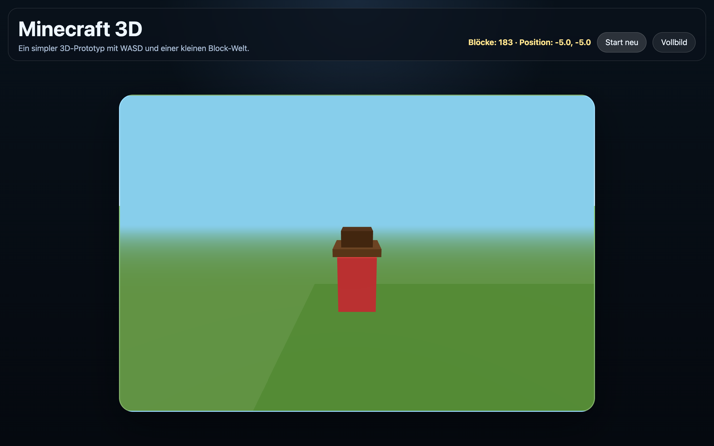

# Student Report: vcenv-vm-14

| | |
|---|---|
| Environment | `vcenv-vm-14` |
| Pi conversation history | Yes, 2 sessions (2026-07-14, 12:37–18:20 UTC) |
| Conversation language | German throughout (one debugging turn phrased by an adult/mentor) |
| Project outcome | Working three.js 3D "Minecraft" world: third-person red character on a grass-block field with a tree |
| Live check | ✅ Dev server running (HTTP 200), three.js scene renders |

## Summary

Across two sessions the student moved from breadth-first game-hopping to one long, stubborn push on a single idea. The first session (12:37–13:24) was pure exploration: they had the agent build a pfeiltasten-controlled jump-and-run with three themed levels (Wasser / Sand / Weltraum), then an archery game, then a simplified 2D Minecraft with inventory and crafting, then repeatedly tried to make it 3D, and finally pivoted to a top-down racing game that they asked to turn into a Formel-1 car. The second session (13:29–18:20) abandoned everything and committed to one goal ("Minecraft in 3D") and stayed there. It began with a raycasting prototype that rendered as a blank brown screen; an adult/mentor stepped in with a classic debugging strategy (draw just a red rectangle, comment out the rest, then re-enable piece by piece), which isolated the problem and led the agent to rebuild the whole thing on three.js. From there the student layered on grass blocks, fullscreen, a tree, jumping, look controls, collisions, a Play button, and finally a third-person 2-block character with a hat and a crosshair. The last stretch of the session collapsed into a long, frustrating loop where the character kept getting stuck; the student typed "ich kann mich nicht bewegen" (I can't move) roughly ten times while the agent kept rewriting the collision code.

## How the student worked with the agent

**Approach.** Goal-only, plain-language German prompts, one wish per turn, with the agent doing all the code. In session one the student behaved like the July-8 explorers: a new game every few turns, never refining one before jumping to the next. Session two is different and more mature: they picked one target and iterated on it relentlessly for hours, describing desired behaviour ("die grüne Seite nach oben", "stelle in die mitte einen baum", "der caracter soll auf dem boden stehen") and reacting to what they saw on screen rather than to code. They also asked for real project hygiene mid-way: *"Bitte mach mir aus dem ordner ein git repo, ich heiße flo ... ein .gitignore und check ein, damit ich zurück kann"* ("make this folder a git repo, my name is flo ... a .gitignore and commit it so I can go back"), showing an awareness of version control as a safety net.

**Problems / friction.**

- **The blank-brown-screen debug.** The three.js rebuild was triggered by a rendering failure. A mentor guided the isolation: *"Der Canvas ist momentan einfach leer. Um das Problem einzugrenzen, zeichne mal nur ein rechteck in den Canvas. Lösche den Code aber nicht raus, kommentiere ihn nur aus. Wir werden ihn wieder brauchen"* ("The canvas is just empty. To narrow it down, draw only a rectangle. Don't delete the code, just comment it out; we'll need it again"). This is clearly an adult teaching a method, and it worked.
- **A long "I can't move" loop.** After switching to a third-person character with collision, movement broke and stayed broken across many turns: *"ich kann mich nicht mehr bewegen"*, *"ich falle noch immer in die blöcke rein"* ("I still fall into the blocks"), *"ich kann nicht laufen"*, *"ich kann mich nicht bewegen behebe das!"* ("I can't move, fix this!"). The agent repeatedly diagnosed its own collision code as "zu streng" (too strict), loosened it, re-tightened it, and eventually stripped collision out entirely ("Kollision fürs Laufen vorerst entfernt") just to get the character moving again. This is the dominant friction of the whole workshop for this student.
- **Contradictory / oscillating requirements.** The student repeatedly flipped the control scheme (arrows for looking vs. moving, W/S for forward/back vs. turning), each flip forcing a rewrite. Several turns cancelled earlier ones ("keine hügel nur gerader boden" after asking for a Hügellandschaft).
- **An explicit undo.** *"resette die letzten zwei schritte"* ("reset the last two steps"): the student asked the agent to roll back the last two changes to the crosshair rather than describe a new state, echoing the earlier git request as another sign they think in terms of "going back".
- **"3D" mismatch.** In session one the agent twice pushed back that only a simple 2D web game was realistic in this project and offered a "3D-ähnlich" (3D-like) fake-perspective version; the student kept insisting ("mach es 3d", "erstelle ein 3d minecraft spie") until session two, where three.js finally delivered real 3D.

**Signals about the student.** A young, games-obsessed beginner (Minecraft, Steve, jump-and-run, F1) who trusts the agent completely and never edits code, but who (unusually for this cohort) has real persistence: they spent hours on one game and pushed through repeated failures instead of abandoning it. The recurring "genau wie Steve" and "es soll genau wie steve aussehen" ("it should look exactly like Steve") show a strong fixed mental image they wanted matched. The git-repo and "reset the last two steps" requests, plus the mentor-led debugging turn, suggest an adult was nearby coaching good habits. Characteristic prompts: *"baue minecraft vereinfacht"* ("build simplified Minecraft"), *"ich hätte gerne minecraft in 3D wie würdest du das machen"* ("I'd like Minecraft in 3D, how would you do it"), and the repeated *"ich kann mich nicht bewegen"*.

## The app

A Vite + TypeScript static site rendering a small three.js 3D voxel world. All code is agent-written; the single git commit ("Initial commit", author `flo`) and the transcript show no student hand-editing.

- `index.html`, German UI titled "Minecraft 3D" with a glass HUD: a live status line ("Blöcke: 0 · Position: 0.0, 0.0"), a **Play** button, a **Vollbild** (fullscreen) button, and a `<canvas id="game" width="960" height="640">`. Loads `index.ts` as a module.
- `index.ts` (~270 lines), the three.js scene: sky-blue background with fog, ambient + directional light, a 13×13 field of grass blocks built from a 6-material box (green top, brown sides), a floor plane, a four-block tree trunk topped with ten darker-green leaf blocks, and a 1×2 red box "character" wearing a two-part brown hat parented to it. Controls: **W/S** move forward/back, **A/D** turn, **arrow up/down** pitch the look, **Space** jumps (gravity + jump velocity), **Play** drops the character from the air onto the world (`started` flag), **Vollbild** toggles `requestFullscreen`. A red-dot crosshair is drawn each frame over the WebGL context. The render loop uses `THREE.Clock` delta time. Notably, the collidable-block array is built up but the collision checks were stripped out during the "can't move" loop, so the character walks freely through the tree and blocks, the visible legacy of that friction.
- `style.css`, the workshop's standard dark theme: radial/linear gradient background, translucent blurred HUD panel with rounded corners, pill buttons, and a responsive `aspect-ratio: 3/2` canvas with `image-rendering: pixelated` and a sky/grass gradient placeholder background.

The app loads and renders the 3D scene; the character can be dropped in with Play and moved, though collision is effectively absent after the debugging loop. It is a genuine three.js result (a real step beyond the 2D canvas games elsewhere in this cohort) and clearly agent-authored, not beginner code.

## Live check

The dev server (`npm run dev`, Vite on `0.0.0.0:8080`) was already running when checked and the site loads at http://vcenv-vm-14.austriaeast.cloudapp.azure.com:8080/ (HTTP 200). I left it running.

The screenshot shows the "Minecraft 3D" HUD above a three.js scene: a green grass-block field under a blue sky, a brown-trunked tree with darker-green leaf blocks in the centre, the red two-block character wearing a brown hat, and a small red crosshair dot in the middle, with Play and Vollbild buttons top-right.
