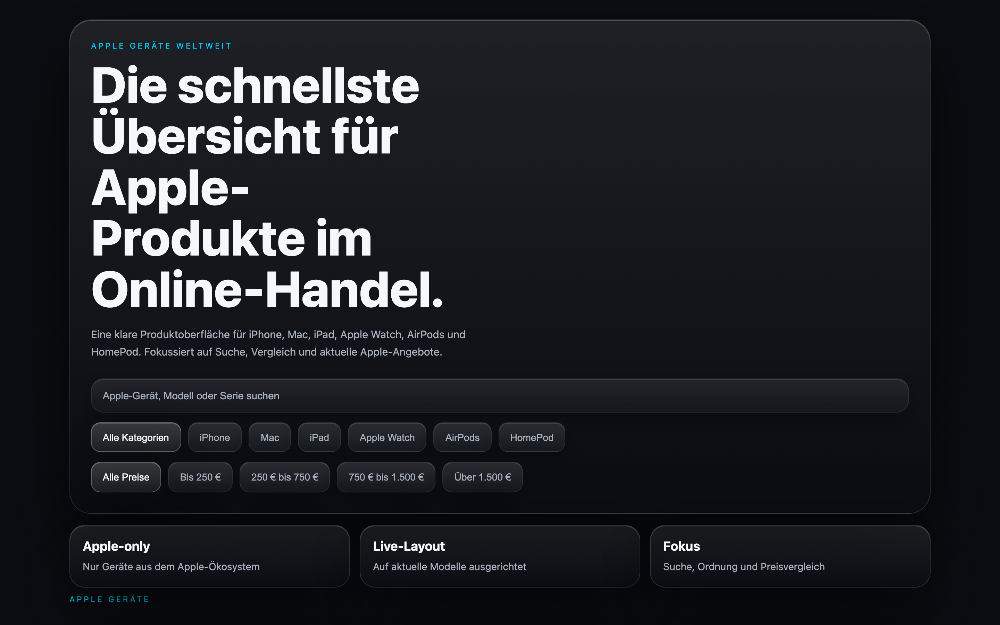

# Student Report: vcenv-vm-15

| | |
|---|---|
| Environment | `vcenv-vm-15` |
| Pi conversation history | Yes, 1 session (2026-07-14, 12:37–14:13 UTC, ~95 min, 60 user turns) |
| Conversation language | German throughout |
| Project outcome | Apple-device catalog website (German) with fuzzy search + category/price filters; a fire-brigade site, an Express/SQLite API, and a multi-shop price comparison were all built earlier in the same session and then removed |
| Live check | ✅ Dev server running, Apple table renders and search/filters work, but leftover dead code makes a row-click throw a (harmless) console error and `tsc` no longer passes |

## Summary

In one long, unbroken 95-minute session the student drove the agent through three completely different projects and an enormous amount of design iteration. They opened by asking for a polished website about fire-brigade operations in Austria, then escalated it into a real data app: a database, then a full Express + SQLite REST API (`GET/POST/PUT/DELETE /api/einsaetze`) with a Vite proxy and an entry form. They then abandoned that entirely and pivoted to "a website of all devices sold online in the whole world," pointing the agent at `evrysecond.de` (later corrected to `everysecond.io`, which the agent correctly identified as Neal Agarwal's visualization site, not a product source). The project was reset, narrowed down to Apple devices only, and grew a genuine multi-shop price-comparison feature (Apple Store / Cyberport / refurbed, with best-price marking) fed by real shop URLs the student pasted. The back half of the session is almost pure aesthetics: custom animated cursor, Apple "Liquid Glass"/water-drop styling, animated background blobs, aggressive 3D shadows, each added, tweaked, and then mostly reverted. Near the end the student had the agent delete the entire price-comparison feature and asked for typo-tolerant search. The final on-disk site is a clean dark Apple-device table with working search and filters, but the price-comparison removal left dangling references (`renderSummary` is called but no longer defined), so the build no longer type-checks and clicking a table row throws a console error. This was one of the more ambitious and persistent sessions: a lot got built, even if the last product is smaller than its mid-session peak.

## How the student worked with the agent

**Approach.** Persistent, iterative, and design-obsessed: the opposite of a one-shot prompter. The student stayed on a single evolving project, giving one plain-language instruction per turn and letting the agent do all implementation, but they iterated deeply: they inspected the running result, noticed what was broken or ugly, and pushed back turn after turn ("the search doesn't work", "the cursor lags", "make it look 3D", "put it back like before"). They fed the agent genuine external material: the `everysecond.io` link and four real Austrian shop URLs (Cyberport, faire, refurbed, apple.com), showing real intent to build a working price comparison rather than just a mock. They also happily used the agent as an undo button, repeatedly reverting design experiments they disliked.

**Problems / friction.**

- **Frequent casual typos**, consistent with fast teenage typing: `Feuerwehreinsetze` (Einsätze), `evrysecond.de` (everysecond.io), `saetze` (setze), `k0mplett`, `krasswe`, `bite`, `preeisvergleich`, `mahen`, `kannstr`, `amche`, `wei` (wie).
- **Repeatedly hit the "real live data" wall.** Across several turns the agent explained (in plain German) that it cannot freely scrape arbitrary shops or connect to a real fire-brigade/operations feed without a permitted API, and fell back to curated example prices/links. The student accepted this each time without pushback but kept probing for it (*"und kannst du jetzt von mehreren offiziellen online shops die geräte vergleichen"*).
- **The everysecond.io misunderstanding.** The student believed `everysecond.io` was a global product database; the agent identified it as a data-visualization art site and offered an "every-second style" build instead, which the student declined in favour of a plain device site.
- **Heavy design churn.** Water-drop/Liquid-Glass styling, blobs, and a custom cursor were added and then explicitly ripped out again (*"nein mach alles weg"*, *"mache die cursor funktion wieder weg"*, *"ok vergiss das mit den wasser tropfen nimm das design von vorher"*). A lot of effort cycled without net progress.
- **Dead code left behind.** Deleting the price-comparison feature removed the comparison markup from `index.html` but left references in `index.ts` to elements that no longer exist (`.device-card`, `productGrid`, `compareSummary`) and, critically, calls to an undefined `renderSummary()`. `npx tsc --noEmit` now reports `Cannot find name 'renderSummary'`, and the abandoned `server.ts` from the API phase also fails to resolve `sqlite`. The Vite dev server (esbuild) still serves the page fine, so this is invisible until you click a product row.
- **Duplicate table rows.** The Apple product table lists "Apple Watch Series 10" twice and carries both generic ("Apple Watch Series", "Apple Watch Ultra") and specific ("Series 10", "Ultra 2") variants: an artifact of the "add new models without removing old ones" step.

**Signals about the student.** A confident, engaged teenager with a strong visual vocabulary and real staying power. Their prompts are casual German full of enthusiasm markers: *"geiles design"*, *"ja mach geile animationen und krasswe cursor"* ("yeah make cool animations and a sick cursor"), *"geiles 3d design"*. They express refinement entirely through look and feel: *"es soll alles 3d aussehen"* / *"noch mehr 3d und alles soll schatten haben"* ("everything should look 3D" / "even more 3D and everything should have shadows"), *"kannst du das wassertropfen design von apple in diese website einfügen"* ("can you add Apple's water-drop design"). They understand app concepts at a surface level: they asked *"kann man das auch mit einer datenbank verbinden in die alle einsetze eingetragen werden"* ("can you also connect it to a database that all operations are entered into") and *"kannst du die api schnittstelle erstellen"* ("can you create the API interface"), and they test what they build, reporting concrete regressions like *"die such funktion funktioniert nicht"* ("the search function doesn't work") and *"der cursor hängt"* ("the cursor lags"). Their last request is a nice touch of user empathy: *"kannstr du bei der search funktion das so machen das mann sich auch vertippen darf"* ("can you make the search so that you're allowed to make typos too"), which the agent implemented as a Levenshtein fuzzy match.

## The app

A Vite + TypeScript static site presenting a German Apple-device catalog. All code is agent-written; there is no sign of hand-editing by the student.

- `index.html`, German UI titled "Apple Geräte weltweit": a masthead with a search box, a row of category filter chips (iPhone / Mac / iPad / Apple Watch / AirPods / HomePod), a row of price-range chips, a three-item "market overview" strip, and one large `<table class="product-table">` listing ~28 Apple products (name, category, price, feature blurb) as clickable rows. The earlier price-comparison sections were removed, so the page is now essentially this one table.
- `index.ts` (~310 lines), filtering and (dead) selection logic. Working parts: `normalizeText` + a full `levenshtein`/`fuzzyMatch` implementation powering typo-tolerant search, category and price-range filtering wired to the chips, and a price sort helper. Non-working remnants: a large `offersByProduct` price-comparison data map (Apple Store / Cyberport / refurbed with real shop URLs) that nothing renders anymore; references to removed DOM nodes (`grid`, `.device-card`, `compareSummary`, `shopCompare`); two calls to an undefined `renderSummary()` inside the row-click handler; and code that still creates two `liquid-blob` background divs. Clicking a product row therefore toggles its highlight and then throws a `ReferenceError`: no visible breakage, but a console error and a broken type-check.
- `style.css`, a dark theme (`#07090d` background, purple/cyan accents) carrying the residue of the 3D-and-shadow phase: heavy layered box-shadows and inset highlights on nearly every surface, a frosted/blurred sticky-header comparison-table style, `perspective`/`translateZ` hover-lift on rows, `fadeUp` entrance animation, plus responsive and `prefers-reduced-motion` handling. The Liquid-Glass/water-drop experiments were reverted; what remains is a coherent, if shadow-heavy, dark table design.
- Leftover from the abandoned phase: `server.ts` (Express + SQLite fire-brigade API) still sits in the project and does not compile, but it is unrelated to the Vite frontend and does not affect the served site.

The site loads and the core experience, browse the Apple table, type a (even misspelled) query, filter by category/price, works. The features the student spent the most time on mid-session (the price comparison, the fancy cursor, the liquid design) were all deliberately removed before the end.

## Live check

The dev server (`npm run dev`, Vite on `0.0.0.0:8080`) was already running when checked and the site returns HTTP 200 at http://vcenv-vm-15.austriaeast.cloudapp.azure.com:8080/. I left it running and did not restart it. The Apple table, search box, and filter chips render and function; the only defect is the leftover `renderSummary` reference that throws in the console when a row is clicked.

The screenshot shows the dark "Apple Geräte weltweit" page: the masthead headline and search box, the category and price filter-chip rows, and the large Apple product table (iPhone, Mac, iPad, Watch, AirPods, HomePod entries with prices and feature notes).
