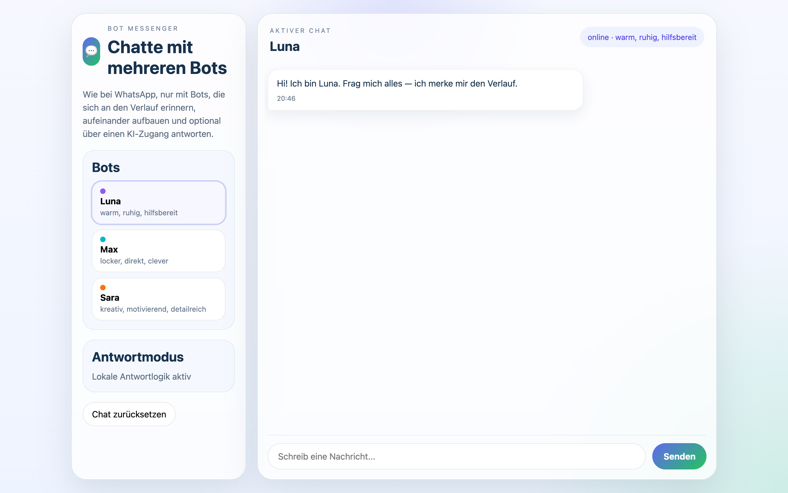
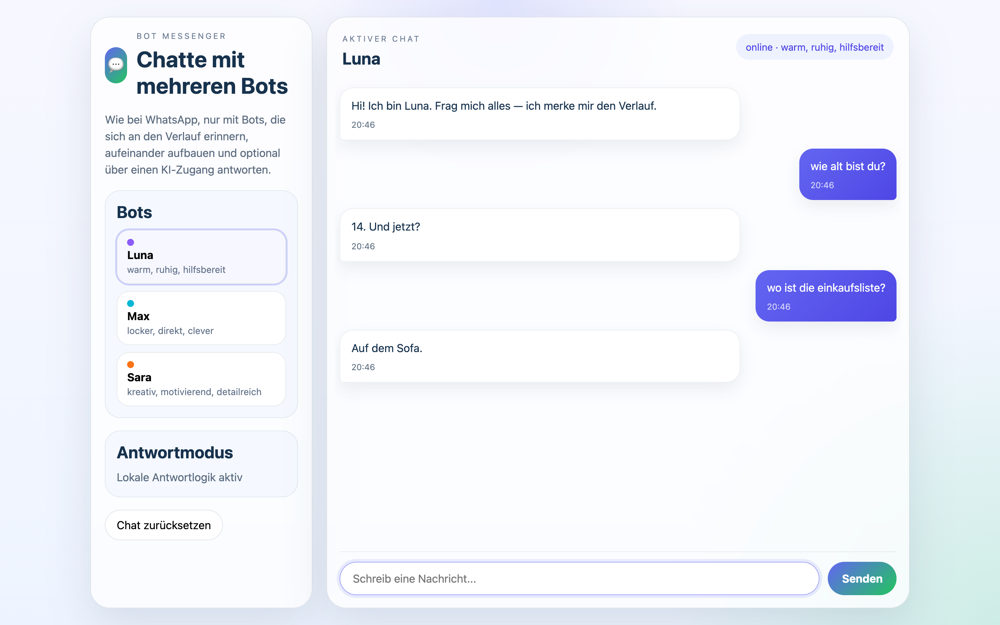

# Student Report: vcenv-vm-2

| | |
|---|---|
| Environment | `vcenv-vm-2` |
| Pi conversation history | Yes, 7 sessions (2026-07-14, 12:37–13:54 UTC session starts) |
| Conversation language | German throughout |
| Project outcome | Working "Bot Messenger": a WhatsApp-style chat with three rule-based bots (local reply logic) |
| Live check | ✅ Dev server running (HTTP 200), site renders |

## Summary

Across seven short sessions in about 80 minutes this student cycled rapidly through six completely different app ideas before landing on the chat app that is now live. They opened with a climbing game ("Cliff Quest"), rebuilt it in a second session with star-collecting and a long back-and-forth over jump physics and camera follow, then jumped to a Minecraft-style block sandbox, a pastel-pink Snake game eating cherries, a Farm/Hay-Day tycoon, and finally a "Bot Messenger" where you chat with several bots. Each new concept was a fresh session, so the on-disk website is simply whatever the last two sessions produced. Every prompt was a plain-language German goal; the student never wrote or edited code themselves and let the agent rewrite all three files each turn. The most revealing stretch is the final app: the student pushed hard to make the bots "answer like real humans," and then (handed a real AI provider config by the workshop) asked the agent to wire the chat up to an LLM, hit a CORS wall, and ultimately told the agent to rip the AI access back out and return to the canned local replies.

## How the student worked with the agent

**Approach.** Fast, breadth-first, and outcome-driven. The student typed one plain-language request per session, accepted whatever the agent built, and usually moved on to a new idea rather than polishing. The exceptions (the climbing game, Snake, and the Bot Messenger) show real iteration, where the student played the build, noticed what felt wrong, and fired off correction after correction ("still too fast", "you can't jump again", "make them answer like real people"). They described feel and behavior, never implementation: no file names, no code terms, no technical vocabulary.

**Problems / friction.**

- **Jump/physics kept regressing in the climbing game.** The student iterated five times on collisions, camera follow, and jumping, and the same complaint kept coming back: *"bitte schau, dass die figur an allen stellen springen kann"* ("please make sure the figure can jump everywhere") and then, a turn later, *"außerdem kann man wieder nicht springen"* ("also you can't jump again"). Jumping broke, got fixed, and broke again.
- **Snake broke outright.** After a change the student reported *"man kann das spiel nicht mehr starten, bitte ändere das"* ("you can't start the game anymore, please fix it"). The agent traced it to a duplicated `const bg` declaration it had introduced and removed it. The student also had to ask twice more to slow the snake down (*"die schlange ist noch immer zu schnell"*, "the snake is still too fast").
- **A blocked request.** In the tycoon session the opening prompt was *"Gib mir Geld"* ("Give me money"); the agent declined (*"Dabei kann ich dir nicht helfen"*, "I can't help with that") and offered legitimate money-themed web apps instead. The student pivoted to *"eine Spiele app"* → *"eine art tycoon"* → *"eine farm tycon"* and got a Farm/Hay-Day clone.
- **Visible frustration with the chatbot.** When the bots gave stilted answers, the student shouted in caps: *"bITTE LASS SIE EINFACH WIE ECHTE MENSCHEN ANTWORTEN!!!!!! Nicht Verstanden: Hallo Lara, und was denkst du dazu, sondern Hallo, wo ist die Einkaufsliste? Und dann schriebt der andere: Am Küchentisch"* ("PLEASE JUST LET THEM ANSWER LIKE REAL PEOPLE!!!!!! Not 'Understood: Hello Lara, and what do you think', but 'Hello, where is the shopping list?' and then the other writes: On the kitchen table"). This concrete example is literally what the agent then hard-coded into the reply logic (the "wo ist … → Am Küchentisch" rule is in `index.ts`).
- **CORS killed the real-AI attempt.** The student pasted the novedu proxy config and asked to make the chat "smart" with the key in the code. The browser rejected the direct call: *"Access to fetch at 'https://novedu-chat-mvp-at.azurewebsites.net/…' … has been blocked by CORS policy"*. The agent explained the problem and set up a Vite proxy, but the student gave up on it, *"entferne den intelligenten ki zugang und verwende die antworten von vorher"* ("remove the smart AI access and use the answers from before"), so the shipped app is back to canned local replies.
- **Frequent typos**, consistent with fast casual typing: `sellber` (selber), `leibt` (bleibt), `udn` (und), `iemmer`/`nnicht`, `geth` (geht), `tycon`, `schriebt`, `wiealt`, and run-together words like `Beispielkommt`.

**Signals about the student.** A young, playful beginner treating the agent as a wish machine. The catalogue of ideas (climbing platformer, Minecraft, pastel Snake with cherries, Hay Day farm tycoon, WhatsApp-style chat) reads as kid/games-culture driven. They trust the agent completely, never inspect code, and measure success by "does it look and behave like I pictured." They are willing to push back hard and specifically when it doesn't (the all-caps "real humans" message, the repeated "too fast"), and they engaged seriously with the AI-integration idea when the workshop gave them the credentials, only backing off when the CORS error made it too fiddly. Representative prompts: *"mach mir ein tolles Spiel wo man klettern muss, du kannst dir sellber was überlegen"* ("make me a great game where you have to climb, you can think of something yourself"), *"erstelle mir das spiel minecraft"* ("make me the game Minecraft"), and *"Erstelle mir bitte das Snake Spiel, aber die Schlange soll pastellrosa sein und Kirschen essen"* ("please make me the Snake game, but the snake should be pastel pink and eat cherries").

## The app

A Vite + TypeScript static site implementing "Bot Messenger," a WhatsApp-style chat. All code is agent-written; there is no git history (`git log` is empty) and no sign of student hand-editing.

- `index.html`, German chat UI: a sidebar with a "Bot Messenger" brand, a bot list, an "Antwortmodus" (reply mode) card that reads "Lokale Antwortlogik aktiv" ("local reply logic active"), and a "Chat zurücksetzen" reset button; a main panel with a chat header, message list, and a text composer. Note the brand badge shows a mojibake glyph (`ð¬`) where a chat emoji was intended, and there is a stray extra `
` in the chat header; browsers tolerate it, so it still renders.
- `index.ts` (~215 lines), the whole chat engine, entirely rule-based (no live AI): three bots (Luna, Max, Sara) each with a tone and an age/mood state; a `generateReply`/`chooseReply` pair that regex-matches the user's text ("wie alt bist du" → the bot's age, "wo ist …" → "Am Küchentisch", greetings, argument triggers, "bist du ein bot", etc.) and otherwise falls back to mood-based random one-liners; `detectMood` to shift a bot between friendly/curious/playful/annoyed; `localStorage` persistence; and a reset. The earlier AI-provider/proxy code the student asked to remove is gone. Two leftover rough edges: a couple of replies contain the same mojibake emoji (`bro ð­`), and the reset function seeds messages/states for two bots (`noah`, `mila`) that don't exist in the three-bot list, harmless but inconsistent.
- `style.css`, a light, friendly "glassmorphism" theme: soft indigo/green radial gradients, translucent blurred sidebar and chat panels, rounded message bubbles (user bubbles gradient-filled and right-aligned), a pill status badge, and mobile breakpoints that collapse the two-column layout.

The app is functional: you pick a bot, type a message, and get a contextless but chatty canned reply that varies with detected mood; the conversation persists across reloads and the reset button restores a scripted opening. It behaves as a scripted chat simulator, not a real AI assistant, which matches the student's final instruction to drop the LLM integration.

## Live check

The dev server (`npm run dev`, Vite on `0.0.0.0:8080`) was already running when checked and the site loads at http://vcenv-vm-2.austriaeast.cloudapp.azure.com:8080/ (HTTP 200). I left it running.

The screenshot shows the Bot Messenger interface: a left sidebar with the "Bot Messenger" brand, the Luna/Max/Sara bot list, an "Antwortmodus: Lokale Antwortlogik aktiv" card and a reset button, and on the right the active chat with the seeded bot intro messages and a "Schreib eine Nachricht…" composer at the bottom.

The second screenshot shows the local reply logic in action: asking Luna *"wie alt bist du?"* returns *"14. Und jetzt?"* and *"wo ist die einkaufsliste?"* returns *"Auf dem Sofa."*, the seeded rule-based answers the student iterated on.
