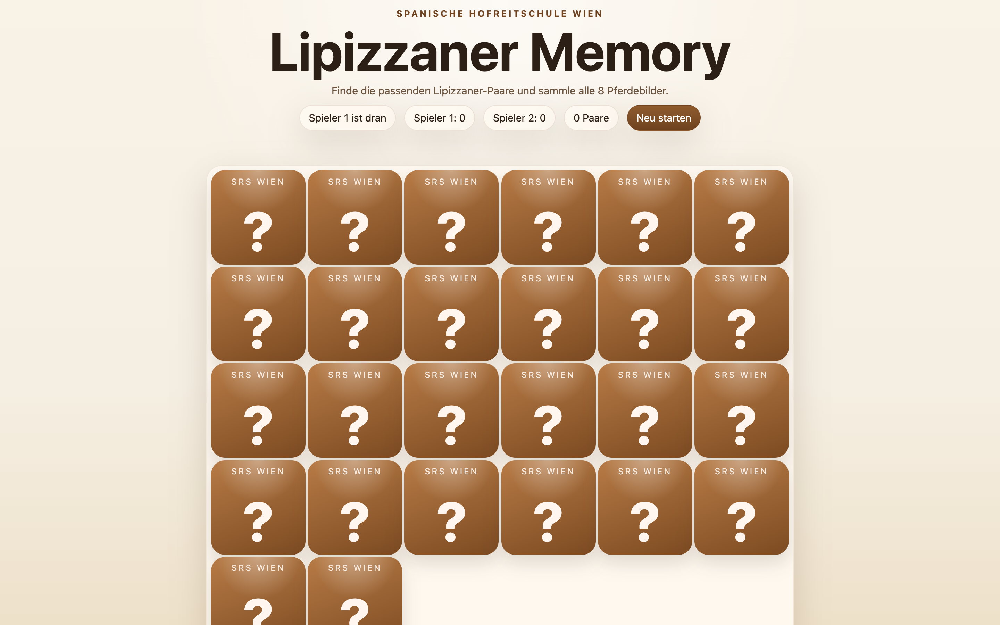

# Student Report: vcenv-vm-3

| | |
|---|---|
| Environment | `vcenv-vm-3` |
| Pi conversation history | Yes, 3 sessions (2026-07-14, 12:36–14:20 UTC) |
| Conversation language | German throughout |
| Project outcome | Working two-player Lipizzaner Memory game with real photos |
| Live check | ✅ Dev server running, game renders and plays |

## Summary

This student pursued a single, clear idea for nearly two hours: a Memory (matching-pairs) card game themed on the Lipizzaner horses of the Spanish Riding School in Vienna. A first attempt (session 1) got them a playable board but with placeholder/stock images they were unhappy with; they wiped it with a "reset to hello world" request (session 2) and rebuilt from scratch (session 3), which is where the bulk of the work happened: 33 turns of steady, opinionated refinement. Every prompt was short, plain-language German, and the student never touched the code themselves. The most striking pattern is how hands-on and specific the student was about details: they rejected the agent's placeholder images outright, hunted down and pasted in 14 of their own real photo URLs, dictated exactly which named pairs should exist, and then spent a long stretch fine-tuning card size and grid layout by feel. The result is a coherent, fully playable two-player game with real Lipizzaner photos, turn-taking, scoring, a winner screen, and auto-reshuffle.

## How the student worked with the agent

**Approach.** Goal-driven but detail-obsessed. The student opened each build with one plain request, *"Bitte baue mir ein Lipizzaner Memory mit Lipizzanern aus der Spanischen Hofreitschule Wien."* ("Please build me a Lipizzaner Memory with Lipizzaners from the Spanish Riding School Vienna."), and then drove the rest through a long series of small, concrete corrections. Unlike a student who accepts whatever appears, this one clearly played each build and pushed back on specifics: how pairs behave (*"wenn ein paar gefunden wurde soll es aufgedeckt bleiben"* / "when a pair is found it should stay revealed"), how many of each motif exist (*"von jedem darf es nur ein paar geben"* / "there should only be one pair of each"), and eventually the exact images. They supplied their own content rather than relying on the agent: pasting a specific image URL with *"setze dieses bild als ein paar im memory ein"* ("insert this image as a pair in the memory"), then later a single message containing 14 photo URLs with the instruction to use them all as pairs and delete the rest. Late in the session they layered on real game mechanics: two players, turn-taking, disappearing matched pairs, a winner announcement, and automatic reshuffle after the game ends.

**Problems / friction.**

- **Placeholder images were a recurring fight.** The agent repeatedly reached for Unsplash/stock placeholders "so the memory works right away," and the student kept rejecting them: *"Nimm keine bilder als platzhalter"* ("Don't use images as placeholders"). This is what pushed the student to go find and paste their own real photo URLs; the friction actually shaped the final app.
- **A long, indecisive card-sizing loop.** Roughly a dozen consecutive turns are just *"vergrößere die karten"* / *"verkleinere die karten"* ("make the cards bigger" / "smaller"), bouncing the card size through 72 → 88 → 104 → 120 → 136 → 152 → 120 → 128 → 136 px. The student was tuning purely by eye with no target in mind, and the agent obliged each time with a small CSS nudge.
- **A grid-vs-count mismatch the agent had to flag.** The student asked to *"ordne die karten 14x14 an"* and then *"14 Spalten und 14 Reihen als Raster"* ("arrange the cards 14×14" / "14 columns and 14 rows as a grid"). The agent correctly pointed out that a real 14×14 grid needs 196 cards while only ~14 were in play, and asked what was actually meant; the student then settled on a 6×6 layout instead.
- **Pair-uniqueness took several passes.** The student spelled out in detail that the named motifs ("Lipizzaner im Sonnenlicht", "auf der Weide", "beim Trab", "Lipizzaner Portrait") should each appear only once, then asked to add more terms, then swapped named/text cards for image cards, a stepwise negotiation rather than one clean spec.

**Signals about the student.** A focused, particular beginner who treats the agent as an executor of a fairly clear vision, not a wish-machine to be surprised by. They had a strong sense of authenticity (real Lipizzaner photos of the Spanish Riding School, not generic stock), were willing to do the legwork of sourcing 14 image URLs themselves, and iterated on concrete, observable behaviour ("stay revealed", "only one pair each", "matched pairs should disappear", "show which player won"). The endless size tweaking shows someone who cared about how it looked on screen and kept playing until it felt right. Characteristic prompts: *"Nimm keine bilder als platzhalter"* ("Don't use placeholder images"), *"von jedem darf es nur ein paar geben"* ("there should be only one pair of each"), and *"wenn alle paare gefunden worden sind, zeige an welcher spieler gewonnen hat"* ("when all pairs are found, show which player won"). One full reset ("setze alles auf 'hello world' zurück") in the middle shows they were comfortable throwing away a false start and rebuilding cleanly.

## The app

A Vite + TypeScript static site implementing a two-player Lipizzaner Memory game. All code is agent-written; the student directed everything through prompts and supplied the image URLs, but did not hand-edit files.

- `index.html`, German UI: a "Spanische Hofreitschule Wien" eyebrow, "Lipizzaner Memory" title, an intro line, and a live status bar showing whose turn it is, each player's score, the pair count, and a "Neu starten" (restart) button. A `#winner` live region and a `#board` container hold the game.
- `index.ts` (~190 lines), the full game logic: a typed `Card` model, an array of **13** real Lipizzaner photo URLs (the student's own sources: familienurlaub-steiermark, srs.at, getyourguide, Bing thumbnails, etc.), a Fisher-Yates-ish shuffle, board rendering with 3D flip cards (front shows an "SRS Wien / ?" face, back shows the photo), two-player turn logic (a correct match keeps the same player's turn and scores a point; a miss switches players), matched cards animating out and being hidden, a winner/`Unentschieden!` (draw) announcement when all pairs are found, and an automatic reshuffle ~2.5 s after the game ends. Coherent and idiomatic, clearly agent-authored.
- `style.css`, a warm, "Viennese" cream-and-brown theme (not the usual dark arcade look): soft radial/linear gradient background, pill-shaped translucent status chips, a rounded board panel, and a fixed **6×6 grid of 136 px** flip cards with `object-fit: cover` photos that fill each card edge-to-edge (per the student's "no gap between card edge and image" request).

The game is fully functional: cards flip, pairs match and disappear, players alternate, scores update, a winner is declared, and the board reshuffles for a new round. The 13 image pairs (26 cards) sit comfortably in the 36-slot 6×6 grid. Note the card names in code are generic ("Lipizzaner Bild 1…13") after the student replaced the earlier named/text cards with pure image cards.

## Live check

The dev server (`npm run dev`, Vite on `0.0.0.0:8080`) was already running when checked and the site loads at http://vcenv-vm-3.austriaeast.cloudapp.azure.com:8080/ (HTTP 200); I left it running.

The screenshot shows the game board: the "Lipizzaner Memory" title and Spanish-Riding-School eyebrow, the status bar (current player, both scores, pair count, restart button), and a 6×6 grid of brown flip cards showing the "SRS Wien / ?" back face, with any matched photo pairs revealed.
