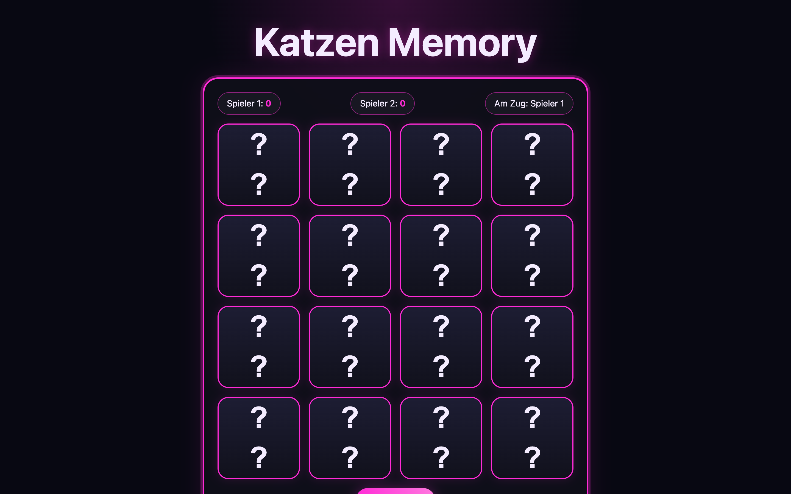

# Student Report: vcenv-vm-4

| | |
|---|---|
| Environment | `vcenv-vm-4` |
| Pi conversation history | Yes, 1 session (2026-07-14, 12:37–14:15 UTC, ~1h40m, 34 user turns) |
| Conversation language | German |
| Project outcome | Working 2-player "Katzen Memory" (cat memory) card game with real photos, neon-pink theme, and confetti |
| Live check | ✅ Dev server running on `0.0.0.0:8080`, site renders and plays |

## Summary

In one focused, continuous session the student built a complete two-player "Katzen Memory" (cat memory) game and refined it through 34 short German prompts. Unlike a breadth-first explorer, this student stuck with a single idea from the first message ("a memory game with cat pictures and a neon-pink border") and shaped it steadily: swapping emojis for real cat photos, tuning card size back and forth, centering the question marks, fixing the pairing logic, adding two-player scoring with turn-passing, celebration emojis, and finally a confetti finish. They never wrote code themselves (every change was expressed as a plain-language wish and implemented by the agent), but they clearly played each build and reported precise, outcome-focused feedback. The session shows a beginner with a strong sense of what they wanted and the patience to iterate toward it, including asking the agent to verify broken image links and adding a test cheat before packaging the project as a ZIP.

## How the student worked with the agent

**Approach.** Depth-first and iterative on a single concept. The student opened with a clear goal, *"Baue mir ein Memory mit Katzen Bilder mit einen Neon Pinken Rand"* ("Build me a memory game with cat pictures and a neon-pink border"), then refined it one small step at a time. The prompts read like someone actually playing the result and reacting: *"Nacher sollen die Kätchen sich wieder umdrehen"* ("Afterwards the cards should flip back over"), *"die Bilder sollen nicht über den Rahmen gehen"* ("the images shouldn't spill past the frame"), *"alle fragezeichen in der mitte"* ("all the question marks in the middle"). Card sizing was a genuine back-and-forth: *"kleinere karten bitte"* → *"mittel groß"* → *"größer bitte"* → *"Könntest du bitte die Kärtchen Größer machen mit dem Rahemen und einer Überschrift"* ("smaller cards please" → "medium size" → "bigger please" → "could you make the cards bigger with the frame and a heading"). The final feature set was ambitious and the student spelled out the game rules themselves: *"ich will das das spiel man zu zweit spilen kann und dann siet man am ende wie viele paare man insgesamt hat und dann wer mehr hat gewinnt"* ("I want the game to be playable by two people, and at the end you see how many pairs each has, and whoever has more wins"), followed by the turn logic: *"wenn man ein paar zusammen gefügt hat dann darf der jenige noch einmal eine paar aufdecken"* ("if you've made a pair, that player gets to flip again").

**Problems / friction.** The main friction was around the images and the pairing logic, and the student handled both well. Noticing broken pictures, they asked *"Wo kommen deine Bilder her"* ("where do your images come from"), then *"Bitte Prüfe alle Bild Links durf machne Funkziunieren nicht"* ("please check all the image links, some don't work") and insisted on a real test: *"Prüfe alle mit Curl"* ("check them all with curl"). The agent ran `curl`, found one Unsplash link returning 404 while seven returned 200, and the student approved the fix (*"Ja, bitte ersätzen"*, "yes, please replace"). The pairing then went through several confused rounds: the student asked for multiple copies per cat, the agent over-corrected to 4 cards per image, and it took a chain of clarifications, *"vn allen 7 katzen darf es nur ein paar geben"*, *"Jedes Katzenpaar darf nur ein Mal vorkommen."*, *"Zwei Bilder pro Katze."* ("only one pair per cat", "each cat pair only once", "two pictures per cat"), before landing on clean 2-per-cat pairs, then *"Ein Paar mehr bitte"* ("one more pair") to reach 8 pairs / 16 cards. One small imperfection: the confetti request came in two steps, *"Voll gut.Bitte am Ende einen Konfettiregen"* ("great, please a confetti shower at the end"), then *"fast. nimm bitte das confetti npm package"* ("almost, please use the confetti npm package"), showing the student knew the difference between a hand-rolled CSS effect and a real dependency.

**Signals about the student.** A methodical, detail-oriented beginner who treats the agent as an implementer but keeps tight control of the design. They test their own builds, notice visual and logical bugs, and give crisp corrective feedback rather than vague vibes. Their instinct to demand `curl` verification of the image links, to add a debugging cheat, *"mach einen Cheat: Wenn in der url \"?test\" drinnen steht, sollen nur noch 2 Karten da sein"* ("make a cheat: if the URL contains ?test, only 2 cards should remain"), and to finish by requesting a clean ZIP export (*"Bitte erstelle mir eine ZIP-Datei ohne .pi, node_modules"*) all point to someone thinking a step beyond "does it look right." German throughout, casual spelling and typos (Kätchen, Funkziunieren, vermischen), consistent with a young student typing quickly.

## The app

A Vite + TypeScript static site implementing a fully working two-player cat memory game. All code is agent-written; there is no sign of hand-editing (the `.ts`/`.css`/`.html` are idiomatic and consistent, and no git history exists; `git log` is empty).

- `index.html` (~30 lines), German UI titled "Katzen Memory": a hero heading, a scoreboard with `Spieler 1` / `Spieler 2` score pills each accompanied by a row of 😺 (U+1F63A, smiling cat) celebration emojis, an "Am Zug" (whose-turn) indicator, an empty `#grid` the script fills, and a "Neu mischen" (reshuffle) restart button.
- `index.ts` (~190 lines), the game logic: a `Card` type, a base list of 8 Unsplash cat-photo URLs, a `makeDeck()` that builds 2-per-cat pairs and shuffles (via `sort(() => Math.random() - 0.5)`), rendering of flip cards (`?` front, `` back), click handling with a `lockBoard` guard, match checking that awards the current player a point and lets them go again on a hit or passes the turn on a miss, matched cards fading out, a `showCats()` celebration pulse next to the scoring player, a `showWinner()` that declares Spieler 1 / Spieler 2 / Unentschieden (draw) and fires `canvas-confetti`, then auto-restarts after 2.5 s. The `?test` cheat trims the deck to a single pair for quick testing.
- `style.css` (~200 lines), a dark neon theme: near-black radial-gradient background, a bordered "board" panel with neon-pink (`#ff2bd6`) glow, a responsive 4-column card grid (150 px desktop, 118 px in a ≤640 px mobile breakpoint), 3D `rotateY` flip animation, glow hover, and pill-shaped score/turn/restart controls. One vestigial block remains: a `.background-cats` rule (from an earlier "4 grinning cats in the background" request) that is no longer referenced in the HTML after the student redirected the effect to per-player `.score-cats`.
- `package.json` adds the real `canvas-confetti` dependency the student asked for.

The game is fully playable: cards flip, mismatches turn back after ~0.9 s, matches score and disappear, turns pass correctly, the winner is announced with confetti, and the board auto-reshuffles. A `website.zip` (excluding `.pi`, `node_modules`, `dist`, `.git`) was generated on the student's final request.

## Live check

The dev server (`npm run dev`, Vite on `0.0.0.0:8080`) was already running when checked and the site responds with HTTP 200 at http://vcenv-vm-4.austriaeast.cloudapp.azure.com:8080/. I left it running and made no changes to any files.

The screenshot shows the neon-pink "Katzen Memory" board: the title heading, the Spieler 1 / Spieler 2 scoreboard with the "Am Zug" turn indicator, and the grid of face-down cards each showing a centered "?" ready to be flipped.
