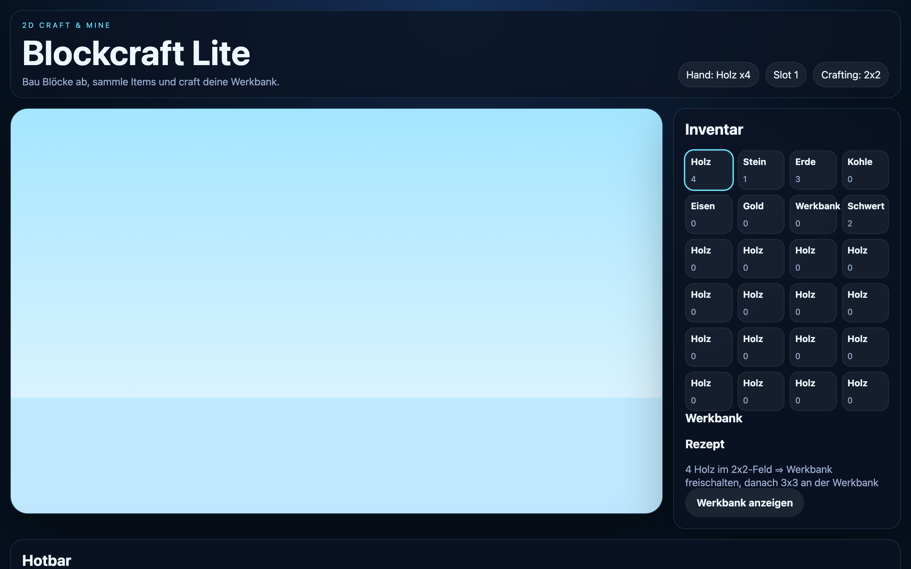

# Student Report: vcenv-vm-5

| | |
|---|---|
| Environment | `vcenv-vm-5` |
| Pi conversation history | Yes, 1 session (2026-07-14, 12:37–14:34 UTC), ~34 user turns |
| Conversation language | German throughout (with heavy teenage-style spelling) |
| Project outcome | 2D "Blockcraft Lite" Minecraft-style game: feature-rich but currently broken (blank game canvas) |
| Live check | ⚠️ Dev server up (HTTP 200) and the UI shell renders, but the game world never draws: a runtime error crashes rendering on every frame |

## Summary

Although the machine shows only a single Pi session, the student packed roughly two hours and ~34 turns of intense work into it. They started by asking for a Space-Invaders clone ("only 10 levels" plus an "operator rank"), then piled on an ambitious wishlist (start screen, in-game shop, operator login with password `1234`, leaderboard, treasure chests with gems, per-kill power-ups and skins), which repeatedly pushed the agent past its output-length limit and left `index.ts` in a broken half-written state. After several failed attempts to finish that, the student cut their losses (*"neues projekt bitte"*) and pivoted to a 2D Minecraft. This second game is where most of the effort went: over ~20 turns they iterated it into a genuinely elaborate block world with an inventory, hotbar, 2x2→3x3 crafting, drag-and-drop, mining/placing, gravity and jumping, a scrolling camera, caves, ores (coal/iron/gold) and multiple biomes. Along the way they kept hitting rendering bugs ("the blocks are gone", "the player isn't shown", "it's flickering"), asked several times for fixes, then wanted the whole thing rebuilt in real 3D with Three.js. The agent declined the large rewrite, the student asked to delete the Minecraft project and instead build a pixel-art painting game, and the session ended before that last request was carried out. So the code left on disk is the 2D Minecraft, and it currently crashes on render.

## How the student worked with the agent

**Approach.** Breadth-first and extremely ambitious, then long single-track iteration. The student gave one plain-German goal per turn, never opened the code themselves, and let the agent do 100% of the implementation (60 edits, 31 writes, 39 reads across the session). Their style is "wish machine": describe a big feature bundle, accept whatever comes back, play it, and report what looked wrong. They were persistent: when a game broke, they didn't abandon it immediately; they asked for repair three or four times in a row before finally pivoting.

**Problems / friction.**

- **Agent hit its output-length limit repeatedly** during the Space-Invaders expansion. The agent openly said so several times (e.g. *"der `index.ts`-Umbau ist noch nicht vollständig fertig, weil mehrere Schreibversuche am Längenlimit abgebrochen sind"*, "the index.ts rewrite isn't fully finished because several write attempts aborted at the length limit"), leaving the file in a "kaputter Zwischenzustand" (broken in-between state) it couldn't cleanly patch. This is what drove the student to start a new project.
- **A recurring rendering bug the student ran into again and again.** They reported it in their own words across multiple turns: *"es sind auf einmal keine blöcke mehr da bitte fixe das"* ("suddenly there are no blocks anymore please fix that"), *"die blöcke sind immer noch nicht da bitte repariere das"* ("the blocks are still not there please repair that"), *"es blinkt es was oben links fliegt und ´der spieler wird nicht angezeigte"* ("it's flickering, something is flying top-left and the player isn't shown"), and finally the exasperated *"der gleiche fehler passiert schon wieder bitte repperiere das"* ("the same error happens again please repair it"). The agent announced fixes each time, but the shipped game still crashes on render (see The app / Live check).
- **Ambition outran the format.** The 3D-Minecraft / Three.js request was one the agent said it couldn't do without a full rewrite of the project; it offered pseudo-3D/isometric alternatives instead. The student then asked to delete the project and switch to pixel-art (a full reset), which never got executed.
- **No commits.** `git log` is empty; nothing was ever committed, so there is no history to fall back on.

**Signals about the student.** A young, games-obsessed beginner having a fast, playful, and fairly frustrating-at-the-end experience. German throughout with characteristic teenage typing (*graffik, paswort, einlogenb, schatz truhe, abaue, repperiere, veschwieden, sreen*). They think in game features, not code, and pour on maximal ideas at once: an operator login, a shop, gems, skins, biomes, ores, real 3D. They clearly played each build and noticed concrete problems (falling through the floor, invisible player, flicker), which is a good instinct, but they had no way to diagnose or fix and relied entirely on the agent. Representative prompts: *"Bitte bau mir das spiel Space invaders nach nur mit nur 10 leveln es soll noch ein operator rang geben"* ("Please recreate Space Invaders for me but with only 10 levels, there should also be an operator rank"), the feature avalanche *"mache ein standbildschirm wo es einen shop gibt und ein operator einlogen … es soll eine rangliste geben wo der beste eine schatz truhe bekommt mit gems die man in dem shop ausgeben kann … für alles ein powerup"* ("make a start screen with a shop and an operator login … a leaderboard where the best gets a treasure chest with gems you can spend in the shop … a power-up for everything"), and the pivot *"neues projekt bitte"* ("new project please") followed by *"programiere mir bitte minecraft nach aber als 2d es soll einen inventar geben und items wie schwert"* ("please program Minecraft for me but as 2D, there should be an inventory and items like a sword").

## The app

A Vite + TypeScript static site. The on-disk code is the **2D "Blockcraft Lite"** Minecraft-style game (the final pixel-art request was never written). Everything is agent-authored; the student edited nothing by hand.

- `index.html`, minimal: `<main id="app">` plus the module `index.ts`. Notably the `<title>` is still **"Space Invaders"**, a leftover from the very first build that was never updated once the app became a Minecraft game (the agent only ever rewrote `index.ts`/`style.css`, not the title).
- `index.ts` (~620 lines), a surprisingly complete 2D block engine: a 60×18 tile world, typed items/blocks, an inventory + 8-slot hotbar, a crafting system that unlocks 3×3 at a workbench after a 2×2 recipe, drag-and-drop between inventory/craft/hotbar, mining and placing via mouse, gravity + jumping with ground/collision checks, a camera that follows the player, procedural caves and ore spawns (coal/iron/gold/clay), and hand-drawn per-block canvas textures. It is genuinely feature-rich for a workshop project, but it **does not run correctly**: `fillWorld()` places `snow` and `clay` blocks, yet the `blockData` lookup table has no entries for them, so `drawBlockTexture` throws `TypeError: Cannot read properties of undefined (reading 'color')` on the very first block it draws. Because `drawWorld` runs 60×/second, this crashes every frame and the entire block world (and player) never render. This is exactly the "blocks are gone / player not shown" symptom the student kept reporting; it was never actually fixed. A Vite/esbuild build would not catch it (types are erased), which is why the agent's repeated "`npm run build` ✅" checks passed anyway.
- `style.css`: a polished dark, glassmorphism theme (radial-gradient background, blurred translucent HUD/panel cards, rounded corners, pill buttons, responsive breakpoint) carried over and adapted across the game's evolution.

Net: a lot of real, coherent code was produced, but the final artifact is broken; the game shell is visible, the game itself is not.

## Live check

The dev server (`npm run dev`, Vite on `0.0.0.0:8080`) was already running and the site loads at http://vcenv-vm-5.austriaeast.cloudapp.azure.com:8080/ (HTTP 200); I left it running. Loading it in a browser, the DOM UI renders, the "Blockcraft Lite" header, the HUD chips (Hand: Holz x4 / Slot 1 / Crafting: 2x2), the full Inventar grid, the crafting/Rezept panel and the Hotbar, but the game `<canvas>` stays a blank light-blue gradient, and the console fills with the `undefined (reading 'color')` exception described above, repeating every frame.

The screenshot shows the loaded page: the dark "Blockcraft Lite" interface with a fully populated inventory (Holz 4, Stein 1, Erde 3, Schwert 2, empty slots) and crafting panel on the right, while the large game area on the left is an empty pale-blue rectangle with no blocks, terrain, or player: the visible result of the per-frame render crash.
