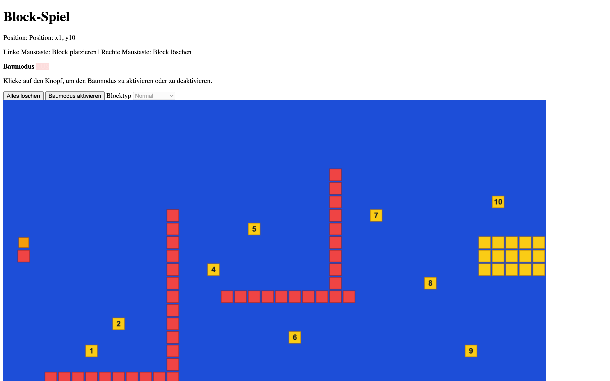

# Student Report: vcenv-vm-6

| | |
|---|---|
| Environment | `vcenv-vm-6` |
| Pi conversation history | Yes, 4 sessions (2026-07-14, 12:37–14:28 UTC) |
| Conversation language | German throughout (many spelling errors) |
| Project outcome | Working "Block-Spiel": a canvas platformer/level-builder (place blocks, player with gravity, jump, lift, goal, build mode) |
| Live check | ✅ Dev server running (HTTP 200), game renders and plays |

## Summary

The student went through two quick false starts before landing on a project they stuck with. They opened by asking for "fortnite", which the agent declined to clone outright, then spent two sessions on a 9×9 tic-tac-toe grid, mostly circling on the same request (make it 9×9, label the rows and columns) without much progress. The real work is the fourth and final session: a nearly two-hour, 39-prompt marathon in which they grew a blank canvas into a small block-building platformer. Step by step they added left/right-click block placing, a player figure, a blue background, a live position readout, gravity (fall until a block stops you), jumping, a purple "lift" block for vertical movement, a yellow goal, ten numbered pickup blocks, a hand-built level, and a toggleable build mode. Every instruction was a short plain-German goal, often pinned to exact grid coordinates (e.g. start at `x1 y13`, goal at `x38 y11`), and the student clearly playtested each build and reported back precisely when the behavior was wrong. The result on disk is a coherent, playable game.

## How the student worked with the agent

**Approach.** Depth-first and iterative, the opposite of a scattershot "generate me a game" user. After the tic-tac-toe detour they committed to one project and refined it across dozens of small turns, each adding or fixing one mechanic. Their feedback was unusually concrete for a beginner: they described game behavior in terms of exact tile coordinates and specific keys, and they reacted to what they saw on screen ("wrong direction", "not like that"). They let the agent write and rewrite all the code and never edited files themselves, but they drove the design tightly.

**Problems / friction.**

- **IP guardrail on the first idea.** Session 1 was just *"bau mir fortnite"* ("build me fortnite"). The agent refused to copy the real Fortnite 1:1 and offered a scaled-down browser version with options; the student never replied and abandoned the session.
- **A cut-off prompt.** In session 2 the second message arrived truncated; the agent noticed (*"Da dein letzter Wunsch abgeschnitten ist"*, "since your last wish is cut off") and asked whether they wanted classic 3×3 or 9×9.
- **Spinning on the tic-tac-toe grid.** Session 3 is seven prompts that largely restate the same thing: *"9 hoch und 9 breid"*, *"9 zeilen und 9 schpalten"*, *"Zeilen und Spalten sichtbar macent"*, *"9 spalten mit beschriftung"*, while the agent kept replying that it was already 9×9 and toggled the win condition between 5-in-a-row and 3-in-a-row. Little forward progress; the student eventually dropped it.
- **Physics tuning was fiddly.** In the block game the fall behavior took several tries: after one attempt the student simply said *"nicht so"* ("not like that"), and the agent backed the change out. The lift went *"falsche richtung"* ("wrong direction") and then W/S had to be swapped (*"w und s in der steurung um trehen"*).
- **One ambiguous key.** The student typed *"mit der sc"* mid-thought; the agent stopped and asked whether they meant Space or Shift rather than guessing.

**Signals about the student.** A persistent, design-minded young beginner with heavy phonetic spelling but strong game-logic intuition. The writing is full of errors: *plöcke* (Blöcke/blocks), *plaziren* (platzieren/place), *löchen* (löschen/delete), *falt/wirt* (fällt/wird), *lerrtaste* (Leertaste/space bar), *hinterkrund* (Hintergrund/background), *zufälig* (zufällig/random), yet the ideas underneath are precise and sequenced like a real level designer's checklist. Representative prompts: *"baue mir ein spiel wo man plöcke plaziren kan mit der linken taste auf der pc maus"* ("build me a game where you can place blocks with the left button on the pc mouse"), *"mache das man immer nach unten falt aber durch plöcke aufgehalten wirt"* ("make it so you always fall down but get stopped by blocks"), *"baue ein ziel pungt auf Position: x38, y11 ein gelben block ein"* ("add a goal point at position x38, y11, a yellow block"), and *"mache jetzt 10 zufälig plazirte gelbe plöcke mit den zalen von 1 bis 10"* ("now make 10 randomly placed yellow blocks with the numbers 1 to 10"). They trust the agent to implement, but they own the vision and verify it by playing.

## The app

A Vite + TypeScript static site titled **Block-Spiel**, a single-canvas tile game. All code is agent-written across the fourth session; the student modified nothing directly (git has no commits).

- `index.html`, German UI: a glassy HUD with the title, a live `Position: x…, y…` readout, a controls help line, and a "Baumodus" (build-mode) panel with an AN/AUS status badge, an "Alles löschen" (clear all) button, a "Baumodus aktivieren" toggle, and a block-type `<select>` (Normal / Unzerstörbar / Lift). Below it a single `<canvas id="game">`.
- `index.ts` (~325 lines): the game engine on a 40×30 grid of 32px tiles. It holds separate sets for placeable blocks, fixed/unbreakable blocks, and lift blocks, plus a `Map` of ten numbered blocks and a fixed `levelData` structure (spawn, solid platforms, numbers). Mechanics: player moves left/right (arrows or A/D) with block collision; gravity via `setInterval(fall, 250)` that drops the player until a block is underneath and resets to spawn if they fall off the bottom; Space jumps two tiles if clear; a purple lift lets W (up) / S (down) move vertically when standing next to one; build mode gates mouse placement (left = place, right = delete) and disables movement; `R` clears everything and re-randomizes the 1–10 blocks; a yellow goal platform sits at `x38, y11`. `draw()` renders lifts (purple), goal/numbered blocks (yellow with the digit drawn on top), fixed blocks (red), placed blocks (green), and the player (orange).
- `style.css`, a clean blue theme: a blue gradient body, translucent blurred HUD/build panels with rounded corners and shadows, pill-shaped gradient buttons, and a pixelated, responsive canvas.

The game is coherent and playable: it starts at the spawn, applies gravity, supports moving/jumping/lifts, toggles build mode, and rebuilds the level on reset. A couple of earlier requests appear to have been superseded by later rewrites (e.g. the requested "can't move until you reach y10" lock is not visible in the final code, and the spawn ended up at `y10` rather than the earlier `x1 y13`), which is expected given how many times the file was rewritten. There is no evidence of student hand-editing.

## Live check

The dev server (`npm run dev`, Vite on `0.0.0.0:8080`) was already running when checked and the site returns HTTP 200 at http://vcenv-vm-6.austriaeast.cloudapp.azure.com:8080/. I left it running.

The screenshot shows the Block-Spiel: the "Block-Spiel" HUD with the live position readout and the "Baumodus" panel on the right, and below it the blue play field with red platform/wall blocks, the yellow goal platform on the right, scattered yellow numbered blocks (1–10), and the orange player square.
