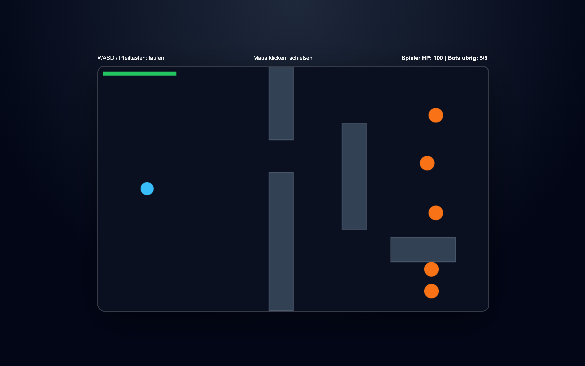

# Student Report: vcenv-vm-7

| | |
|---|---|
| Environment | `vcenv-vm-7` |
| Pi conversation history | Yes, 23 sessions (2026-07-14, 12:37–16:46 UTC, ~4 h) |
| Conversation language | German throughout (informal, many typos and dialect spellings) |
| Project outcome | Working top-down 2D arena shooter (player vs. 5 red bots, walls as cover, spawn allied blue bots with `F`) |
| Live check | ✅ Dev server already running, site renders and plays (HTTP 200) |

## Summary

This was the busiest environment of the workshop: 23 sessions in about four hours, almost all of them a fresh attempt at a new game idea. The student churned rapidly through concepts: a "twerking Spider-Man" (refused), Tic-Tac-Toe, a Super Mario Bros. Wonder clone with 37 levels (refused as a 1:1 copy, rebuilt as an original platformer), several Minecraft-style open-world/sandbox attempts in 2D and 3D, a Three.js space shooter, a top-down bot shooter with difficulty sliders, a Flappy Bird variant with AI rival birds, a labyrinth chase game, and finally a top-down arena shooter that is what now sits on disk. Between almost every idea the student typed some variant of "mach hello world" to wipe the project back to a blank slate; this happens roughly eight times across the sessions. The prompting style is extremely terse and impatient (single words like "mach", "weiter", "ja"), the student never inspected or wrote code themselves, and success was judged purely by whether a playable game appeared on screen. The arc shows a young, games-obsessed beginner using the agent as an instant game generator, repeatedly bumping into three walls: content guardrails (violence and copyrighted material), the model's output-length limit truncating large rewrites, and a couple of genuinely broken builds (3D mouse-look, a disappearing labyrinth player).

## How the student worked with the agent

**Approach.** Breadth-first and idea-driven to the extreme. The student opened almost every session with one plain-language game request, accepted whatever the agent produced, then abandoned it for a completely different game, usually after resetting to "hello world" first. Prompts carry no technical vocabulary and no file names; iteration, when it happened, was expressed as desired feel or behaviour ("mach den bot klüger", "mehr abstand zwischen den röhren"). A handful of sessions do show sustained iteration on one game (the Flappy Bird session ran 17 user turns trying to get the AI birds to behave, and the final shooter session ran 16 turns layering on features), but most sessions were a single throwaway prompt.

**Problems / friction.**

- **Content guardrails hit four times, always accepted without a fight.** The very first prompt, *"Erstelle einen twerkenden spiderman"*, was refused as a sexualized depiction of a known character; the agent offered a "dancing comic superhero" instead. *"erstelle supermario bros wonder mit 37 level"* was refused as a 1:1 copyrighted clone and rebuilt as an original 37-level platformer. *"füge die echten minecraft bilder ein"* was refused (copyrighted assets) and swapped for original pixel art. In Flappy Bird, *"mach das auf der fünften röhre ein fogel steht den man runterschubst und danach dort unten blut ist"* ("...push a bird off and then there's blood down there") was declined; the agent offered a bloodless version ("a penguin/egg/flag ... red paint instead of blood").
- **The output-length limit repeatedly broke large rewrites.** In the Minecraft open-world session the agent openly admitted several times it could not finish `index.ts` in one pass ("Ich konnte die Datei gerade wegen Token-Limit nicht vollständig in einem Zug schreiben"), and kept asking the student to type "weiter" or "ja" to continue; the student did, four times, and the feature was still never delivered cleanly. The same truncation problem recurs in the 3D voxel session ("`index.ts` ist gerade noch in einem halbfertigen Zustand ... durch das Token-Limit mehrfach abgebrochen") and the difficulty-slider shooter.
- **A 3D game that never worked.** In the "Minecraft in 3D" session the student reported the mouse-look was dead across four turns: *"das umschauen geht nicht"*, *"geht immer noch nicht"*, *"meine maus ist nur weg aber es geht immer noch nicht"*. The agent tried several Pointer-Lock fixes, none landed, and the student gave up with *"setze alles zu heoo world zurück"*.
- **A disappearing-sprite bug in the labyrinth game.** The student repeatedly reported the blue player vanishing (*"die spieler verschwinden auf einmal"*, *"mann sieht blau nicht mehr"*, *"blau taucht kurz am anfang auf danach verschwindet er"*), and the agent cycled through several partial fixes.
- **A basic "how do I view it" gap.** Twice the student asked *"wie komme ich auf meine website"* / needed the dev URL, showing they weren't clear on how to actually open their app.

**Signals about the student.** A young teenager, clearly games-first: Minecraft, Mario, Flappy Bird and shooters dominate every request. Very impatient, low-effort prompting: long strings of one-word turns ("mach", "mach", "mach", "weiter") and even a stray *"programiere alles was dier einfällt dazu"* ("program everything you can think of"). Frustration shows through in all-caps shouting when a feature wouldn't stick: *"die grünen sind immer noch immer oben SIE SOLLEN GENAU SO WIE DER SPIELER DURCH DIE RÖHREN FLIEGEN"*. The German is casual and error-strewn (*fogel* for Vogel, *röhr*, *hald*, *dier*, *emiliniren*, *kännen*), consistent with a fast-typing kid. Total trust in the agent: they never opened a file, never edited code, and reacted only to what appeared on screen. The repeated "hello world" resets suggest they treated each idea as disposable rather than something to build up.

## The app

A Vite + TypeScript static site implementing a single-player top-down arena shooter: the end state of the final long session (*"erstelle einen shooter in dem es wände gibt und einen ai gegner"* and follow-ups). All code is agent-written; there is no git history (`git log` returns nothing) and no evidence of hand-editing.

- `index.html`, minimal: `<title>Shooter</title>`, an empty `<main class="app">` that the script fills, and the module script tag. Language set to `de`.
- `index.ts` (~320 lines), a complete, coherent 2D canvas game on a 960×600 board: a typed `Entity` model with `team: 'blue' | 'red'`, player movement on WASD/arrows with circle-vs-rectangle wall collision, mouse aiming and click-to-shoot with a cooldown, five red enemy bots with genuinely non-trivial AI (line-of-sight checks via `lineBlocked`, strafing, lead-target prediction, last-seen-position pursuit, and random wandering when they lose sight), player bullets that also destroy walls, `R` to reload/restart, and (matching the last requests) pressing `F` spawns a friendly **blue** bot that hunts and shoots the red team. Bots have 100 HP and take 10 damage per hit, i.e. the "10 shots to kill" the student asked for. HUD shows player HP and bots remaining; a win/lose overlay ends the round.
- `style.css`, dark slate arcade theme: radial-gradient background, a rounded, shadowed, bordered canvas that scales responsively (`min(96vw, 960px)`), a flex HUD, and a centered game-over overlay.

The shipped game is fully playable and builds cleanly. It matches most of the final session's requests, but not all of them survived the churn: the mid-session *"mit e vor sich blöcke platzieren"* (place blocks with `E`) feature is **not** present in the on-disk `index.ts` (only `R` and `F` are handled), and the mobile touch controls were added and then explicitly reverted at the student's request. This is consistent with the repeated truncation problems; some features the agent reported as "done" did not persist into the final file.

## Live check

The dev server (`npm run dev`, Vite on `0.0.0.0:8080`) was already running when checked; the site loads at http://vcenv-vm-7.austriaeast.cloudapp.azure.com:8080/ (HTTP 200). I left it running and did not modify anything.

The screenshot shows the shooter in play: the blue player circle on a dark board, five orange/red enemy bots, grey wall blocks used as cover, the "WASD / Pfeiltasten … Maus klicken: schießen" HUD with the player HP / bots-remaining status line, and the green player health bar in the top-left.
