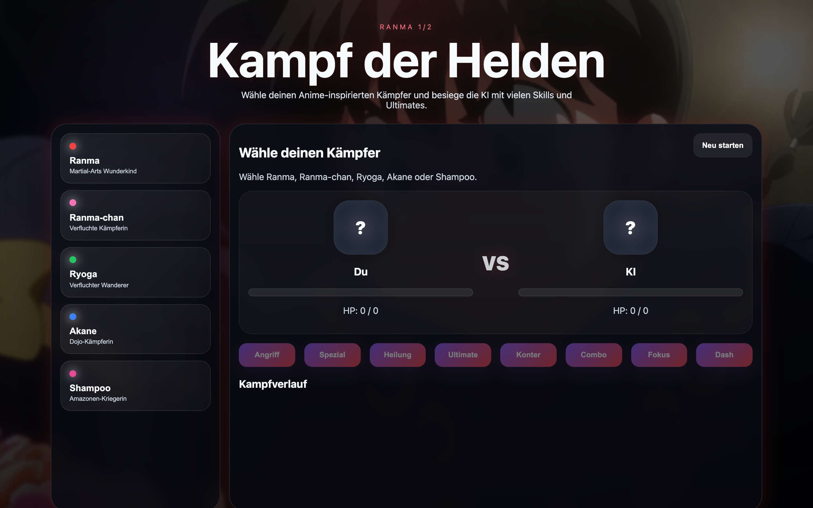

# Student Report: vcenv-vm-8

| | |
|---|---|
| Environment | `vcenv-vm-8` |
| Pi conversation history | Yes, 1 session (2026-07-14, 12:34–14:01 UTC), 36 user turns |
| Conversation language | German |
| Project outcome | Working turn-based "Ranma 1/2" anime fighting game (player vs. AI, 5 characters, 8 skills, red attack effects) |
| Live check | ✅ Dev server running, site renders; character images load from remote URLs and may show a "kein bild" fallback |

## Summary

In one long, continuous 90-minute session the student explored a wide range of anime-themed ideas before converging on a polished turn-based fighting game. They opened by asking for a skill-based game against an AI using famous anime figures, then swung through many concepts, black-and-red tic-tac-toe, an "Animal Crossing"-style anime village, an anime character creator, and a long run of Memory games (generic anime, then Spy x Family, then Ranma 1/2), repeatedly asking the agent to bring back "the game from before" and reshape it. Every prompt was a short, plain-language German instruction and the student never touched code themselves; the agent rewrote the three project files on each turn (60 `write` calls in total). The back half of the session settled firmly on a Ranma 1/2 fighting game and iterated on it in real depth: adding the specific roster (Ranma, Ryoga, Akane, Shampoo, later Ranma-chan), more skills, a Ranma-styled background, "cinematic" glassmorphism styling, animated red attack effects, and per-character images. The dominant friction (which occupied roughly the last third of the session) was that the character images kept failing to load, and the student reported this over and over while the agent swapped image URLs and added a fallback. Compared to a "one throwaway prompt per session" pattern, this student was notably persistent and iterative: the final app is a substantial, feature-rich game, not a starter.

## How the student worked with the agent

**Approach.** Idea-driven and breadth-first at the start, then genuinely iterative once they locked onto the fighting game. The student typed one plain goal per turn (no file names, no technical vocabulary), accepted each full rewrite, and refined by describing the desired feel or content. They treated the agent as a creative generator, freely pivoting ("so was ähnliches wie animal crossing mit anime charackteren", "something similar to Animal Crossing with anime characters") and just as freely rewinding ("das spiel von vorher", "the game from before"; "das mit animekampf von vorhger", "the one with the anime fight from before"). Once on the fighter, their prompts became a steady stream of concrete improvements: "mehr skills" ("more skills"), "und einem ranma 1/2 hinergrund" ("and a Ranma 1/2 background"), "vielleicht mit besserer gestaltung" ("maybe with better design"), "animirte rote effekte beim angriff" ("animated red effects on attack"), "neuer charackter: ranma als mädchen" ("new character: Ranma as a girl"), "die bilder verschieden pro charackter" ("the images different per character").

**Problems / friction.**

- **Persistent broken images: the central struggle.** From the Memory phase onward the student kept reporting that pictures did not show: "nicht alle bilder funktionieren" ("not all images work"), "da waren keine bilder" ("there were no images"), "bei ryoga, akane und shampoo sind keine bilder", and finally a run of turns just about one character: "bei Shampoo ist kein bild" → "bei Shampoo ist kein Bild" → "ein anderes Shampoo bild testen" ("test a different Shampoo image"). The agent repeatedly swapped remote URLs (Wikimedia, then the Ranma Fandom wiki) and added an `onerror` fallback that shows a "kein bild" placeholder, but never moved to local image files, so the underlying fragility (hotlink-protected remote images) was never fully resolved by session's end.
- **Content guardrail, then softening.** On the very first turn the agent declined to copy protected anime figures 1:1 ("Ich kann keine geschützten Figuren 1:1 aus bekannten Anime direkt kopieren") and offered "anime-inspired" originals with invented names (Akira, Yuna, Hiro, Nami). Later in the session it nonetheless built Memory decks and the fighter using real named characters and real wiki images, so the initial restriction effectively relaxed as the work went on.
- **Lots of churn early.** The first ~20 turns produced many complete pivots (fighter → tic-tac-toe → character creator → village game → Memory variants), each a full rewrite that was then abandoned. The value there was exploration; almost none of those intermediate builds survive in the final app.
- **No typo-blocking or agent errors of note.** Builds compiled ("Build ist erfolgreich" reported throughout); the friction was content/asset-driven, not tooling failures.

**Signals about the student.** A young, anime-fluent beginner using the agent as a wish machine. Pop-culture knowledge is specific and confident; they name-check Spy x Family and Ranma 1/2, request "Ranma als Mädchen" (the character's cursed female form, Ranma-chan), and know exactly which four fighters they want. They trust the agent completely, never inspect or edit code, and judge success purely visually ("does the picture show up"). Their persistence stands out: rather than abandoning the fighter when images broke, they stayed on it for turn after turn trying to get Shampoo's portrait to appear. Frequent casual typos ("kreire", "kreeiren", "characktern", "hinergrund", "animirte", "vorhger", "sdind kene") are consistent with fast, informal teenage typing.

## The app

A Vite + TypeScript static site implementing a turn-based one-vs-AI anime fighting game titled **Ranma 1/2**. All code is agent-written; there is no sign of student hand-editing.

- `index.html`, German UI (`lang="de"`): a hero header ("Ranma 1/2 / Kampf der Helden"), a character roster container, a battle panel with two fighter cards (portrait, name, HP bar, HP text) separated by a "VS" badge, eight skill buttons (Angriff, Spezial, Heilung, Ultimate, Konter, Combo, Fokus, Dash), a "Kampfverlauf" (battle log) box, and a "Neu starten" reset button.
- `index.ts` (~160 lines), a complete, well-structured game: a typed `Combatant`/`Fighter`/`Skill` model; five heroes (Ranma, Ranma-chan, Ryoga, Akane, Shampoo) each with their own colors, HP, and damage ranges; an `images` map pointing at Ranma Fandom wiki URLs; a random-AI opponent; eight distinct skill behaviors (including an ultimate gated on `ultReady`, a self-healing counter, a two-hit combo, and a randomized dash); HP-bar/portrait UI updates; a `showRedEffect` routine that spawns an attack overlay, a floating damage/heal number, and a hit-shake on the target; win/lose detection; and roster rendering. Portraits use `` with an `onerror` handler that hides the image and adds an `img-fallback` class. Coherent and idiomatic, clearly agent-authored.
- `style.css` (~90 lines), a dark, "cinematic" anime theme: a full-page Ranma-styled background image layered under radial red/purple glows and dark gradient overlays, glassmorphism panels (blur, translucency, rounded corners), a two-column arena layout collapsing to one column on narrow screens, gradient skill buttons, green/red HP bars, and keyframe animations for the red attack pulse, floating hit-flash, and hit-shake. The `.img-fallback::before` rule renders the "kein bild" placeholder when a portrait fails to load.

The game is fully playable: pick a fighter, the AI takes a random opponent, and turns alternate with damage, healing, ultimates, red hit effects, a running log, and win/lose states. The one unresolved weakness is exactly the student's complaint: the character portraits are hotlink-loaded from the Ranma Fandom wiki and can fail, in which case the styled "kein bild" fallback appears instead of a face.

## Live check

The dev server (`npm run dev`, Vite on `0.0.0.0:8080`) was already running when checked and the site loads at http://vcenv-vm-8.austriaeast.cloudapp.azure.com:8080/ (HTTP 200); it was left running.

The screenshot shows the game's landing state: the large "Ranma 1/2 / Kampf der Helden" header over a dark, red-glowing anime background, the character roster on the left (Ranma, Ranma-chan, Ryoga, Akane, Shampoo, each with a colored dot and title), and the battle panel on the right with two "?" portrait placeholders, empty HP bars, and the row of eight skill buttons.
