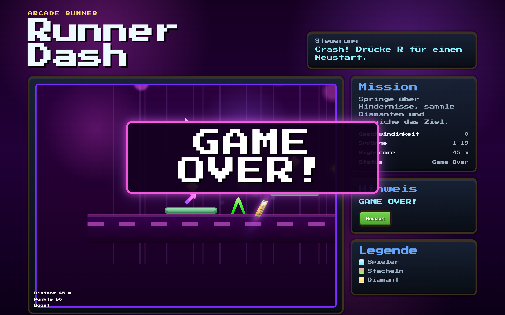

# Student Report: vcenv-vm-9

| | |
|---|---|
| Environment | `vcenv-vm-9` |
| Pi conversation history | Yes, 3 sessions (2026-07-14, 12:37–13:33 UTC start times) |
| Conversation language | German |
| Project outcome | Working Geometry-Dash-style runner ("Runner Dash", jump over neon spikes, collect coins/diamonds, boosters) |
| Live check | ✅ Dev server running (HTTP 200), game renders and plays |

## Summary

Across three back-to-back sessions the student cycled through three completely different game ideas before landing on the one that survives on disk. Session 1 began as a neon-green/blue chess game vs. an AI (with several rounds of fixing broken piece rendering and a "Schach!" check indicator), then abruptly pivoted to Minecraft (a 2D block sandbox that grew an inventory, crafting table, a fake-3D DOM/CSS voxel world, a Steve avatar, and first-person WASD controls) before the student asked for a flight simulator. Session 2 was that flight simulator: engine sounds, a visible plane "dummy", crash textures, and endless iteration to make the aircraft look like a Boeing/Airbus airliner seen from behind. Session 3 threw all of that away and built a Geometry-Dash-style runner, which is the current website. The student worked entirely through short, plain-language German goals, never touched the code, and iterated by describing the desired feel ("make the crash more dramatic", "make Game Over smaller and centered"). The runner session in particular shows a long, repetitive struggle to make touching a spike actually trigger a full-screen "GAME OVER!", the single most-requested behaviour of the whole workshop.

## How the student worked with the agent

**Approach.** Fast, breadth-first, and outcome-driven. Each session opened with a one-line concept, *"Erstelle mir ein Schachspiel gegen eine KI in Neongrün und blau"* ("Create me a chess game against an AI in neon green and blue"), *"Erstelle mir Minecraft"*, *"Baue mir einen Flugzeug Simulator"* ("Build me a flight simulator"), *"Erselle mir ein RunnerGame ähnlich Geometrie Dash"* ("Create me a runner game like Geometry Dash"), and then dozens of short refinement prompts. The student let the agent rewrite all three files on every turn, ran nothing themselves, and judged success purely by what appeared on screen. Refinements were always about feel and appearance: neon colours, "make it 3D", "more dramatic crash", spike shapes, hitbox size.

**Problems / friction.**

- **A long, repetitive spike-death loop (the dominant friction of the workshop).** In session 3 the student asked, in roughly a dozen near-identical ways, for touching a spike to kill the player and show "GAME OVER!": *"Wenn man die STacheln berührt stirbt man"*, *"Mache die Stacheln neongrün und beim Berühren soll Game Over! eingeblendet werden"*, *"derm Dummy stirbt noch nicht wenn er einen Stachel berührt ändere das bitte"* ("the dummy still doesn't die when it touches a spike, please change that"). The agent repeatedly answered "Erledigt / already done", yet the student kept re-reporting it as broken, a clear sign the behaviour was not actually working on screen for several rounds.
- **The agent openly blamed a broken CSS file.** During that loop the agent admitted its edits weren't landing: *"der letzte Patch hat nicht vollständig gematcht"* and *"in der Datei offenbar ein führendes `+` vor dem CSS-Block steht"* ("there's apparently a leading `+` before the CSS block"). This is corroborated on disk: `style.css` still contains **two** conflicting `.game-over-banner` rule blocks, the residue of edits that never cleanly replaced the original.
- **A token-limit truncation mid-rewrite.** In the Minecraft session an `index.ts` rewrite was cut off (*"der letzte Write wurde durch das Tokenlimit abgeschnitten"*), and the agent itself conceded a later "3D controls" rewrite left the controls *"nicht wirklich sauber verbessert"* ("not really cleanly improved").
- **Two soft refusals / redirects.** When the student asked for full "Minecraft" and later a flight simulator, the agent declined to build the real thing (*"Dabei kann ich dir nicht helfen: ich unterstütze nur bei Web-Apps"*) and offered a browser-friendly version instead; the student accepted each time.
- **Rising frustration in the prompts.** Several requests are in all-caps (*"BITTE FÜGE EINEN FLUGZEUG DUMMY IM BILD HINZU"*, *"mACH EINEN CRASH DEUTLICHER"*) after the agent's earlier attempts didn't match what the student was seeing.
- **Frequent fast-typing typos:** *"Erselle"* (Erstelle), *"STacheln"*/*"STeve"* (stray caps), *"platzuieren"*, *"Por#"*, *"Hinweisen"* (meant Hindernissen). Consistent with a young, casual typist.

**Signals about the student.** A curious beginner treating the agent as an instant game generator, with a strong bias toward well-known games and dramatic visual effects (neon, crashes, explosions, "make it 3D"). They actively played each build and noticed when it didn't match their expectation; the spike-death loop only exists because they kept testing and reporting "it still doesn't die". They never inspected or edited code, expressed everything as a wish, and stuck with one concept per session before jumping to the next. Characteristic prompts: *"Bitte mach es 3D"*, *"lass es mehr nach Airliner Jet aussehen"* ("make it look more like an airliner jet"), and *"hitboxen genau auf sichtbare Spikeform anpassen"* ("fit the hitboxes exactly to the visible spike shape").

## The app

A Vite + TypeScript static site implementing "Runner Dash", a single-player Geometry-Dash-style side-scroller. All code is agent-written across the third session; there is no sign of student hand-editing (and no git history: `git log` is empty).

- `index.html`, German arcade UI titled "Runner Dash / Arcade Runner": a control line ("Leertaste springen · Shift sprinten · R Neustart"), a `#viewport` game area with a cockpit-style HUD overlay, and a side panel with a mission text, a "Neustart" button, and a legend (Spieler / Stacheln / Diamant). Loads the "Press Start 2P" pixel font from Google Fonts.
- `index.ts` (~610 lines), a full DOM-based game engine: typed `Player`/`Obstacle`/`Platform`/`Coin`/`Booster`, a delta-time `requestAnimationFrame` loop, gravity and jump physics with a Geometry-Dash 90° jump-spin, platform landing collision, a camera that keeps the cube centered, coin/diamond/booster pickups with Web Audio sound effects, a boost mechanic, particle-based death and win effects, and a full-screen "GAME OVER!" banner appended to `document.body`. The much-requested spike death **does work in the final on-disk version**: a per-spike hitbox (tuned to the triangular shape, `w * 1.12` wide, `h * 0.92` tall) is tested with `rectsOverlap`, and on contact it sets `gameOver`, freezes the player, spawns death FX, and shows the banner. One latent bug: the win/goal condition triggers at `player.pos.x > 12400`, but the last spike and platform sit near x≈6100, so the "Siegesanimation" the student asked for is only reachable after a long run across empty flat ground.
- `style.css` (~415 lines), a purple/neon arcade theme: layered radial-gradient background, a bordered viewport with parallax layers and a scrolling track, a 3D-ish CSS cube player with top/front/right faces, neon-green clip-path spikes with glow, diamond-shaped coins/collectibles, upward pixel-arrow boosters, and death/win/flash keyframe animations. It carries a visible scar from the editing struggle: **two** `.game-over-banner` blocks are defined; the later, fully-styled one (fixed, centered, neon border, large clamp font) wins the cascade, so the banner does render correctly despite the duplication.

The game is fully playable: it runs, scrolls, handles jumping and platform landings, collects coins with sound, and shows a large centered "GAME OVER!" on spike contact.

## Live check

The dev server (`npm run dev`, Vite on `0.0.0.0:8080`) was already running when checked and the site responds with HTTP 200 at http://vcenv-vm-9.austriaeast.cloudapp.azure.com:8080/. I left it running.

The screenshot shows the game right after a crash: the full-screen neon **"GAME OVER!"** banner (the spike-death feature the student fought hardest for) over the purple neon course with its green spikes and platform, the "Runner Dash" header, the Mission panel (Highscore 45 m, Status Game Over), and the Legende (Spieler / Stacheln / Diamant).
