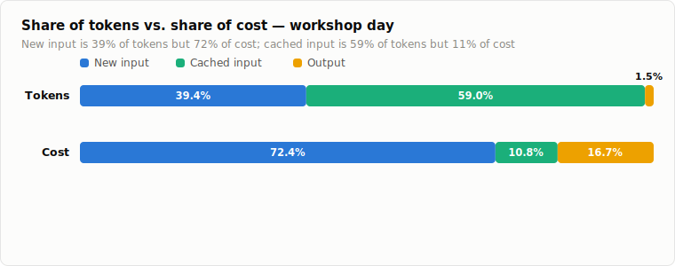
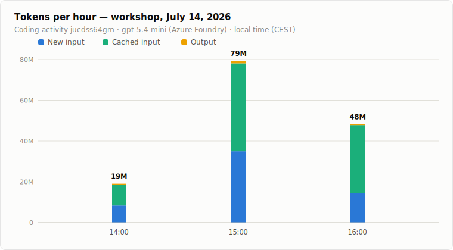
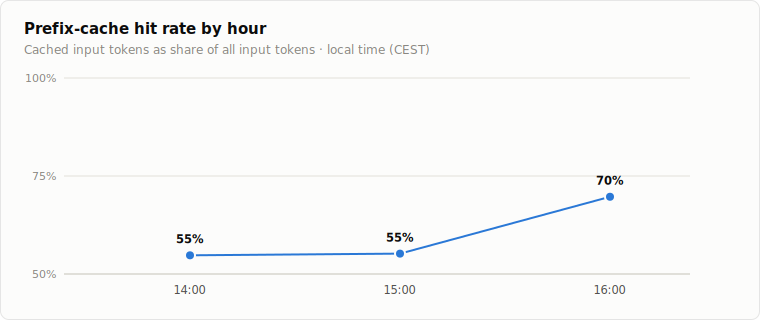
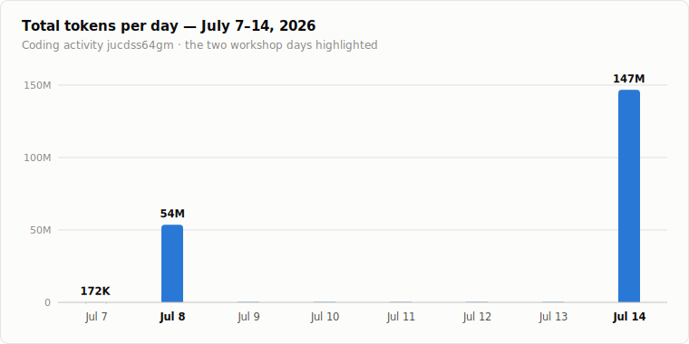

# Token usage report: student workshop, July 14, 2026

**TL;DR:** The workshop ran on a single coding activity (`jucdss64gm`, "Web dev assistant: HTML/CSS/TS/Vite") pinned to **gpt-5.4-mini on Azure Foundry**. Between 14:00 and 17:00 local time (CEST) the students consumed **146.8 million tokens**, which at the given prices cost **$59.96**. Prefix caching absorbed 60 % of all input tokens and cut the bill by roughly half; without it the same session would have cost about $118.44. This was a much bigger day than the July 8 workshop (53.6M tokens, $17.93) even though fewer students took part; see the [cross-workshop comparison](../2026-07-workshop-comparison.md) for why (the context window went from 32k to 128k, and there was more hands-on time).

All data comes from the production `novedu_usage_by_code` table (hourly aggregates), filtered to 2026-07-14. The coding module is always anonymous and its API path carries no user identity, so `novedu_usage_by_user` has no rows for the day; per-student numbers are not available by design. Note that the same activity code was reused for both the July 8 and July 14 workshops, so the figures below are date-filtered to July 14 only.

## Totals

| Metric | Tokens | Share | Price / 1M | Cost |
|---|---:|---:|---:|---:|
| New input | 57,893,931 | 39.4 % | $0.75 | $43.42 |
| Cached input | 86,643,712 | 59.0 % | $0.075 | $6.50 |
| Output (incl. reasoning) | 2,230,579 | 1.5 % | $4.50 | $10.04 |
| **Total** | **146,768,222** | 100 % | | **$59.96** |

The cost structure is dominated by **new input** this time: it is 39 % of the volume but 72 % of the cost. Output is only 1.5 % of the volume but 17 % of the cost (it is 60× the cached-input price), and cached input, the majority of the volume, is just 11 % of the cost.

## Usage over the afternoon

Activity peaked in the 15:00 hour, which alone accounts for 54 % of the day's tokens. By 17:00 the workshop was winding down.

| Hour (CEST) | New input | Cached input | Output | Total tokens | Cost |
|---|---:|---:|---:|---:|---:|
| 14:00–15:00 | 8,396,733 | 10,166,528 | 528,084 | 19,091,345 | $9.44 |
| 15:00–16:00 | 34,999,715 | 43,119,360 | 1,277,971 | 79,397,046 | $35.23 |
| 16:00–17:00 | 14,491,997 | 33,338,368 | 422,405 | 48,252,770 | $15.27 |
| (08:00 blip) | 5,486 | 19,456 | 2,119 | 27,061 | $0.02 |
| **Total** | **57,893,931** | **86,643,712** | **2,230,579** | **146,768,222** | **$59.96** |

(The stored buckets are UTC 12:00–14:00; shown here in local time. The tiny "08:00 blip" is a UTC 06:00 provisioning/smoke-test bucket from before the workshop, included for completeness.)

## Cache efficiency

The prefix-cache hit rate held around 55 % for the first two hours and climbed to 70 % in the final hour as sessions accumulated context:

In money terms: the 86.6M cached input tokens cost $6.50 instead of the $64.98 they would have cost as fresh input, a saving of **$58.48**. The effective blended price for the whole session was about **$0.41 per million tokens**. The blended cache rate (60 %) was notably lower than July 8's 74 %, which, together with the much larger per-turn context, is the main reason new-input tokens dominate the bill this time.

## Context: how the day compares

July 14 was the biggest usage day for this activity: 146.8M tokens, nearly 2.7× the July 8 workshop (53.6M), despite fewer participants. The only other days with activity on this code were July 8 (the first workshop) and a tiny July 7 setup/smoke-test.

| Day | Total tokens | Note |
|---|---:|---|
| Jul 7 | 172,460 | setup / provisioning smoke tests |
| Jul 8 | 53,594,509 | workshop 1 (morning · 32k context · ages 15–16) |
| **Jul 14** | **146,768,222** | **workshop 2 (afternoon · 128k context · ages 12–14)** |

A dedicated [cross-workshop comparison](../2026-07-workshop-comparison.md) digs into what drove the difference (context-window size, hands-on time, and out-of-context error behaviour).

## Notes

- **15 of 20 environments were used** this workshop (`vcenv-vm-1` … `vcenv-vm-15`); VMs 16–18 were never used, and VMs 19–20 were the teachers'. At $59.96 for 15 students the average was roughly **$4.00 per student** for the afternoon.
- The coding endpoint is metered per code only (no user attribution, no message content); the numbers above are the complete record of the day.
- `tool_calls`, `user_messages`, `quiz_answers`, and `writing_saves` are all zero for this code: the coding proxy counts tokens only, and no other module was used during the workshop.

*Prices used: $0.75 / 1M new input, $0.075 / 1M cached input, $4.50 / 1M output. Data queried from `ng-workshop.database.windows.net / WizardAcademy` (table `novedu_usage_by_code`, code `jucdss64gm`, hours in 2026-07-14 UTC) on July 14, 2026.*
