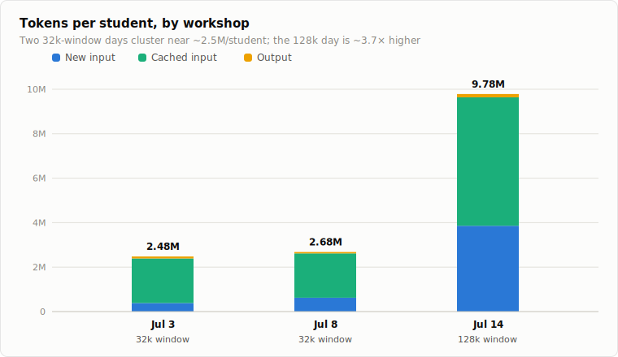
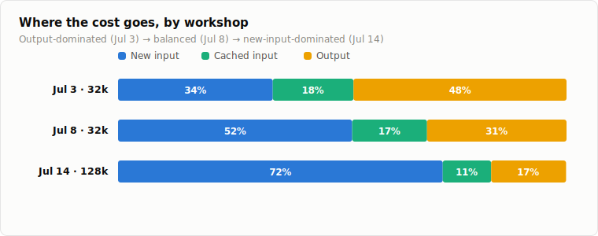
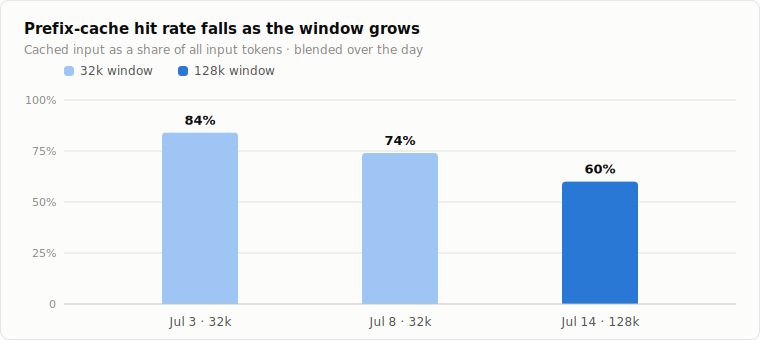
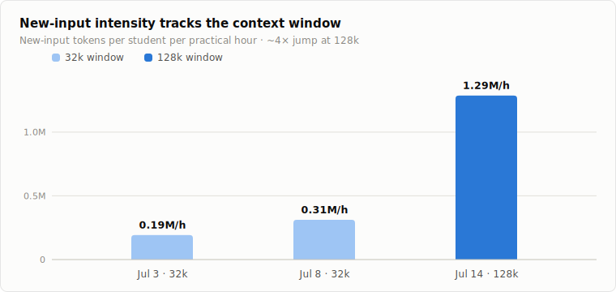

# Coding Workshops: Token-Usage Comparison (July 3, 8 & 14, 2026)

Three coding workshops for teenagers ran in July 2026 on the pi coding agent with per-student dev VMs. The two main workshops are directly comparable: **July 8** and **July 14** ran on the same infrastructure: activity code `jucdss64gm`, pinned to **gpt-5.4-mini on Azure Foundry**, with identical pricing ($0.75/1M new input, $0.075/1M cached input, $4.50/1M output). They differ in one deliberate configuration change: the model's **context window was raised from 32k tokens (July 8) to 128k tokens (July 14)**. A third, earlier data point precedes both: **July 3**, a rehearsal run with 5 students on a **different provider (SCCH**, activity code `3p6f1prcjk`) that reports **no model name** but ran with a **32k context window, the same window size as July 8**; its costs are computed at the same gpt-5.4-mini rates **purely as a reference for comparability** (SCCH's actual cost basis is an academic/self-hosted backend, not a per-token bill). This document compares token usage, cost, and error behaviour across the three days, based on the authoritative usage reports ([2026-07-03-reports/token-usage.md](2026-07-03-reports/token-usage.md), [2026-07-08-reports/token-usage.md](2026-07-08-reports/token-usage.md), [2026-07-14-reports/token-usage.md](2026-07-14-reports/token-usage.md)) and the 35 per-student work reports from July 8 and 14 (no conversation transcripts were captured on July 3).

## TL;DR: verdicts on the three questions

The three core questions concern the **July-8-vs-July-14** context-window change; July 3 (same 32k window as July 8, but a different provider and no transcripts) is now a genuine **second 32k point** on the low-context side of the axis (not a perfectly controlled A/B versus July 8, since the provider differs).

1. **Was token usage/cost similar? No.** July 14 consumed **2.7× the tokens** (146.8M vs 53.6M) and **3.3× the cost** ($59.96 vs $17.93) with **fewer students** (15 vs 20). Normalized, a July 14 student consumed **~3.7× more tokens** (9.79M vs 2.68M), and even after correcting for the longer hands-on time (~3h vs ~2h) still **~2.4× more per practical hour** (3.26M/h vs 1.34M/h). More students and more time explain only a minority of the gap; most of it is higher **per-turn input intensity**. The two 32k days sharpen this: July 3 (≈ **2.48M tokens/student**) and July 8 (≈ 2.68M) cluster tightly at ~2.5–2.7M/student despite different providers and cohorts, making the 128k day (July 14, 9.79M) the lone ~3.7× outlier among the three.
2. **Did the 32k→128k context window affect token usage? Yes, strongly, on the input side.** New-input tokens grew **4.6×** in absolute terms and **~4.1× per student-hour**, closely tracking the 4× window increase. New input's share of cost rose from **52% to 72%**, while the blended prefix-cache hit rate **fell from 74% to 60%** (July 3, also 32k but on its different provider, had recorded **84%**; the cache rate is monotonically decreasing across the three days). That both 32k days sit at the same low per-student input baseline while only the 128k day breaks away reinforces that the window is the driving variable. The mechanism (each turn can now carry up to 4× more history/code, and larger re-read files defeat prefix caching) is worked through below. Output grew only 1.8×, consistent with the window being an input-side variable.
3. **Did 128k reduce "out of token" problems? Yes for context exhaustion, no for output truncation; these are two different limits.** The July 8 reports contain repeated **input-side failure signatures** (agent going silent, empty responses, losing the thread, recovering only in a fresh session) that fit 32k context exhaustion; these are **essentially absent** on July 14. But the July 14 reports are full of a *different* failure, the **output-length limit** cutting off large file rewrites ("Token-Limit", "Längenlimit", "abgeschnitten"), which the context window does not govern, and which became *more* visible on July 14 precisely because the bigger window let students grow much larger single-file programs. July 3 contributes nothing to this question either way: with no conversation transcripts, its error behaviour cannot be assessed.

## Side-by-side numbers

| | **July 3, 2026** | **July 8, 2026** | **July 14, 2026** | Jul 14 / Jul 8 |
|---|---:|---:|---:|---:|
| Role | rehearsal | workshop 1 | workshop 2 | |
| Provider / model | SCCH (model not reported) | Azure Foundry, gpt-5.4-mini | Azure Foundry, gpt-5.4-mini | |
| Context window | **32k** | **32k** | **128k** | 4× |
| Students (environments used) | 5 | 20 | 15 | 0.75× |
| Ages / background | 16 (HTL CS, 1 year completed) | 15–16 (general) | 12–14 (general) | |
| Time of day (CEST) | 09:00–11:00 | 09:00–12:00 | 14:00–17:00 | |
| Practical/hands-on time | ~2 h (core) | ~2 h | ~3 h | 1.5× |
| **Total tokens** | **12,386,561** | **53,576,755** | **146,768,222** | **2.74×** |
| New input | 1,921,117 | 12,474,782 | 57,893,931 | 4.64× |
| Cached input | 10,024,992 | 39,861,504 | 86,643,712 | 2.17× |
| Output (incl. reasoning) | 440,452 | 1,240,469 | 2,230,579 | 1.80× |
| **Total cost** | **$4.17** (reference†) | **$17.93** | **$59.96** | **3.34×** |
| Cost share: new input | 34.5% ($1.44) | 52% ($9.36) | 72% ($43.42) | |
| Cost share: cached input | 18.0% ($0.75) | 17% ($2.99) | 11% ($6.50) | |
| Cost share: output | 47.5% ($1.98) | 31% ($5.58) | 17% ($10.04) | |
| Blended prefix-cache hit rate | 84% | 74% | 60% | |
| Tokens per student | ≈ 2.48M | ≈ 2.68M | ≈ 9.79M | ≈ 3.7× |
| Tokens per student per practical hour | ≈ 1.24M/h | ≈ 1.34M/h | ≈ 3.26M/h | ≈ 2.4× |
| New input per student per practical hour | ≈ 0.19M/h | ≈ 0.31M/h | ≈ 1.29M/h | ≈ 4.1× |
| Output per student per practical hour | ≈ 44k/h | ≈ 31k/h | ≈ 50k/h | ≈ 1.6× |
| Cost per student | ≈ $0.83 (reference†) | ≈ $0.90 | ≈ $4.00 | ≈ 4.4× |
| Effective blended price / 1M tokens | ≈ $0.34 (reference†) | ≈ $0.33 | ≈ $0.41 | |

*(Sources: [2026-07-03-reports/token-usage.md](2026-07-03-reports/token-usage.md), [2026-07-08-reports/token-usage.md](2026-07-08-reports/token-usage.md), [2026-07-14-reports/token-usage.md](2026-07-14-reports/token-usage.md); per-student figures divide day totals by 5, 20 and 15 environments respectively; per-student attribution is unavailable by design, since the coding endpoint is anonymous. The "Ratio" column compares only the two controlled workshops, July 14 over July 8.)*

*† July 3 ran on the SCCH provider, which does not bill per token; all July 3 dollar figures apply the July-8/14 gpt-5.4-mini rates purely so the three days can be compared on one scale. They are not an actual bill. July 3 per-hour figures use the ~2 core hours (09:00–11:00); it shared July 8's 32k context window, but as a different provider with unreported model and token-accounting details, its per-hour rows should be read as indicative, not strictly comparable.*

## 1. Usage and cost: not similar at all

At first glance one might expect the second workshop to be *cheaper* than the first: five fewer students, same model, same activity, same kind of task (small Vite + TypeScript sites and games). Instead it cost 3.3× as much. Decomposing the 2.74× token growth between July 8 and July 14:

- **Student count works in the opposite direction** (15 vs 20, ×0.75). Per student, usage rose **~3.7×** (2.68M → 9.79M tokens), and cost per student rose from **~$0.90 to ~$4.00**.
- **Hands-on time explains a 1.5× factor** (~2h vs ~3h of practical work). Normalizing to tokens per student per practical hour still leaves a **~2.4×** gap (1.34M/h → 3.26M/h).
- **The residual ~2.4× is per-turn intensity**, and it is concentrated almost entirely in **new input**: 0.31M → 1.29M new-input tokens per student-hour (**~4.1×**), versus only ~1.6× for output. Students on July 14 did not type dramatically more or receive dramatically longer answers; each *request to the model* simply carried far more input.

The cost structure flipped accordingly. On July 8 the bill was spread across output (31%), new input (52%) and cached input (17%); on July 14 **new input alone was 72% of the bill**. Both days confirm the same two structural facts: output is a small share of volume (2.3% / 1.5%) but expensive per token, and prefix caching is the single biggest cost lever (it saved ~$26.91 on July 8 and ~$58.48 on July 14 versus fresh-input pricing).

### The July 3 baseline

The rehearsal run adds a second 32k data point at the low end: it ran with the **same 32k context window as July 8**, with the standing caveat that the provider differs (SCCH), so it corroborates rather than perfectly controls:

- **The two 32k days agree; the 128k day stands alone.** July 3's ≈ **2.48M tokens/student** and July 8's ≈ 2.68M are within ~8% of each other; July 14's 9.79M is ~3.7–3.9× above both. Two independent 32k days (different provider, different cohort, different activity code, **same 32k window**) landing at essentially the same per-student baseline, with the single 128k day towering above them, **reinforces the thesis that the context window (not cohort size, experience, time of day, or provider) is the dominant driver of July 14's usage growth**: every other variable differed between July 3 and July 8, yet the shared window produced the same low baseline. New-input intensity tells the same story: ≈0.19M and ≈0.31M new-input tokens per student-hour on the two 32k days versus ≈1.29M on the 128k day.
- **Experience did not inflate usage; if anything, the opposite.** The July 3 students were the most experienced of the three cohorts (a completed year of HTL computer science) yet posted the **lowest** per-student consumption (≈2.48M tokens, ≈$0.83 reference cost). That is consistent with more targeted prompting and less trial-and-error, and it also means the two 32k days' agreement cannot be explained away by experience inflating one of them. Still, with n=5, ~2 hours, and a different provider, the experience effect itself is suggestive, not conclusive.
- **The cost mix spans a full spectrum across the three days.** July 3 was **output-dominated**: output was only 3.6% of tokens but **47.5%** of (reference) cost, because caching was so heavy (84%) and new input so small (15.5% of volume). July 8 was **balanced** (52% new input / 31% output / 17% cached). July 14 was **new-input-dominated** (72% / 17% / 11%). Same nominal price sheet in every column; where the money goes is determined almost entirely by caching intensity and per-turn context size.
- **The blended cache-hit rate is monotonic across the days: 84% → 74% → 60%.** The July 3 point comes from a different provider whose prefix-caching mechanics are not necessarily comparable, so it should not be over-read, but the direction is consistent with the mechanism developed in §2: short, focused sessions over small projects keep requests prefix-heavy and cache-friendly, while bigger windows and larger, frequently-edited files dilute the cached prefix.

## 2. Effect of the context window on token usage

The 32k→128k change is an **input-side** change: it does not alter how many tokens the model may *write* per response, only how much prior conversation, code, and tool output can be *fed in* on each turn. The observed shifts match that mechanism precisely.

**Where July 3 fits, and where it doesn't.** July 3 ran with the **same 32k window as July 8**, so it genuinely sits on the low-context side of the axis: a second 32k point whose per-student input intensity lands at the same low baseline. The remaining caveats are the **provider (SCCH, no reported model name)** and the **absence of transcripts**, not the window: SCCH's caching implementation may differ from Azure Foundry's, so July 3 corroborates the quantitative window argument below rather than serving as a clean, isolated A/B against July 8. Read this way, it is strong corroboration: two 32k days that differ in provider, cohort, and activity code agree on the per-student baseline, and July 3's 84% cache rate extends the 84→74→60 monotonic sequence in exactly the direction the mechanism predicts for short sessions over small, stable contexts.

**Mechanism.** An agentic coding turn resends the accumulated context (system prompt, conversation history, previously read files, tool results) plus the new user message. With a 32k window, that payload is hard-capped at 32k tokens: once a session's history exceeds it, the harness must truncate or compact, and every subsequent turn costs at most ~32k input tokens. With 128k, each turn can carry up to ~4× more, and cumulative input over a long session grows roughly with (turns × retained-history length), so raising the cap lets per-turn input keep growing where it previously plateaued. The cleanest quantitative signal: **new input per student per practical hour rose ~4.1×, almost exactly the 4× window increase** (0.31M/h → 1.29M/h), while output, which the window does not govern, rose only ~1.6× per student-hour.

**Longer, larger sessions became possible, and students used them.** The July 14 overview notes the cohort "pushed the agent into much larger single-file programs (several 400–600-line engines, two real Three.js 3D worlds)". Individual sessions ran far longer coherently: student-8 built a fighting game in "one persistent 90-minute session", student-5 packed "~34 turns of intense work" into a single session, student-15 ran one 60-turn, ~95-minute session, student-3's final rebuild was 33 turns. On July 8, by contrast, work fragmented into many short sessions (student-19: 16 sessions; student-22: 30 sessions in ~2 hours; student-21: 11 sessions), partly by temperament, but also because, as shown in §3, long July 8 sessions tended to die (empty responses) and students restarted. Every restart resets context to near-zero; every long-running 128k session drags an ever-growing history into each turn.

**Why the cache-hit rate *fell* despite more caching.** Absolute cached input rose 2.2× (39.9M → 86.6M), yet the blended hit rate dropped from **74% to 60%**. Prefix caching only pays for the *unchanged leading portion* of a request; everything after the first divergence is billed as new input. Three effects of the bigger window pull the cached share down:

1. **Bigger fresh suffixes per turn.** With 128k of room, each turn appends much more novel material: large tool outputs, full re-reads of 400–600-line files, long agent write-ups. The stable cached prefix (system prompt + early history) becomes a smaller *fraction* of each request even as it grows in absolute terms.
2. **Edited files defeat the cache.** The dominant content in a coding session's context is the project's source. On July 14 the projects were much larger, and every agent edit changes the file bytes, so each re-read of `index.ts` after an edit is a cache miss over hundreds of lines. Small July 8 projects made this penalty small; 600-line engines made it large.
3. **Compaction/truncation at 32k kept requests prefix-heavy.** Once a July 8 session saturated 32k, requests stabilized around a bounded, slowly-changing window dominated by a reusable prefix: the July 8 report shows the hit rate *climbing* from 68% to 88% over the morning as sessions saturated. On July 14 the rate sat near 55% for two hours and only reached 70% at the end, because sessions kept *growing* into the 128k headroom rather than saturating.

Net effect on cost: the window change roughly **quadrupled the input-token cost per student-hour and shifted spend from the cheap cached tier to the expensive fresh tier**, which is why cost per student rose ~4.4× while output cost per student rose far less. The larger window was not "free capacity"; it converted directly into billable input volume.

## 3. Context-exhaustion vs output-length errors: two limits, often conflated

Both main workshops produced failures that a bystander would call "token limit problems". They are not the same failure, and the window change affects only one of them:

- **Context-window exhaustion (input side, the 32k→128k variable).** When the conversation + code no longer fits, the harness truncates history or the request fails outright. Symptoms: the agent **goes silent / returns empty responses**, loses track of earlier work, or a fresh session suddenly "fixes" everything (because a fresh session is an empty context).
- **Output-length limit (output side, unchanged between the workshops).** A separate cap on how many tokens the model may *write* in one response. Symptoms: **large file rewrites cut off mid-write**, files left in a broken half-written state, the agent asking the student to type "weiter" to continue a write.

**July 3 cannot be assessed on either axis.** No conversation transcripts were captured that day, so there are no per-student work reports and no evidence about silent-agent, context-exhaustion, or output-truncation behaviour on the SCCH backend. Nothing about July 3's error profile should be inferred from its token numbers, and it plays no part in the analysis below.

### July 8 (32k): input-side failure signatures, repeatedly

The 32k reports contain a cluster of "agent went dark" incidents, characteristically late in long sessions and characteristically cured by starting a new session:

- **Student-14** (quiz): "Near the end of session 2 several consecutive requests … got **empty assistant responses (the agent produced no reply or tool call)**. The student abandoned the session and reopened a fresh one (*'beseitige fehler'*) to continue, **where things worked again**." A textbook context-exhaustion signature: same student, same project, same model; only the context was reset.
- **Student-18** (Connect Four): after a long session of escalating win effects, "the final two requests received **empty responses**, so the last change ('win with 2 in a row') was never applied."
- **Student-29**: "Session 1 ended with the agent producing **two completely empty responses**" to repair/reset requests; the report also notes the agent "losing the thread at session boundaries."
- **Student-22**: after an error moment, "the agent's final turn there was effectively empty; the student gave up on that session and simply re-issued [the request] **in a brand-new session**."
- **Student-5**: the final request (halve the car speed) saw the agent only *read* the file: "the session ended with no follow-up write."

Not every one of these is provably a 32k overflow (session timeouts or abandonment can look similar, and student-5's case reads as time running out), but the pattern (empty responses arriving *at the end of long, content-heavy sessions*, with a fresh session immediately working) is exactly what a 32k window would produce for sessions that accumulate a game engine plus dozens of turns of chat. Notably, **no July 8 report quotes the agent itself saying "Token-Limit"**: input-side exhaustion is silent by nature; the model never sees the request, so it cannot apologize for it.

### July 14 (128k): the silent-agent failures disappear; output truncation takes center stage

Across all fifteen July 14 reports there is **no incident of the agent going silent or returning empty responses**. The recurring "leer" (empty/blank) complaints on July 14 (e.g. student-10's repeated *"Webseite ist im Browser leer"*) are the **rendered web page** being blank after broken rewrites, not the agent failing to answer; the agent responded and attempted fixes every time. Long single sessions (90+ minutes, 30–60 turns) ran to completion without the agent losing the thread. On the input side, 128k did its job.

What the July 14 reports are instead full of is the **output-length limit**, now named explicitly by the agent itself, over and over:

- **Student-5**: the Space-Invaders expansion "repeatedly pushed the agent past its output-length limit and left `index.ts` in a broken half-written state". The agent said so directly: *"der `index.ts`-Umbau ist noch nicht vollständig fertig, weil **mehrere Schreibversuche am Längenlimit abgebrochen** sind"*, leaving a *"kaputter Zwischenzustand"*. This is what drove the student to abandon the project.
- **Student-7**: *"Ich konnte die Datei gerade **wegen Token-Limit** nicht vollständig in einem Zug schreiben"*. The agent asked the student to type "weiter" four times and the feature still never landed cleanly; later, *"`index.ts` ist gerade noch in einem halbfertigen Zustand … durch das **Token-Limit** mehrfach abgebrochen"*. The report concludes some features the agent reported as done "did not persist into the final file."
- **Student-9**: *"der letzte Write wurde **durch das Tokenlimit abgeschnitten**"* during a Minecraft rewrite.
- **Student-10**: *"der Code wurde hier durch die **Größenlimits beim Schreiben abgeschnitten**"*, after the student demanded "as many lines as possible."
- **Student-12**: a write "was truncated because of file size", leaving `index.ts` "half rebuilt": "a sign the single-file game had outgrown clean incremental edits."

Crucially, **the bigger context window could not fix these and plausibly made them more frequent**: 128k let students accumulate 400–600-line single-file engines and full Three.js worlds, and the agent's strategy of rewriting the whole file per change then collides with the unchanged output cap on every big edit. July 8's smaller window indirectly kept files small enough that whole-file rewrites usually fit, though the *same* failure mode did occur there in miniature: student-14's `index.ts` "truncated at a half-written `if (!questionEl || !answersEl ||` line", student-20's file "left syntactically truncated mid-function (`Expected } but found EOF`)", and student-29's "truncated `ctx.rotate(tilt` line". Output truncation existed on both days; on July 14 it merely graduated from occasional accident to the workshop's dominant, agent-acknowledged friction.

### Verdict on question 3

**Yes and no, and the distinction matters.** The 128k window appears to have **eliminated the input-side failures**: no July 14 student experienced the "agent stopped responding / empty response / works again in a fresh session" pattern that hit at least four July 8 students. But it did **nothing for the output-length limit**, which is a separate cap, and by enabling much larger programs it **increased students' exposure** to output truncation, now the single most common friction, with at least five students (5, 7, 9, 10, 12) hitting it, several repeatedly, and two shipping broken or feature-losing artifacts partly because of it. Anyone summarizing this as "the bigger token limit didn't help, students still hit token limits" would be conflating two different limits: the one that was raised stopped hurting; the one that wasn't raised became the new bottleneck.

## Caveats / confounds

- **July 3 corroborates but does not prove.** It ran with the **same 32k context window as July 8**, so it does sit on the low-context side of the axis, but on a **different provider (SCCH)** with **no reported model name**. Its dollar figures are **reference costs only** (gpt-5.4-mini rates applied for comparability; SCCH is not billed per token), its cache rate comes from a caching implementation that may differ from Azure Foundry's, **no conversation transcripts or per-student data exist** for the day, and with **n=5** and only ~2 core hours, its per-student figures carry wide uncertainty. A second 32k data point that agrees with July 8 strengthens the window attribution; it is not a controlled replication of it.
- **The July 3 cohort was the most experienced** (age 16, one completed HTL computer-science year, vs general-population 15–16 on July 8 and 12–14 on July 14). Its low per-student usage is consistent with experience *reducing* token consumption, but cohort, provider, and session length all moved at once; treat the experience effect as suggestive only.
- **Different cohorts between the main workshops.** July 8 was ages 15–16; July 14 was ages 12–14. The younger group skewed heavily toward games (five Minecraft/voxel projects, two full Three.js 3D worlds), which produce larger codebases than landing pages; this inflates per-turn input independent of the window. The window and the cohort's ambitions likely compounded: the window *permitted* the large programs the cohort *wanted*.
- **Different hands-on time and time of day.** ~2h morning (July 3, July 8) vs ~3h afternoon (July 14). The per-practical-hour normalization corrects the duration but not fatigue/energy effects.
- **Fewer but possibly more persistent students.** 15 environments vs 20 on the main days; averages divide totals evenly, but usage was certainly uneven (July 14's student-7 alone ran 23 sessions). **No per-student token attribution exists by design**: the coding endpoint is anonymous, so per-student figures are means, not measurements.
- **Session-restart behaviour is endogenous.** July 8 students restarted sessions partly *because* the agent went silent; those restarts reset context and depressed July 8's per-turn input. Some of the input-volume gap is thus a *consequence* of the 32k failures, not only of the 128k capacity.
- **Three days, three groups, many simultaneous differences.** The controlled comparison remains the two-day July-8/14 pair; the 4×-window ↔ ~4.1×-new-input correspondence is suggestive, not proof. That the second 32k day (July 3) agrees with July 8 despite a different provider and cohort strengthens the pattern considerably, but it cannot substitute for a same-cohort A/B (half the VMs at 32k, half at 128k), which would isolate the variable.
- The July 8 report's per-student note (≈$0.69 over 26 folders) predates the confirmed count of 20 used environments; this document uses 20 (≈$0.90/student) per the reconciled figures.

## Takeaway

Quadrupling the context window transformed the economics and the failure profile of the workshop far more than any other variable. Input capacity converts almost linearly into billable new-input volume (~4.1× per student-hour for a 4× window) while simultaneously diluting the prefix-cache hit rate (74% → 60%), so **cost per student rose ~4.4× to ~$4.00**, still cheap in absolute terms for three hours of one-on-one AI pair programming, but no longer negligible at scale. The July 3 rehearsal strengthens the attribution from the outside: two independent **32k** days (different providers, different cohorts, including the *most* experienced students of the summer, but the same window) cluster at ~2.5–2.7M tokens per student, while the single 128k day sits ~3.7× higher; and across the three days the cost centre migrates from output (47.5% of July 3's reference cost) through balance (July 8) to fresh input (72% on July 14) as caching intensity falls (84% → 74% → 60%). Pedagogically the 128k trade was clearly worth it: the demoralizing "the assistant just stopped answering" failures vanished, sessions became long and coherent enough for real depth-first building, and nothing was lost to context amnesia. The next bottleneck is now unambiguous and is *not* the context window: it is the **output-length cap on single large file writes**. Mitigations for a future workshop would target that directly: steer the agent toward multi-file project structure and incremental diffs instead of whole-file rewrites, and set expectations ("many small asks beat one huge rewrite") in the student briefing.
