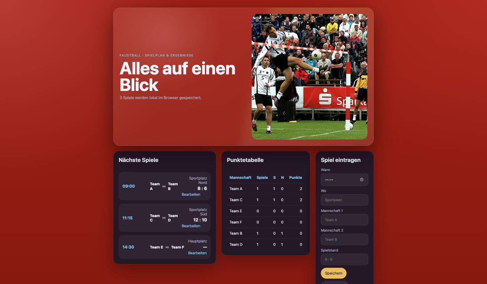

# Student Report: vcenv-vm-1 (CoderDojo Linz, 2026-08-14)

| | |
|---|---|
| Environment | `vcenv-vm-1` (only environment used; VMs 2–10 unused) |
| Pi conversation history | Yes, 3 sessions (2026-08-14, 12:42–16:23 UTC) |
| Conversation language | German throughout (agent replied in German) |
| Student | "Moritz", self-described absolute beginner in text-based coding; one mentor interjection (Rainer) |
| Project outcome | "Faustball Spielplan": fixture list, auto-computed points table, local-storage data entry; pushed to GitHub with a Pages CI/CD pipeline |
| Live check | ✅ Public site live at https://maulkorb587.github.io/website/ (HTTP 200), dev server also running |
| **maxTokens (32,768)** | **Never approached. 0 truncations in 121 assistant messages.** |

## Headline: did the July-14 output-length problem come back?

**No. Not once.** Every assistant message in all three sessions carries `stopReason` of either
`toolUse` (75) or `stop` (46). The value that indicates a response cut off at the output ceiling
(`length`) does **not appear a single time**. There is no "ich konnte die Datei wegen Token-Limit
nicht vollständig schreiben" moment anywhere in the transcript, no half-written file, and no
"weiter"/"ja" continuation prompting: the pattern that dominated July 14 for students 5, 7, 9 and 12.

The largest single response was **1,883 output tokens, 5.7 % of the 32,768 limit**.

**Honest caveat, and it matters for how much this proves.** This student never came close to
stressing the limit, and would most likely not have hit even the old 4,096 ceiling (max response
was 46 % of it). The July-14 truncations came from 400–600-line single-file game engines being
rewritten in one pass. This project is a **391-line** three-file website, and the agent overwhelmingly
used incremental `edit` calls (30) rather than whole-file `write` calls (10); the largest single
write was 4,534 characters. So the correct reading is: **the raise did no harm and the failure mode
was absent, but this workload did not put the new limit to the test.** A game-building cohort is
still the real experiment.

Confirmation the setting was actually live: `models.json` was patched to `"maxTokens": 32768` at
**12:37:03 UTC**, five minutes before the first session opened at 12:42:19 UTC. All logged activity
ran under the new value.

## KPIs

### Sessions

| Session | Span (UTC) | Duration | User prompts | Assistant msgs | Tool calls |
|---|---|---:|---:|---:|---:|
| 1 (probe) | 12:42:19–12:42:41 | <1 min | 2 | 3 | 3 |
| 2 (build) | 14:14:12–14:57:23 | 43 min | 24 | 62 | 44 |
| 3 (ship) | 14:59:12–16:23:28 | 84 min | 20 | 56 | 45 |
| **Total** | **12:42–16:23** | **~2 h 09 m span** | **46** | **121** | **92** |

Wall-clock span is 2 h 09 m, but session 3 contains two long idle gaps (15:06→15:37 and
16:04→16:23) where the student was working in the GitHub and Supabase web UIs. Active
agent-driven coding is roughly **1 h 15 m**, consistent with the "~1 h vibe coding" estimate.

### Tokens and cost

| Metric | Tokens | Price / 1M | Cost |
|---|---:|---:|---:|
| New input | 284,037 | $0.75 | $0.213 |
| Cached input | 3,974,016 | $0.075 | $0.298 |
| Output | 27,691 | $4.50 | $0.125 |
| **Total** | **4,285,744** | | **$0.64** |

- **Prefix-cache hit rate: 93.3 %** (vs. 60 % blended on July 14). One student on one long-lived,
  steadily-growing project is close to the best case for prefix caching.
- **$0.64 for the environment for the day**, against **~$4.00 per student** on July 14. Both the
  lighter workload and the far better cache rate contribute; this is not a like-for-like comparison
  (July-14 figures come from the Novedu usage DB, these from the pi transcripts).

### Output-length distribution (the number this report is about)

| Session | Max | p90 | Median | ≥4,096 | ≥8,192 | ≥32,768 |
|---|---:|---:|---:|---:|---:|---:|
| 2 (build) | 1,883 | 724 | 147 | 0 | 0 | 0 |
| 3 (ship) | 944 | 449 | 114 | 0 | 0 | 0 |

### Context window (128k)

| Session | Peak context | % of 128k | Median |
|---|---:|---:|---:|
| 2 (build) | 54,591 | 42.6 % | 24,668 |
| 3 (ship) | 65,515 | 51.2 % | 45,134 |

No compaction pressure either: the session peaked at just over half the window. The July-14
"agent goes silent" failure mode was likewise absent.

### Tool mix

`edit` 30 · `read` 29 · `bash` 17 · `write` 10 · `web_search` 4 · `fetch_content` 2

## What the student built

A German-language Faustball (fistball) fixture-and-results site, explicitly modelled on
"wie bei dem ORF Webside im Fussball":

- **Fixture cards** with time, venue, both teams and the score, each editable in place.
- **A points table** computed automatically from the entered results (team, played, wins, losses, points).
- **An entry form** (Wann / Wo / Mannschaft 1 / Mannschaft 2 / Spielstand) plus a delete dropdown.
- **`localStorage` persistence**, a deliberate architectural choice by the student (see below).
- A Wikimedia Commons fistball action photo as the hero image, styled "extrem" at the student's request.

`index.ts` (211 lines), `index.html` (87), `style.css` (93). All agent-written; no sign of hand-editing.

Then, in session 3, genuinely real engineering for a beginner: a GitHub repo
(`maulkorb587/website`), a **GitHub Actions workflow building with `npm ci` + `npm run build` and
deploying to GitHub Pages**, and a working public URL. Six commits, working tree clean, all pushed.

The live site shows the red background, the loaded hero photo, three fixtures with scores, the
computed points table (Team A and C on 2 points), and the entry form.

## How the student worked with the agent

**Approach: plan first, then build.** The opening prompt is unusually mature for a beginner and
worth quoting in full: *"Hi! Ich bin Moritz und kann noch nicht so gut programmieren. Ich spiele
Faustball und würde gerne was in diese Richtung machen. Kannst du mir helfen? Nicht gleich
losprogrammieren, lass uns erst über meine Idee reden."* ("Don't start programming right away,
let's talk about my idea first.") Six turns of requirements gathering followed before a single
file was written: what to display, who may edit, how many teams, what the design should look like.

**A real architectural decision, made by the student.** *"Speichere die Daten nicht irgendwo im
Internet, sondern lokal im Browser. Damit brauchen wir kein Passwort weil eh der Computer schon
mit Passwort geschützt ist. Schon klar, dass die Daten dann nur auf dem Computer sind, das ist
ok."* They chose local storage over a backend, gave the reason (the machine is already
password-protected), and explicitly acknowledged the trade-off. That is design reasoning, not
prompt-and-hope.

**Debugging with real console errors.** The student pasted `index.ts:13 Uncaught TypeError:
crypto.randomUUID is not a function` verbatim, twice, and the agent replaced it with a
`Date.now()`+`Math.random()` `createId()`. (Worth noting for the workshop setup: the real cause is
that `crypto.randomUUID()` requires a secure context, and the student dev server runs plain HTTP
on `:8080`. The agent's fix worked but it never diagnosed the actual reason, and told the student
"läuft auch in Browsern ohne `crypto.randomUUID()`", which misattributes it to the browser. Any
student using `crypto.*` APIs on port 8080 will hit this.)

**A curiosity arc at the end.** Asked for public comments → agent built a local-only version and
was honest that it isn't really public → *"Was ist eine Firebaseß"* → Firebase installed → *"mach
firebase wieder retour"* → cleanly uninstalled → *"was gibt es für andere möglichkeite zB übers
Internet?"* → Supabase. The last 30 minutes are the agent acting as a **teacher, not a code
generator**: explaining Firestore vs. Supabase vs. Airtable, walking through table columns
(`id uuid` / `gen_random_uuid()`, `created_at timestamptz`), and explaining Row Level Security
and policies while the student worked in the Supabase web UI. The session ends mid-tutorial on RLS.

## Problems and friction

Ranked by how much time they cost:

1. **The hero image took four rounds to become visible** (14:48–14:52). *"ich sehe das bild nicht.
   Bitte mache es so, dass ioch das bild sehe"*. The agent went through a generic stock URL → a
   `<picture>/<source>` construct → a Wikimedia `Special:Redirect` URL → finally a direct
   `upload.wikimedia.org` link to `Fistball_Spike.jpg`, using `web_search` and `fetch_content`
   to verify. **Resolved**; the image loads on the live site today (HTTP 200). This is the same
   category as July 14's broken-image friction, and it remains the most common time sink.
2. **"Der Hintergrund ist bei mir nicht rot!!"** (15:37–15:40, three rounds). Not a code failure:
   the CSS was correct each time, and the student was looking at a stale GitHub Pages deploy /
   browser cache. The agent diagnosed this correctly and told them to hard-reload. A new class of
   confusion introduced by shipping to Pages, which no July-14 student reached.
3. **GitHub Pages asset paths broke on first deploy.** *"er findet die ganzen CSSen und TSen nicht"*.
   Fixed in one round: `./style.css` instead of `/style.css`, and `base: '/website/'` in
   `vite.config.ts`. Note the side effect: the dev server on `:8080` now 302-redirects `/` to
   `/website/`, which still works but is a wrinkle if you reuse this VM.
4. **A truncated student prompt.** *"füge bitte eine <tabelle"* arrived cut off; the agent noticed
   and asked rather than guessing. (The same thing happened to July-14 student-6. It is a student
   typing habit, unrelated to model limits.)
5. **An unhelpful scope refusal.** At the very end of session 2 the student typed `gh auth login`
   into pi and got *"Dabei kann ich dir hier nicht direkt helfen, weil ich nur bei Web-Apps
   unterstützen soll."* They had to solve GitHub auth themselves. By session 3 they had, but the
   system prompt's scope guard fired on a legitimate, workshop-relevant request.
6. **Repo hygiene: `node_modules` was committed.** 797 of 810 tracked files are `node_modules`,
   and there is still no `.gitignore`. The agent flagged this itself in the initial commit
   (*"Hinweis: Ich habe dabei auch `node_modules` mit eingecheckt... Wenn du willst, räume ich
   dir das noch sauber auf"*) and offered to fix it; the student never took the offer.

Notably absent compared with July 14: **no output-length truncation, no half-written files, no
context exhaustion, no "mach hello world" project wipes, and no content-guardrail refusals.**

## Signals about the student

A planner rather than a churner. They opened by refusing to let the agent start coding, specified
requirements over six turns, made and justified a storage decision, pasted real console errors,
and finished by pushing to GitHub with CI/CD and then asking how real backends work. Where the
July-14 cohort mostly wanted a game to appear on screen, this student wanted a **tool that does
something for their sport** and then wanted to understand how to put it on the internet properly.
The Faustball site is smaller than the July-14 game engines but considerably better finished:
committed, deployed, publicly reachable and working.
